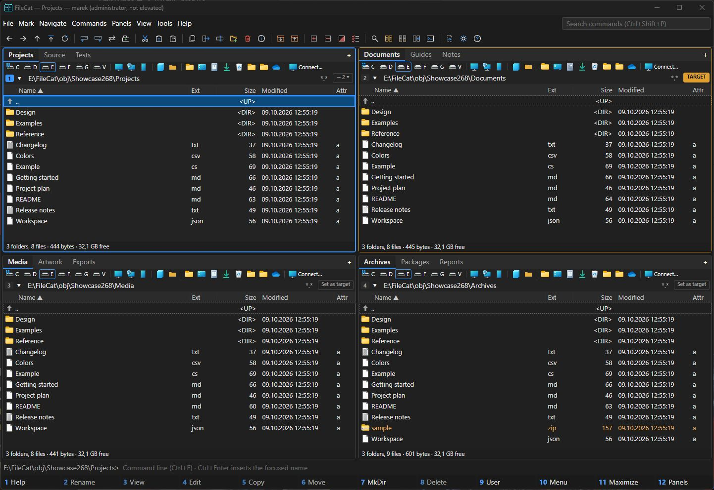
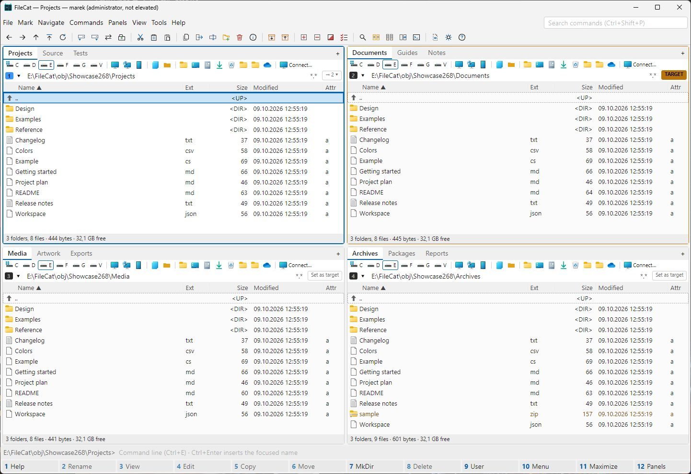
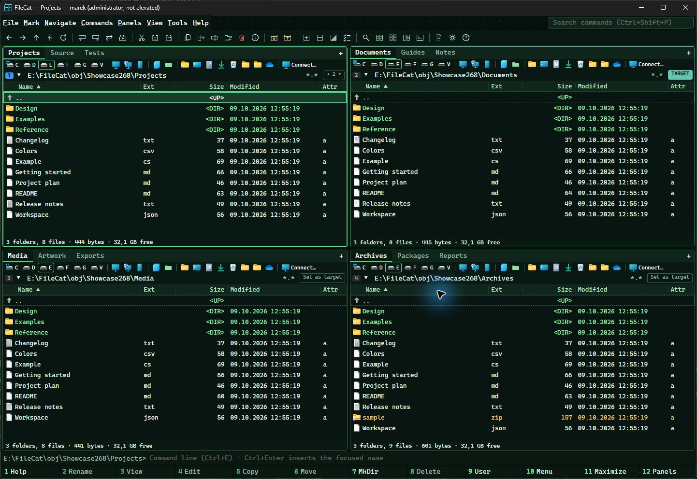
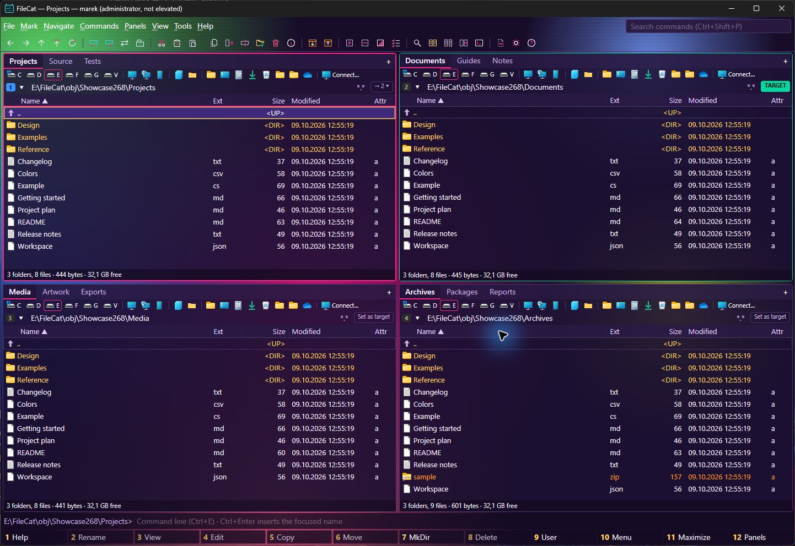
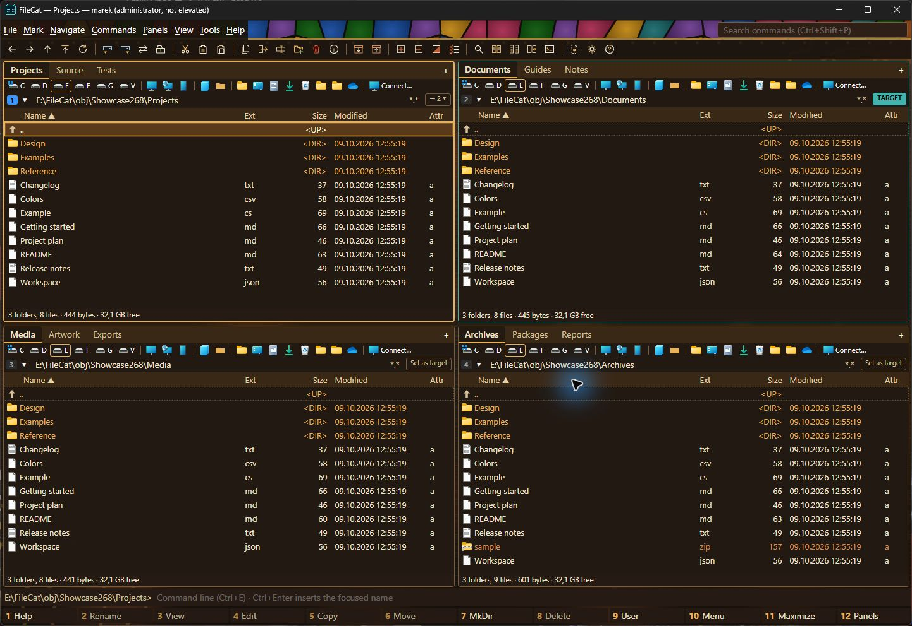
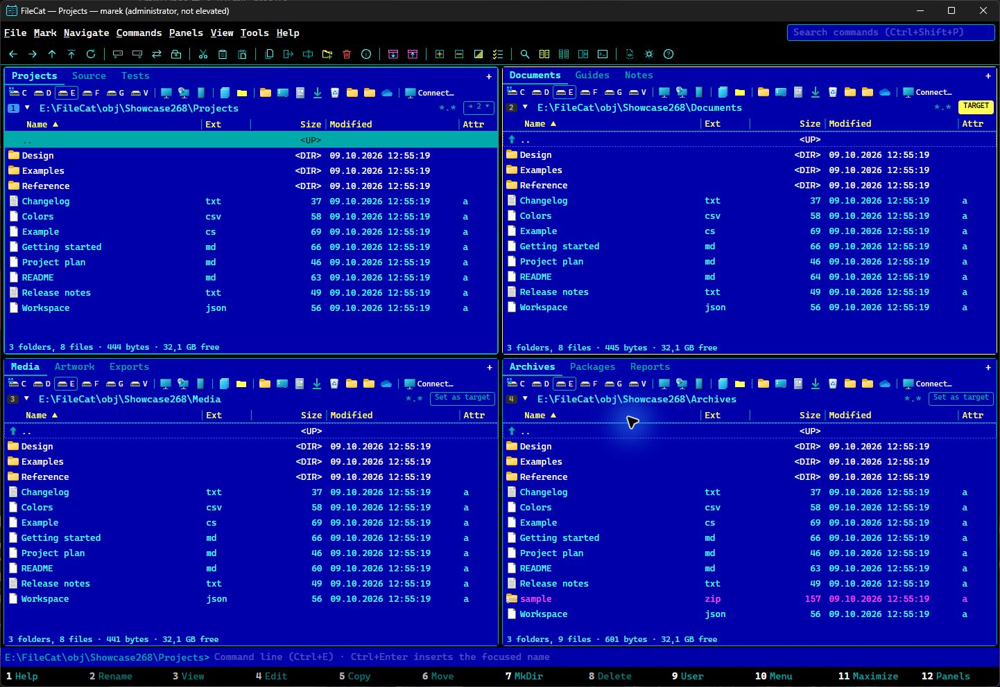
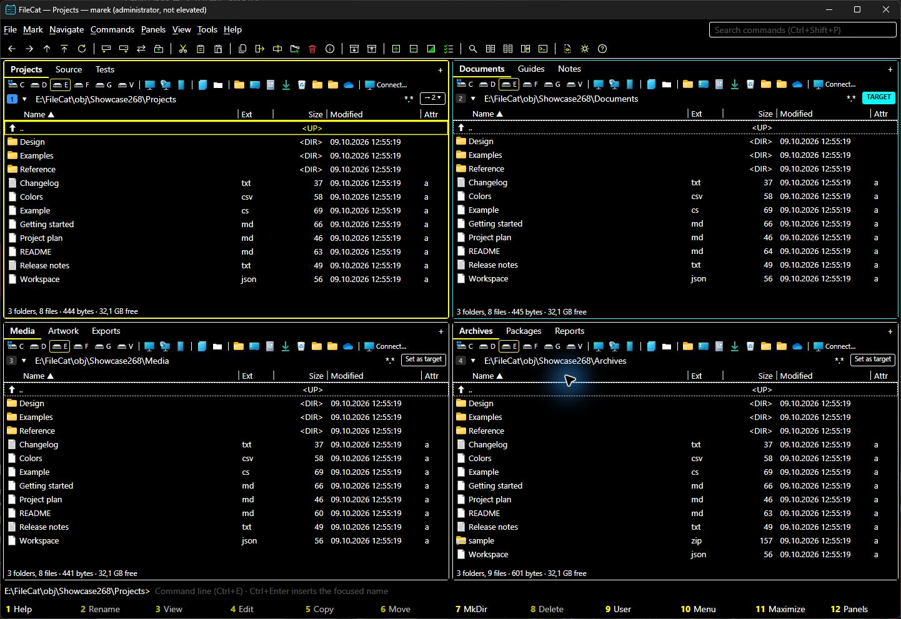
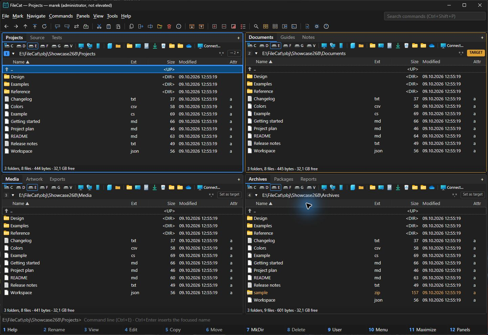

# FileCat

**Your files. Your layout. Your keyboard.**

FileCat is a keyboard-first file manager and system-resource navigator. Start with two panels,
open tabs for the folders you return to, then arrange more panels around the work in front of you.
It follows the familiar conventions of Open Salamander, Total Commander and FAR Manager, with
explicit operation targets and clear reports of what completed, failed or remains uncertain.

Built with **C# · .NET 10 · Avalonia 12**. **MIT-licensed.** Windows provides the full native
integration; Linux and macOS builds run the portable core.

[Explore the features](#highlights) · [Choose a theme](#make-it-yours) · [Keyboard essentials](#keyboard-essentials) · [Build and run](#build-and-run)



*Four panels, twelve tabs, one workspace. Real Windows captures using owned demonstration files.*

FileCat 1.0.0 is in release validation. See the [release dashboard](docs/release/1.0.0/FILECAT_1_0_RELEASE_EXECUTION_REPORT.md)
for current readiness and remaining qualification; the screenshots show a development build.

## Highlights

- **Panels and tabs**: two panels by default, more when there is room, each with its own target;
  locked tabs, recently closed tabs, bookmarks (Ctrl+0–9), histories (Alt+F11/F12), named workspaces;
  typing a path in the location box suggests the folders that complete it (Tab completes).
- **Fast listings**: a custom virtualized list streams millions of entries without per-row controls;
  quick search as you type, quick filter (Ctrl+S), column profiles (Alt+0–4), lazy metadata columns.
- **Safe operations**: staged copies published only when complete, Start or Queue per drive, overlap
  detection, conflict prompts with compare, verified Recycle Bin outcome (never a silent permanent
  delete), guarded undo, and a crash-safe journal with interrupted-operation review.
- **Find and compare**: Alt+F7 search into result sets that act on the originals, flat view (Ctrl+B),
  compare-and-mark (Ctrl+F10).
- **Viewer**: F3 text/hex viewer that reads multi-gigabyte files without loading them whole, encoding detection with
  evidence, search, go to offset, checksums, follow mode; Ctrl+Q quick view.
- **Archives**: ZIP browsing and extraction (read-only) with Mark-of-the-Web propagation.
- **Windows integration**: native CopyFile2 (keeps ReFS block cloning and SMB offload), SMB share
  listing with credential prompts, terminals, reveal in Explorer, and the installed Windows file
  context menu with application commands and icons. Shell extensions run in a separate process.
- **Git state on icons**: clean, changed, added, untracked, and conflicted items in local Git folders
  get small badges. Windows uses its installed Shell overlay when assigned; otherwise FileCat draws
  a status mark from Git. Status loads in the background and refreshes with the folder or on focus.
  FileCat's Git-derived badges omit partial-clone repositories to avoid fetching missing objects.
  Shared object stores retain these badges when their bounded local alternate paths pass admission;
  quoted alternate paths and HTTP alternate locations leave the Git-derived badges plain.
- **Themes**: Classic, Classic Dark, High Contrast, Cyberpunk, Psychedelic, Steampunk and DOS Commander.
  System follows Windows light/dark and high-contrast preferences. Preview them on the main window before keeping a choice.

## Make it yours

Choose **View → Theme…** to preview a theme on FileCat itself. Press Enter to keep it or Esc to return.
Animated effects can be turned off, and system high contrast takes priority.

<details>
<summary><strong>See every theme — four panels and three tabs per panel</strong></summary>

<table>
<tr>
<td width="50%"><strong>Classic</strong><br><a href="docs/screenshots/windows/Classic.jpg"></a></td>
<td width="50%"><strong>Classic Dark</strong><br><a href="docs/screenshots/windows/ClassicDark.jpg"></a></td>
</tr>
<tr>
<td width="50%"><strong>Cyberpunk</strong><br><a href="docs/screenshots/windows/Cyberpunk.jpg"></a></td>
<td width="50%"><strong>Psychedelic</strong><br><a href="docs/screenshots/windows/Psychedelic.jpg"></a></td>
</tr>
<tr>
<td width="50%"><strong>Steampunk</strong><br><a href="docs/screenshots/windows/Steampunk.jpg"></a></td>
<td width="50%"><strong>DOS Commander</strong><br><a href="docs/screenshots/windows/DosCommander.jpg"></a></td>
</tr>
<tr>
<td width="50%"><strong>High Contrast</strong><br><a href="docs/screenshots/windows/HighContrast.jpg"></a></td>
<td width="50%"><strong>System (this host uses dark mode)</strong><br><a href="docs/screenshots/windows/System.jpg"></a></td>
</tr>
</table>

System adapts to the operating system; in this capture it matches the dark palette.
[Capture details and exact source](docs/screenshots/windows/CAPTURE.md).

</details>

## Keyboard essentials

| Keys | Action |
|---|---|
| F3 / F4 / Shift+F4 | View / edit (external editor) / edit new file |
| F5 / F6 / Shift+F5 | Copy / move or rename / duplicate here |
| F7 / F8 / Shift+F8 | Create folder / delete to Recycle Bin / delete permanently |
| F2 | Rename in place |
| Insert / Space | Mark and move down / mark (sizes folders) |
| Num+ / Num− / Num* / Num/ | Select by mask / unselect / invert / restore selection |
| Tab / Ctrl+U | Switch to target panel / swap locations |
| Ctrl+T / Ctrl+W / Ctrl+Tab | New / close / next tab |
| Alt+F7 / Ctrl+B / Ctrl+F10 | Find files / flat view / compare directories |
| Ctrl+Shift+P / F1 / Ctrl+J | Command palette / keyboard reference / operations |
| Ctrl+E, then Tab | Command line; Tab completes names from the panel's folder (again for the next) |

Every binding can be changed: in the keyboard reference (F1), select a command and press F2, then the new keys; or in Settings (Ctrl+,).

## Build and run

Requires the exact .NET SDK selected by `global.json`. No paid components or accounts are needed.

```
dotnet build FileCat.slnx
dotnet test FileCat.slnx
dotnet run --project src/FileCat.App -- [path] [--left PATH] [--right PATH] [--profile NAME] [--data FOLDER]
```

Dependencies restore from the tracked `packages.lock.json` files in locked mode.
A missing lock, changed dependency request or changed package content fails the restore.
To deliberately update dependencies, edit `Directory.Packages.props`, then regenerate every
tracked project lock in PowerShell and review the complete diff:

```powershell
git ls-files '*.csproj' | ForEach-Object {
    dotnet restore $_ --force-evaluate -p:FileCatUpdateDependencyLocks=true
    if ($LASTEXITCODE -ne 0) { throw "Dependency update failed: $_" }
}
```

Normal builds and publishes restore the frozen graph. For a separate RID restore, use
`dotnet restore -p:RuntimeIdentifier=win-x64`; `restore --runtime` narrows the declared
multi-RID graph and is rejected. The Linux ARM64 graph preserves the packaging script's
existing restore compatibility; it does not establish stable platform support.

Packaging also checks the frozen notice snapshot in `licenses/dependencies/index.json`
against the App lock and published runtime version before copying full texts.
Review and update that snapshot from verified package/source bytes when changing
dependencies or the SDK; its index records unresolved license-provenance gaps.
AppImage packaging additionally checks the original runtime input against
`licenses/appimage-runtime/index.json` and copies its available wrapper notices.
Update the runtime pin, source references and notice snapshot together, including
when supplying `APPIMAGE_RUNTIME` or selecting another architecture. Complete
static-library composition and source obligations remain release audit gates.

Packages: `pwsh eng/publish.ps1 -Version 0.1.0` builds the self-contained, portable, and
framework-dependent payloads; `eng/installer/FileCat.iss` builds the per-machine installer.
A portable copy keeps its settings in `Data/` next to the executable (marker file `FileCat.portable`).
`--data FOLDER` keeps everything FileCat writes (settings, history, logs, journals, caches, scratch) in that one
folder. FileCat does not scan a disk for deleted files while it keeps files of its own there: to recover from that
disk, close FileCat and start it with `--data` on another disk.

## Documentation

- [Product architecture and design](docs/design/FILECAT_PRODUCT_ARCHITECTURE_AND_IMPLEMENTATION_PLAN.md)
- [Implementation status](docs/IMPLEMENTATION_STATUS.md)
- [Third-party notices](THIRD-PARTY-NOTICES.md)
- [Security policy and vulnerability reporting](SECURITY.md)
- [Release servicing](docs/SERVICING.md) — no updater; security-release cadence
- [Validation records](docs/validation/) — scale and latency evidence
