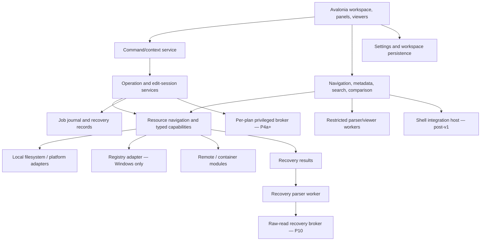
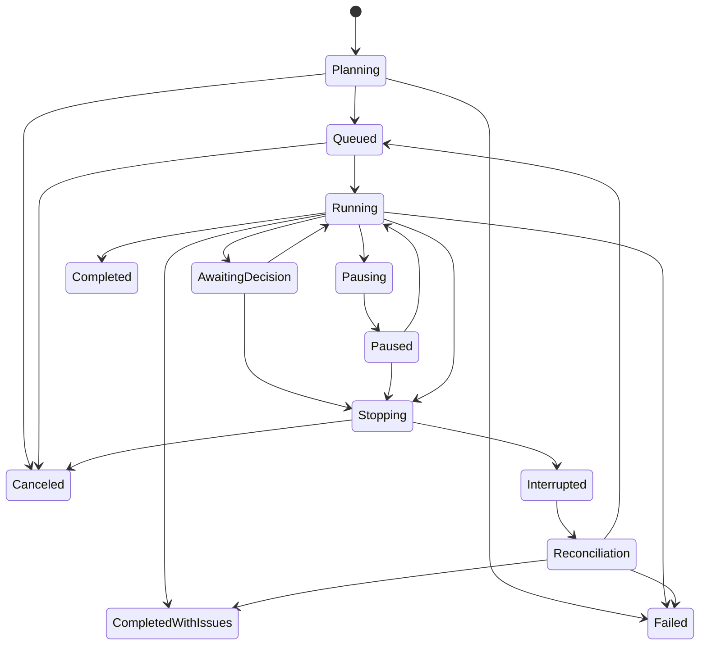

# FileCat: Product, Architecture, and Implementation Plan

Final version · 2026-09-26 · Stages B and C

This is a design and implementation-planning document. No application, solution, prototype, installer, migration, or technical experiment was implemented during planning. It is self-contained and stored in the FileCat repository under `docs/design/`.

## 1. Executive summary and reading guide

FileCat is an MIT-licensed, Windows-first file manager and system-resource navigator built with C#, .NET 10, and Avalonia. Its defining experience is fast, predictable panel-based work: navigate, select, inspect, edit, copy, move, rename, delete, search, and compare without losing context. The default is two side-by-side panels, with tabs and additional visible panels available when window space permits.

The first stable release is a dependable filesystem daily driver. It includes local Windows and accessible SMB/UNC locations, multi-panel/tab workflows, the selection and keyboard conventions that Open Salamander, Total Commander, and FAR Manager share, safe operations, search with actionable result sets, two-panel compare-and-mark, a command line, configurable metadata columns, and text/hex viewing. It also browses and extracts ZIP archives read-only. It deliberately ships without an elevated helper and without automatic in-process execution of third-party Shell handlers. Registry editing, elevated retry, overwrite hex editing, archive creation and other archive formats, SFTP and other protocols, bulk rename, advanced comparison and synchronization, richer viewers, and recovery remain substantive planned capabilities. They are not prerequisites for declaring that initial product useful.

The architecture should grow from working vertical slices. Start with an unelevated desktop application, a small resource-navigation model, a dedicated operation engine, and a Windows filesystem adapter. Introduce additional processes, storage engines, or extension contracts when concrete features require them. A generic resource can be a container, a byte stream, a typed Registry value, or a recovery candidate; hierarchy does not imply filesystem semantics.

Data correctness has priority over convenience. An operation must state what it completed, what failed, what remains uncertain, and whether recovery is possible. A sparse hex overlay is not an atomic-save mechanism. A journal is not universal undo. A separate process is not automatically a security sandbox. A Recycle Bin request is not proof that nothing was permanently deleted, an argument list is not a safe command line on Windows, and a UAC consent is not a scope limit. These distinctions are product behavior, not implementation trivia.

Read sections 2–5 for scope, reference-product lessons, and product behavior; 6–18 for architecture; 19–23 for delivery, testing, validation, and the roadmap; 24–30 for traceability, threats, risks, decisions, unresolved work, and evidence. The source references support the explanations but are not required to understand the design.

### Evidence and decision vocabulary

- **Confirmed**: the original specification, a Stage A answer, or a later product-owner decision explicitly settles the product decision.
- **Recommended**: the design proposed here; adoption is subject to the named validation when uncertainty matters.
- **Assumption**: a temporary basis for planning, explicitly revisitable.
- **Open ADR**: a significant implementation decision that needs evidence before closure.
- **Capability gap**: desired behavior that is unavailable or materially weaker on a platform/provider.
- **Deferred**: intentional future work with a stated revisit trigger.
- **Planned validation**: a future experiment, not a completed test or performance claim.
- **Reference-derived**: a decision informed by Open Salamander (primary reference) or Total Commander and FAR Manager (secondary references), classified as Preserve, Adapt, Supersede, Defer, or Omit (§3.4).

Framework and dependency evidence was checked during planning on 2026-09-26. Exact package versions and their complete transitive/native inventories must be pinned at implementation; this document does not claim that an untested library is approved for shipping.

### Navigation

- [Product decisions, scope, and invariants](#2-product-contract-scope-and-invariants)
- [Reference products](#3-reference-products-and-local-visual-reference-findings) and [workspace/keyboard UX](#4-workspace-commands-and-interaction)
- [Platforms](#5-platform-support-and-known-capability-gaps), [architecture and trust](#6-architecture-processes-and-ownership), [resources](#7-resource-model-and-first-party-extension-points), [operations](#9-operation-engine-integrity-and-recovery-from-interruption)
- [Metadata](#10-metadata-columns-and-analysis-scheduling), [Registry](#12-windows-registry-architecture-and-ux), [hex editing](#13-large-file-texthex-access-and-overwrite-editing), [networking/edit sessions](#14-networking-and-external-edit-sessions)
- [Archives](#15-archives-and-compound-resources), [viewers/comparison](#16-viewers-inspectors-and-comparison), [recovery](#17-integrated-recovery), [UI/accessibility](#18-avalonia-ui-themes-unicode-and-accessibility)
- [Delivery/project structure](#19-state-diagnostics-packaging-and-project-structure), [dependencies](#20-dependencies-and-license-management), [testing](#21-testing-and-performance-strategy), [planned validations](#22-planned-technical-validations)
- [Roadmap](#23-implementation-roadmap-and-feature-prioritization), [requirements](#24-requirements-traceability), [threats/risks](#25-threat-model-and-risk-register), [ADRs](#26-architecture-decision-records)
- [Decision log](#27-decision-log), [assumptions/deferred work](#28-assumptions-unresolved-decisions-and-deferred-complexity), [consistency review](#29-consistency-review-and-document-coverage), [sources](#30-evidence-and-source-references)

## 2. Product contract, scope, and invariants

### 2.1 Users, goals, and usage modes

Primary users are developers, administrators, technical analysts, and experienced Commander-style file-manager users. A user performing routine file management should not need to understand providers, IPC, or parser hosts.

The product serves four modes: everyday file work; large-data inspection and comparison; remote/container work; and system-resource inspection/recovery. The first mode defines the default UI. The other modes appear through contextual locations, columns, viewers, and commands rather than permanent specialist controls.

Goals are reliable operations, responsive navigation at large scale, keyboard productivity, clear destinations, honest platform behavior, excellent Windows integration, and a maintainable open-source codebase. New functionality must justify its effect on the ordinary workflow.

### 2.2 Confirmed decisions

| Decision | Binding consequence |
|---|---|
| MIT; Salamander is a behavioral reference | Independently implement FileCat; do not copy GPL implementation into it. Evaluate all redistributed dependencies separately. |
| C#, .NET 10, Avalonia; Windows-first | Portable logic with explicit native adapters; Windows receives the deepest initial integration and testing. |
| Arbitrary practical visible panels; tabs; one initial window | Default two panels/one tab each; respect minimum usable sizes; multi-window is deferred. |
| Canonical F3–F8 workflow | View, Edit, Copy, Move/Rename, Create, Delete retain stable intents across applicable resources. |
| No general built-in text editor | F4 normally opens a configured external editor; structured resources may use built-in editors. |
| Built-in advanced hex viewer and fixed-length file overwrite editor | Viewing is in v1; overwrite editing follows v1. Insertion/deletion of file bytes is out of scope. |
| First-class dynamic metadata | Browsing cannot synchronously depend on expensive enrichment. |
| First-class Windows Registry | Use panel workflows, typed values, explicit views, and honest mutation semantics. |
| Integrated recovery | Read-only recovery results use normal selection, preview, and destination workflows; low-level work is isolated appropriately. |
| Internal first-party extensibility | No initial public SDK, stable binary ABI, marketplace, signing ecosystem, or scripting runtime. |
| Self-update deferred | Manual distribution initially; preserve a future update path. |
| First stable release is the filesystem daily driver | Advanced systems do not become hidden v1 dependencies. |
| Two panels target the other panel; additional panels use a designated target | Target state is visible and the concrete destination is shown before F5/F6 execution. |
| Safe replacement plus explicitly selected, validated in-place hex saving | Non-atomic saves are never silently substituted for stronger guarantees; unsupported cases retain edits and offer alternatives. |
| Core build/run requires no paid component license or vendor account | Signing credentials may be release infrastructure; they are not contributor prerequisites. |
| Windows ARM64 is a later target; Intel Mac is not a target | Keep architecture, native boundaries, and packaging ready for Windows ARM64; do not promise untested binaries. No Intel Mac builds or tests are planned, because macOS 26 is the last release for Intel Macs. |
| Read-only ZIP browsing and extraction ship in the first stable release | In-box `System.IO.Compression`, parsed in-process under enforced limits, with Mark-of-the-Web propagation; creating and updating archives stays post-v1. |
| Releases are signed through SignPath Foundation | Every shipped component carries an OSI-approved license without commercial dual-licensing; release artifacts are built by CI from this repository; a labeled preview release precedes the first signed release. |
| Image/healthy-secondary-media recovery first | Start validation with NTFS/FAT/exFAT; ext4/APFS are separate feasibility tracks. |
| SFTP first; legacy SCP only for a demonstrated need | Preserve the protocol requirement as a conditional roadmap item, not an unacknowledged omission. |
| Familiar copy defaults; explicit loss reporting and strict profile | Use stronger checks before source deletion in cross-provider moves. |
| Explicit commit for external edits in remote/container resources | Navigation does not commit or discard; sessions persist through interruption. |
| Directory-wide expensive metadata requires explicit analysis | Automatic work prioritizes visible rows; incomplete results are labeled. |
| Panels dock anywhere in the window | Panels form a split tree: each can be moved beside, above, or below another panel, swapped, and resized; the arrangement belongs to the workspace and survives restarts. |
| A visible command search runs any command | A search box in the menu bar finds commands by title, synonym, keyword, shortcut, or menu path and runs them; no command requires walking the menus. |
| Find (Alt+F7) covers Salamander's functional scope | Attribute, size, and date criteria; whole-word, hex, and regular-expression content search; ignored folders; refine, append, and duplicate finding; saved searches; a search log; a results window that does not block the panels. |
| Esc closes every dialog | Every dialog, chooser, and secondary window closes (cancels) with Esc; where work would be lost, Esc asks first. |

### 2.3 Release boundaries and priority

“Must-have” below means required for the named milestone, not necessarily v1. Phase identifiers are defined in section 23.

| Scope | Included outcome | Deliberately outside that boundary |
|---|---|---|
| v1 core, P1–P3 | Windows 11 x64 filesystem browsing and operations on NTFS, ReFS/Dev Drive, exFAT/FAT, and SMB via UNC (share listing, credential prompts); panels/tabs; the shared Commander keyboard and selection conventions; command line; search with result sets; two-panel compare-and-mark; read-only ZIP browsing and extraction; history/bookmarks; text and advanced hex viewing; metadata scheduling and configurable columns; diagnostics, persistence, accessibility, signed packaging | Elevated helper; per-file Shell icons, thumbnails, property handlers, and Shell menus; Registry mutation; hex writing; archive creation/update and non-ZIP formats; custom remote protocols; bulk rename; checksum-manifest verification; recursive diff/sync; media/browser engines; recovery |
| Post-v1 near-term, P4–P6 and independent slices | Registry browsing/typed editing with per-plan elevated retry; fixed-length hex editing; ZIP creation, validated update, and member editing; SFTP; explicit external edit sessions; bulk rename, link creation, and checksum manifests as independent slices | Broad archive write parity, legacy protocols without need, filesystem recovery |
| Later roadmap, P7–P10 | Advanced comparator, recursive directory diff, and preview-first synchronization; Shell integration host; persistent working sets; richer isolated viewers and inspectors; additional archives, protocols, and portable devices; usable Ubuntu/macOS releases; initial integrated recovery | Unsupported parity claims or guaranteed undelete |
| Workspace arrangement and discoverability, P11 | Dockable panels (move beside, above, or below; swap; resize; persisted), a visible command search with synonyms, Find with Salamander's criteria and result tools, and Esc on every dialog | Floating or multi-window panels, public plugin commands, indexed search |
| Experimental/research | ext4/APFS undelete, damaged-media acquisition, native Wayland promotion, difficult disk/VM containers, advanced snapshots and synchronization | Release commitments before evidence |
| Explicit initial non-goals | Public plugins, embedded scripting, multi-window workspaces, automatic updater, full text editor, variable-length file hex editor, global mandatory index, embedded terminal emulator, standing (timed or session-wide) elevation, mobile/web FileCat | No preparatory framework built solely for these features |

The three theme directions—Classic, Cyberpunk, Psychedelic—remain planned complete visual systems. Classic ships as the default in v1; static, readable Cyberpunk/Psychedelic variants are part of P3 but do not gate v1 exit and may follow in a v1 point release. Elaborate animated treatments are later and optional. Rich media, binary format inspection, Registry, and recovery are not dropped merely because they are outside v1.

### 2.4 Product invariants

| ID | Invariant |
|---|---|
| PI-01 | Navigation, focus, selection, and panel/tab switching remain responsive independently of expensive work. |
| PI-02 | The two-panel workflow stays simple; adding panels never silently changes an already planned destination. |
| PI-03 | F3–F8 retain recognizable intent; unavailable operations explain why rather than inventing semantics. |
| PI-04 | Users can distinguish focus, marked selection, source, target, partial results, and pending work without relying on color alone. |
| PI-05 | Destructive scope, overwrite policy, and data/metadata loss are visible before the relevant irreversible step. |
| PI-06 | Known external changes are not silently overwritten; missing concurrency guarantees are disclosed and stronger guarantees are never fabricated. |
| PI-07 | Failure, cancellation, skipped work, partial completion, and uncertain remote outcomes remain distinguishable. |
| PI-08 | Core use works offline; advanced features do not overwhelm the default workspace. |
| PI-09 | Themes and platform adaptations preserve interaction semantics and accessibility. |
| PI-10 | Original resource identity survives display formatting, sorting, normalization, refresh, and navigation. |

### 2.5 Architecture invariants

| ID | Invariant |
|---|---|
| AI-01 | No intentional blocking disk/network/parser work on the UI thread. |
| AI-02 | Resource mutations are executed through operation/edit services, not controls or view models. |
| AI-03 | Every background service has explicit ownership, cancellation, bounded work, and stale-result handling. |
| AI-04 | Windows/native assumptions stay in explicit adapters; actual capabilities and guarantees remain visible to callers. |
| AI-05 | UI and ordinary services remain unelevated; privileged requests are narrow, authenticated, and scoped to the intended user/resources. |
| AI-06 | Process separation and security containment are described and tested separately. |
| AI-07 | Jobs capture source selection scope and destination identity; later UI changes cannot retarget them. |
| AI-08 | Watcher notifications are invalidation hints; correctness comes from revalidation and real OS/provider outcomes. |
| AI-09 | Journal/state persistence has versioning, bounded retention, safe recovery, and privacy controls. |
| AI-10 | There is no dependency on loading a complete huge file or directory into RAM. |
| AI-11 | Cancellation never means rollback unless a particular operation can prove rollback. |
| AI-12 | Provider and operation contracts are shaped by working first-party features, without premature public compatibility promises. |
| AI-13 | Elevation consent covers exactly one displayed, immutable operation plan; there is no timed or session-wide standing elevation. |
| AI-14 | Third-party native code in the Shell's extension points (icon, thumbnail, property, and context-menu handlers, copy hooks) never runs automatically on untrusted content inside the UI process. |

## 3. Reference products and local visual-reference findings

### 3.1 Evidence boundary

The reference is Open Salamander commit `86a183f92547e51ded0c29f333a8e627ce3b57f7` (2026-06-01). Repository help, selected source contracts, and dependency notes were inspected. Salamander was not executed. Some help contains older version descriptions; those are not evidence that every historical limitation remains in current runtime behavior. All links in the following matrix are pinned to that commit.

The reference demonstrates productive workflows, not a code-reuse plan. Its README identifies a WinAPI/C++ heritage and plugin dependency limitations. The filesystem SDK includes capability flags but also Windows handles, left/right panel concepts, and path-buffer assumptions. FileCat should retain explicit capability discovery while independently deriving smaller portable contracts.

Two secondary references complement Salamander. **Total Commander 11.58** (released 2026-07-01) is proprietary shareware; the evidence is `KEYBOARD.TXT` and the English help (`TOTALCMD.CHM`) bundled in the official installer, read without running the program [TC download][tc-download]. **FAR Manager build 6739** (commit `0a00879dbd2db94bc37e8b38553cf0519f22dede`, 2026-09-25) is BSD-3-Clause; the evidence is its English help source, the bundled Temporary Panel plugin help [Temporary Panel][far-tmppanel], and the key-bar source [FAR help][far-help]. Salamander's keyboard reference at the pinned commit was also inspected [Keyboard shortcuts][sal-keys]. Salamander remains the primary reference. Total Commander informs mature graphical dual-panel workflows; FAR Manager informs keyboard-centric technical and administrative workflows. All findings are documented behavior, not runtime observation, and no reference code or assets are reused.

### 3.2 Functional coverage matrix

| Salamander capability | Evidence | FileCat relevance | Treatment and reason | Candidate phase |
|---|---|---|---|---|
| Dual panels and panel components | [Panel help][sal-panel] | Baseline daily work | Preserve clarity; extend to explicit multi-panel targeting | P1–P2 |
| Focus separate from selection; fallback to focused item | [Selection help][sal-selection] | Muscle memory and batch scope | Preserve; selection anchored to resource identity | P1 |
| Quick name search and configurable typing behavior | [Quick search][sal-quick] | Fast keyboard navigation | Preserve direct typing; fuzzy search is a separate mode | P1–P3 |
| Copy target defaults, history, masks, queue, rate limit, metadata options | [Copy dialog][sal-copy-dialog] | Efficient operations | Preserve progressive disclosure; redesign around common jobs and explicit loss reporting | P1–P3 |
| Copy/move across filesystem/archive/plugin resources | [Copy][sal-copy], [Move][sal-move] | Transfer interoperability | Supersede manual staging only for validated source/destination pairs | P5–P6 |
| Configurable confirmation and conflict behavior | [Confirmations][sal-confirm] | Safety with low prompt fatigue | Redesign rules scoped to the current job; protect against accidental global overwrite policies | P1–P3 |
| F3 viewer and F4 configured editor | [View][sal-view], [Edit][sal-edit] | Stable intents | Preserve; explicit hex-edit command stays separate | P1, P4 |
| Archives browsed in panels; edit via temporary extraction | [Archives][sal-archive] | Familiar container work | Preserve navigation; supersede path-exit commit detection with explicit sessions | P3 (ZIP browse/extract), P5 (editing) |
| Lazy-loaded plugins and advertised services | [Plugin concepts][sal-plugins], [SDK][sal-sdk] | Modular first-party systems | Redesign internal contracts; omit public ecosystem initially | P4 onward |
| FTP background work, per-item errors, retries, parallel connections | [Operations][sal-ftp-ops], [Errors][sal-ftp-errors] | Work proceeds around independent conflicts | Preserve behavior under one operation center; bound concurrency | P6, P8 |
| SFTP/SCP and remote synchronization | [WinSCP introduction][sal-winscp], [Synchronization][sal-sync] | Remote productivity | SFTP first; modern authentication/security; synchronization deferred | P6, P8+ |
| Search results support further file actions and logs | [Search][sal-search] | Discovery-to-action workflow | Preserve provenance and partial/error visibility | P3 |
| Directory comparison selects differences | [Directory compare][sal-dircompare], [Keyboard shortcuts][sal-keys] | Efficient reconciliation | Preserve the two-panel compare-and-mark in v1; recursive diff as an explicit preview; distinguish comparison from destructive sync | P3 (mark), P7 (recursive) |
| Character-level file differences | [Detailed differences][sal-diff] | Meaningful comparison | Preserve intent; extend bounded huge-file and Unicode handling | P7 |
| Opened-file history and Hot Paths | [File history][sal-history], [Hot Paths][sal-hotpaths] | Fast return to locations | Preserve; provider-aware bookmarks with privacy controls | P2–P3 |
| Registry-backed configuration and export | [Configuration][sal-config] | Reproducible user setup | Supersede with portable versioned state; no automatic execution/import from installation files | P2–P3 |
| Clipboard, associations, external tools | [Clipboard][sal-clipboard], [User menu][sal-usermenu] | Windows interoperability | Preserve native intent; safe argument handling and explicit non-file exports | P1–P3 |
| Registry panel, typed editing, explicit export | [Registry][sal-reg], [Edit value][sal-reg-edit], [Export][sal-reg-export] | Non-filesystem resource test | Preserve integrated UX; stabilize F4/F7 and explicit views | P4 |
| Undelete results recovered by F5 | [Recovery workflow][sal-recover], [Limitations][sal-recover-intro] | Recovery in ordinary panels | Preserve; stronger source-safety and process/trust separation | P10 |
| Command line with name/path insertion and history | [Keyboard shortcuts][sal-keys] | Developer and administrator work without leaving the panels | Preserve as an optional field; commands run in the configured shell in a visible terminal; no embedded console initially | P3 |
| Space marks and sizes a directory; Ctrl+W restores the last operation's selection | [Selection help][sal-selection], [Keyboard shortcuts][sal-keys] | Muscle memory and repeatable batches | Preserve with cost guards; restore selection moves to another key because FileCat uses Ctrl+W for tabs (§4.5) | P1–P3 |
| Name, full-path, and UNC copy commands; paste a path to navigate | [Keyboard shortcuts][sal-keys] | Developer and support workflows | Preserve | P1–P3 |
| Change case, Make File List, convert encoding/EOL, e-mail selection | [Keyboard shortcuts][sal-keys] | Low-frequency utilities | Supersede case changes by bulk rename and file lists by name-copy commands and result-set export; omit e-mail and in-place conversion | Post-v1 / — |
| Plugins not covered above: Portables (WPD/MTP), Nethood, DiskMap, Checksum, Split/Combine, DB viewer, Automation, Windows Mobile | [Plugin directory][sal-plugins-dir] | Coverage check | MTP: defer (P8 candidate); network browsing: adapt as SMB share listing (P3); DiskMap: disk-space analysis (P7+); Checksum: range checksums in v1, manifests post-v1; omit Split/Combine and DB viewer (low value), Automation (no scripting runtime), and Windows Mobile (obsolete) | Various |
| Historical ANSI/path contracts and legacy plugin engines | [SDK][sal-sdk], [README][sal-readme] | Portability and maintenance lessons | Independently supersede; do not reproduce old contracts or obsolete engines | All |

### 3.3 Local themes reference

`E:\screener` was accessible. `screener/dashboard/page_core.py` defines Cyberpunk/Psychedelic palettes and shared style tokens; `screener/assets/dashboard/theme_background.js` includes reduced-motion checks, frame throttling, lower-cost rendering modes, and input-aware scheduling. This was generator-code inspection, not visual/runtime validation. The useful lesson is a coherent theme vocabulary and prioritizing interaction over effects. FileCat must design its own dense list, focus, selection, and error treatments; dashboard decoration is not automatically suitable for file management.

### 3.4 Total Commander and FAR Manager findings that shaped FileCat decisions

The table lists only findings that shaped or confirmed a FileCat decision; many other capabilities were inspected and found already covered or irrelevant. Each row names the user problem, the documented reference behavior, the FileCat decision, its classification, and where the decision lives. Where the references disagree, FileCat chooses one coherent model. Keyboard conflicts are resolved in §4.5 and ADR-16.

| User problem | Reference evidence | FileCat decision | Class | Where |
|---|---|---|---|---|
| Group selection and repeatable batches | All three: Insert; mask select/unselect/invert on Num+/Num−/Num*; same-extension and same-name variants; restore the previous selection (Salamander Ctrl+W, TC Num /, FAR Ctrl+M) | Mask, same-extension, same-name, invert, and restore-selection commands in v1. After an operation, processed items are unmarked and failed or skipped items stay marked | Preserve | §4.3 |
| Directory size while marking | Salamander and TC compute a directory's size when Space marks it (TC can disable this); FAR sizes folders on F3 | Space marks and starts a bounded, cancellable size job for that directory; mark-only by default on network, removable, and cloud-placeholder locations | Preserve (guarded) | §4.3 |
| Typed letters: quick search or command line | Salamander: letters start quick search. TC and FAR: letters go to the command line, and quick search needs a modifier (TC configurable, FAR Alt+letters). FAR supports `*`/`?`, and Ctrl+Enter cycles matches | Letters start prefix quick search; `*` searches anywhere in the name; the command line is a separate focus target | Preserve / Adapt | §4.3 |
| Running commands in the current location | All three have a command line; Ctrl+Enter inserts the focused name in all three; TC and FAR keep command history (Alt+F8) | Optional command line in v1, running in the configured shell in a visible terminal with shell-correct quoting of inserted names; no embedded console | Adapt | §14.2 |
| Many locations per panel | TC: new, close, and cycle tabs; open a folder in a new tab; locked tabs (navigation opens a new tab, or the tab returns to a saved root); recently closed tabs; tab list menu; saved tab sets. FAR and Salamander have no folder tabs | Adopt TC's tab operations, locked tabs, and recently closed tabs; tab sets become named workspaces | Adapt | §4.1, §19.1 |
| Opening a folder on the other side | Salamander Ctrl+Shift+←/→; TC Ctrl+←/→; FAR history "open in passive panel" | "Open in target panel" addresses the designated target (with two panels: the other panel) | Preserve | §4.2 |
| Previewing without losing the destination | TC and FAR replace the other panel with a quick view (Ctrl+Q); TC also offers a separate quick-view window | Preview overlays the target panel or opens a preview pane. The target location stays in its header and remains the F5/F6 destination | Adapt | §4.1 |
| Name collisions during copy | TC: overwrite older (version resource first), rename the copied or the existing file automatically, compare by content, view either file. FAR: Overwrite, Skip, Rename, Append, Only newer, remember choice, F3 to view | Conflict prompt with inspect and compare actions. Job-scoped rules: skip, replace, replace if newer, keep both by renaming either side. Append is omitted | Adapt / Omit | §9.1 |
| Running transfers efficiently | TC's F2 Queue feeds a background transfer manager because big copies run faster one after another; background/foreground switch; speed limit | Start or Queue in the F5/F6 dialog; per-device queues by default; overlapping jobs wait | Adapt | §9.1 |
| Selecting what to copy | TC "Only files of this type" and saved search filters in the copy dialog; FAR "Use filter" in copy, move, link, and find | One shared filter model. Copying from result sets offers keep-relative-paths or flatten | Adapt | §9.2, §11 |
| One filter language | FAR masks: comma/semicolon lists, `\|` exclusions, `/regex/`, named filters reused by panels, copy, and find. TC: `\|` exclusions and `\**\` for any depth | One mask syntax and saved-filter model for quick filter, selection, search, copy, compare, and sync | Adapt | §11 |
| Acting on search results | FAR sends results to a Temporary Panel; TC "Feed to listbox", search in found files, and skipping a directory while searching | Result sets are panel locations of original references; they can be narrowed and support F3–F8 after revalidation | Adapt | §11 |
| Collecting items from many folders | FAR Temporary Panel keeps references (F7 removes names without deleting; ten independent panels); TC LOADLIST loads a list file | Named working sets later. "Remove from set" is a distinct command, and F8 always names the originals it deletes | Adapt / Defer | §11 |
| Finding files without knowing the folder | TC branch view (Ctrl+B; selected folders with Ctrl+Shift+B) | Flat view: an explicit, cancellable recursive result set of the current location | Adapt | §11 |
| Comparing two folders quickly | Salamander Ctrl+F10; TC "Compare directories" and "Mark newer, hide same" with a "Comparison:" label; FAR Compare folders (name, size, time; no subfolders) | Two-panel compare-and-mark in v1 with a visible comparison state and timestamp-precision tolerance | Preserve | §16.2 |
| Keeping two trees in sync | TC Synchronize dirs: preview grid with a proposed direction per file, per-item override, asymmetric mode meant for backups, compare by content, 1–3 s tolerance, case-only differences excluded, only visible files synchronized | Preview-first synchronization plan executed by the job engine; deletions only as explicit per-item actions | Adapt (P7+) | §16.2 |
| Renaming many files | TC Multi-Rename Tool: live preview until Start, separate name and extension masks, counters, regex, editing names in an external editor, collision auto-rename, undo after closing | Preview-first rename plan with name/extension separation, counters, regex, external-editor round-trip, collision and cycle detection, and journaled undo | Adapt | §23.3 |
| Returning to recent locations | Salamander Alt+F11/Alt+F12 (opened files, working directories); FAR Alt+F11/Alt+F12 (view/edit and folder history with pinned items); Ctrl+Shift+0–9 folder shortcuts in Salamander and FAR | Type-to-filter file and folder history with pinning; numbered bookmark slots | Preserve | §11 |
| Discovering modified keys | FAR's key bar keeps a label set for each modifier combination and screen area | Modifier- and context-aware function-key bar driven by the command registry | Adapt | §4.4 |
| Passing selections to tools | FAR metasymbols (name, list file `!@!`, passive/left/right panel prefixes, prompts); TC `%P %N %T %S` within a 32,767-character command line | Structured tokens including list-file and target-panel tokens and a previewed runtime prompt; list files when a command line would exceed the limit | Adapt | §14.2 |
| One command per marked item | FAR Apply command (Ctrl+G) | Per-item tool invocation as a job with previewed invocations and per-item outcomes | Defer | §23.3 |
| Folder-specific commands | FAR reads a local `FarMenu.ini` from any folder | FileCat never reads command definitions from browsed folders | Omit | §14.2 |
| Retrying with administrator rights | TC's `tcmadmin.exe` stays elevated for `AdminTimeout`; FAR can elevate for the rest of the session without asking | One consent per displayed plan; no standing elevation | Supersede | ADR-14 |
| Creating links | FAR Alt+F6 creates hard links, junctions, and symbolic links; TC creates shortcuts in the target | "Create link" command with privilege and filesystem capability checks | Adapt (post-v1 slice) | §23.3 |
| Opening locations from outside | TC `/O` forwards paths to a running instance; `/L`, `/R`, `/S` address panels; LOADLIST and `.tab` files | Single instance per profile forwards locations to new tabs or the target panel; arguments open locations, workspaces, and list files | Adapt | §19.1 |
| Column layouts | Salamander Alt+0–9 view modes; FAR's ten panel modes defined by column types; TC custom column views with auto-switch rules by folder or drive type | Named column profiles switchable from the keyboard. Auto-switch rules are deferred and never enable expensive columns on remote or removable locations | Adapt / Defer | §10 |
| Recognizing file kinds at a glance | FAR highlight and sort groups by mask and attributes; TC colors by file type; FAR and TC `descript.ion` comments | Semantic styling with non-color cues in v1; user highlight rules later; no `descript.ion` writing | Adapt / Omit | §18.2 |
| Utilities of declining value | FAR wipe (Alt+Del) and print; TC split/combine and UUE/MIME encoding | Omitted: secure erase cannot be guaranteed on modern storage, and the rest have low value | Omit | §23.3 |
| Fast name search on large volumes | TC can query Everything's MFT-based index | Optional external index accelerators may be evaluated instead of a FileCat index | Defer | §11 |

## 4. Workspace, commands, and interaction

### 4.1 Layout and focus

Each workspace has ordered panels; each panel owns ordered tabs and one active tab. A tab retains its location, navigation history, view profile, filter, sort, focus anchor, and selection scope. A panel is a viewport and focus context, not the owner of an ongoing copy job or edit session.

Default: two equal side-by-side panels, one tab each, compact address/breadcrumb rows, columns, status rows, and a visible function-key bar. Additional panels are arranged by docking (below): the layout is a split tree, not a fixed left-to-right order. Enforce minimum usable dimensions in device-independent units and refuse a new split if it would make normal panels unusable. Resizing a window must preserve readable panels; offer removal/merging of panels or temporary focus mode rather than silently hiding normal panels behind a carousel.

Temporary maximize keeps the workspace topology and target state visible through a compact header. Restore returns the previous proportions. Closing a panel moves or closes its tabs through an explicit action when unsaved sessions are involved. Moving tabs transfers tab state without changing a queued job.

**Arranging panels (docking, P11).** Panels are docked in one window, as editor groups are in IDEs, so the whole screen can be used: two panels side by side and a third below them, a tall panel beside two stacked ones, and so on.

- **Model.** The layout is a tree. A split has an orientation (side by side or stacked) and ordered children with proportional sizes; a leaf is a panel. The tree is normalized after every change: no split with one child, and no split nested directly in a split of the same orientation. The default is one side-by-side split of two panels.
- **Moving with the mouse.** Dragging a panel by its number badge or the empty part of its tab strip shows drop zones on the panel under the pointer: the outer quarter of its left, right, top, or bottom edge docks the dragged panel beside, above, or below it; its middle swaps the two panels. A preview shows the resulting position before release, a drop that would break minimum sizes is refused with the reason in the preview, and Esc cancels the drag.
- **Moving with the keyboard.** Alt+Shift+arrow keys move the active panel one step that way, as tiling window managers do: past its neighbor within its split, else out of its split beside the part that holds it, else to that edge of the whole workspace. Commands also swap the panel with its target, add a panel to its right or below it, equalize every panel size, and turn the split that holds it between side by side and stacked. The command search and Panels → Arrange list them; bindings follow ADR-16.
- **Numbers.** Panels are numbered in reading order (left to right, then top to bottom within each part), so a move renumbers them; each panel keeps its tabs, target, and jobs.
- **Sizes.** Splitters between siblings resize them, and the sizes are kept in the tree; minimum sizes (260 × 140 device-independent pixels) apply to every panel. When the window is too small for every panel to keep its minimum size, a strip over the panels says so and F11 shows the active panel whole.
- **Targets and jobs.** Moving or swapping panels never retargets a job; designated targets refer to panel identity, not position. With two panels, the other panel stays the target wherever it is docked.
- **Maximize and close.** Maximize shows one panel and keeps the tree; restore returns it unchanged. Closing a panel removes its leaf and gives its space to its siblings.
- **Persistence.** The tree (orientation, order, proportions, panel identities) is saved with the workspace; a tree that no longer fits the saved panels falls back to the default split.
- **Accessibility.** Every mouse arrangement has a keyboard command, and every move is announced with the panels' new numbers ("Panel 2 is now below panel 1").

Floating panels and further windows remain deferred with multi-window workspaces (D-24).

Tab operations follow Total Commander:

- new tab, close tab, and next/previous tab (Ctrl+T, Ctrl+W, Ctrl+Tab);
- open the focused folder in a new tab;
- a searchable tab list menu and recently closed tabs;
- duplicate a tab, or copy it to the target panel;
- locked tabs.

A locked tab keeps its location: navigating from it opens a new tab. In the "return to root" variant, the tab returns to its saved location when revisited, which suits project roots. Large tab sets use overflow/search and resource-aware suspension, not a tab for every active background connection.

Only one panel owns keyboard focus. Focus, marked rows, inactive selections, and designated targets use different non-color-only treatments. Focus returns to a predictable anchor after dialogs and operations. Menus and editors retain normal Tab behavior; panel switching shortcuts are active only in the appropriate context.

Viewers and the hex editor open in their own top-level windows, as in Salamander and Total Commander. They host no panels, so the single-workspace decision (D-03) is unchanged. Open viewers appear in a window list reachable from the command palette, the principle behind FAR's screen switcher. Quick view (Ctrl+Q in Total Commander and FAR) overlays the target panel in two-panel layouts, or opens a preview pane when there are more panels. The target's header keeps showing its location, which remains the F5/F6 destination.

### 4.2 Source and destination rules

With two panels, F5/F6 initializes the destination from the other panel's active tab. With three or more, each source panel has an explicit target-panel designation. Adding a third panel preserves existing valid pairings; the new panel gets a visible target assignment before its first transfer. Never infer a new target merely because focus moved. When the layout returns to exactly two panels, both revert to implicit other-panel targeting and their headers show it. A dangling explicit target is resolved by that rule, not by a picker (D-09).

The target header shows its panel number and current location. A user can set the target through the header, a keyboard destination picker, or a context command. If the designated panel closes while three or more panels remain, becomes the source, or cannot accept the operation, show a destination picker; do not silently redirect to a recent panel. Panel numbers can change after reorder, but stored pairings use stable panel IDs.

**Implemented (2026-09-29).** Every panel's header carries a role chip. With three or more panels the target reads TARGET and has a frame in the target color; every other panel offers "Set as target", which one click turns into the active panel's target while the keyboard stays where it is; the active panel's chip ("→ 2 ▾", or "no target ▾") lists the panels to choose from, as Shift+F12 does. With two panels the other panel's chip reads TARGET. The F5/F6 dialog offers every other panel's folder as a one-click destination (Alt and the panel number), the one in the box highlighted, so a transfer can go elsewhere without changing the target.

Tab moves focus to the active panel's designated target — with two panels, the other panel, exactly as in all three references — and Shift+Tab returns. Other panels are reached through a spatial focus chord and a numbered panel overlay; ADR-16 sets the bindings and TV-10 validates them. The following commands address the designated target:

- "open focused folder in target panel" (Salamander Ctrl+Shift+←/→, Total Commander Ctrl+←/→);
- "swap source and target locations" (Ctrl+U in all three);
- "set target to the source location".

Alt+F1 opens the location menu of the source panel (the active one) and Alt+F2 that of its target, whichever side each is on (D-53; Total Commander and FAR tie them to the left and right panels). What is chosen in the target's menu opens there while the keyboard stays in the source, so the destination of F5 and F6 can be pointed elsewhere without leaving the source. A press anywhere in a panel, not only in its list, makes it the source. In the location menu a drive letter typed first opens that drive at once, without Enter; other typing filters (D-49). Choosing the drive another panel shows opens it at that panel's folder, as Total Commander does (the active panel first, then its target).

F5/F6 opens one concise operation dialog showing source count/scope, concrete destination, and operation kind. An arbitrary path, bookmark, or inactive tab can be chosen explicitly. The displayed destination is captured when the job is confirmed. Navigation in any panel afterward cannot change it. Drags within FileCat, drops into FileCat, and clipboard pastes capture their explicit destination at invocation. A drag from FileCat into another application cannot learn the drop target, because the target performs the transfer; WinSCP documents the same limitation [WinSCP drag][winscp-dragext]. Local files are offered as files. Items from archives, remote sessions, the Registry, or recovery are offered only after explicit staging into a quota-limited temporary location with Mark-of-the-Web propagated, or not at all; TV-07 and TV-12 decide per provider. Incompatible resource pairs explain the supported alternative, such as Export Registry Key, without silently converting data.

### 4.3 Selection and keyboard model

Arrow keys move focus without destroying marked selection. Insert toggles marking and moves down. Space marks the focused item and moves down too (D-49), so holding Space marks, and sizes, everything below. On a directory, Space also starts a bounded, cancellable size calculation for that directory, as in Salamander and Total Commander. That calculation is an explicit per-directory analysis: it runs at low priority within the device budget, shows its partial state in the Size column, and stops when the user unmarks the directory or presses Escape. It is mark-only by default on network, removable, and cloud-placeholder locations and can be disabled everywhere. Shift navigation extends selection.

Group selection follows the three references:

- mask select, unselect, and invert (Num+, Num−, Num*);
- select all and none;
- same-extension and same-name variants.

All of these use the shared mask syntax (§11). Restore selection brings back the set used by the previous operation. After an operation, fully processed items are unmarked. Failed, skipped, and filtered-out items stay marked so the user can retry; Total Commander keeps filtered-out items marked for the same reason.

Batch F5/F6/F8 uses marked items, or the focused item if none are marked. F3/F4 act on focus; separate explicit commands handle multiple viewers/editors. Ctrl+A selects the current completed listing snapshot; while listing is incomplete, it selects only the already enumerated scope with a clear partial count. A separate “enumerate and select all” action completes a bounded membership pass and then freezes that result. The pass is not an atomic filesystem snapshot, and changes encountered during it are reported. Commands never silently expand a frozen selection to later arrivals.

Changing a filter does not clear marks. The status line shows how many marked items the filter hides, and every confirmation states that count and lets the user drop hidden items from the operation. An "unmark hidden items" command also exists. Sort/refresh preserves selection and focus by identity, not row index. Items that disappear become invalid, not substituted by the row now at the same index.

A huge selection is stored as ranges over one immutable enumeration order or as a bounded on-disk identity set. Ranges do not survive reordering, so the first re-sort, refresh, or generation change converts them into identities. A selection never becomes a million UI objects.

| Key/intent | Filesystem default | Non-filesystem rule |
|---|---|---|
| F3 View | Built-in/default viewer for focused file | Appropriate read-only inspection; no execution of resource content |
| F4 Edit | Configured external editor | Typed resource editor where available; never silently switch to hex editing |
| Shift+F4 Edit new | Create an empty file with the entered name and open it in the configured editor (all three references) | Unavailable where no file-like child can be created |
| F5 Copy | Copy selected scope to shown destination | A supported typed copy/transfer, otherwise explain explicit export |
| Shift+F5 Duplicate here | Copy the focused item within its location under a new name (Total Commander) | Typed duplicate where supported |
| F6 Move/Rename | Destination-based move | Rename or supported move with actual guarantees; recovery source is never deleted |
| F2, Shift+F6 Rename in place | Inline rename of the focused item (F2 in Salamander and Explorer, Shift+F6 in Total Commander and FAR) | Typed rename where supported |
| F7 Create | Create directory | Explicit contextual create choices, including Registry Key versus Value; unavailable in result sets |
| F8 Delete | Recycle where available with a verified outcome (§9.2); otherwise a clearly confirmed permanent deletion | Provider-native delete with actual reversibility, or unavailable for recovery; in result sets, deletes the originals and says so |
| Shift+F8, Shift+Del Delete permanently | Explicit permanent deletion with scope confirmation (Salamander and Total Commander) | Same as F8 where no recycle concept exists |
| Enter Open | Folder: navigate. Supported container: enter it (all three references). Program or document: open through the OS with its normal security prompts. Shortcut to a folder: navigate to the target | Key: navigate. Typed value: open its viewer; Registry data is never executed |

Direct typing starts name-prefix quick search. In the search text, `*` matches anywhere in the name and `?` matches one character (FAR). While quick search is active:

- Space and other characters extend the search text;
- Ctrl+Enter and Ctrl+Shift+Enter cycle to the next and previous match (FAR);
- Escape exits quick search before canceling unrelated work;
- a character that matches no name is refused and said ("no name matches"), and the search text stays.

The search text shows in the panel's status line, never over the list, where it would hide the item found at its bottom.

Outside quick search, Ctrl+Enter inserts the focused name into the command line (all three references). Current-panel filtering, recursive search, and fuzzy navigation have distinct labels and shortcuts.

Enter on a ZIP enters it read-only (§15). Other archive formats open through their OS association until their engines arrive, and FileCat marks them as such.

Function-key modifiers, platform alternatives, and configurable bindings are discoverable in menus and the command palette. Detect conflicts by context; accommodate international layouts, IME, and laptops whose function keys require Fn. macOS alternatives supplement the canonical commands without redefining their intents.

### 4.4 Command ownership and workflows

One command registry describes stable command IDs, labels, context, selection semantics, availability/reason, destination needs, risk presentation, and execution service. Menus, toolbar, palette, function-key bar, and shortcuts dispatch the same intent. **Toolbar and menu icons (D-49, implemented).** A toolbar under the menu holds the commands used most, grouped as Salamander's top toolbar groups them (moving around, the panels, the clipboard, file operations, archives, marking, finding and comparing, the view); each button's tooltip names its key, switches show their state, and View → Show the toolbar hides it. Menu items and toolbar buttons share FileCat's own 16×16 line icons, drawn in each theme's colors (§18.2). Availability is cached from current context and asynchronously refreshed; it must not issue blocking permission checks on a keypress. Execution revalidates rights and identity. The function-key bar is driven by the same registry: it shows the bindings for the currently held modifiers and the current context, as FAR's key bar keeps a label set per modifier combination and screen area [FAR key bar][far-keybar]. Menus, history lists, and the palette filter as the user types.

**Command search (P11).** A search box at the end of the menu bar ("Search commands", Ctrl+Shift+P) runs any command without walking the menus; the palette is the same search in a dialog, used where the window is too narrow for the box. It matches titles, categories, command IDs, shortcuts, menu paths, and per-command synonyms and keywords that the registry keeps beside each title, so "file recovery", "undelete", or "restore deleted" all find *Recover deleted files*. Every word typed must match the start of a word in one of these fields, in any order, or be a close misspelling of one; results rank title matches first, then keywords, then recently used commands. Each row shows the command, its shortcut, its menu path, and why it is unavailable here when it is. Enter runs the chosen command in the active panel, F2 changes its shortcut (as in the keyboard reference), and Esc returns to the panel. With nothing typed, the box lists the commands recently run from it, the palette, or the menus.

Core workflows to use as end-to-end acceptance scripts are:

- copy selected files to the other panel and resolve one conflict;
- queue a second transfer that overlaps the first while browsing;
- mark the differences between two panels and copy them;
- search recursively, send the results to a panel, and act on them;
- run a command on the focused file from the command line;
- inspect a huge file without scanning it;
- edit a Registry value and resolve an external change;
- edit an archived/remote file and explicitly commit;
- compare two destinations before reconciliation;
- browse recovery results and copy candidates to a safe destination.

Each script includes keyboard-only and mouse paths, cancellation, failure, and returning focus to the workspace.

### 4.5 Keyboard conventions from the reference products

FileCat adopts a binding when at least two of the three references agree on it and it does not contradict a confirmed FileCat intent. Where they disagree, FileCat picks one coherent binding and records the choice in ADR-16. Every binding remains configurable, and command IDs stay stable so that optional migration presets can be added later.

| Intent | Open Salamander | Total Commander | FAR Manager | FileCat default |
|---|---|---|---|---|
| View, Edit, Copy, Move/Rename, Create folder, Delete | F3–F8 | F3–F8 | F3–F8 | Preserve (F7 is contextual Create) |
| Mark; mask select, unselect, invert | Insert, Space; Num+, Num−, Num* | Insert, Space; Num+, Num−, Num* | Insert; Gray+, Gray−, Gray* | Preserve |
| Edit new file | Shift+F4 | Shift+F4 | Shift+F4 | Preserve |
| Find files | Alt+F7 | Alt+F7 | Alt+F7 | Preserve |
| Change source/target location | Alt+F1/Alt+F2 (left/right) | Alt+F1/Alt+F2 (left/right) | Alt+F1/Alt+F2 (left/right) | Alt+F1 the source, Alt+F2 the target (D-53, §4.2) |
| Alternate viewer | Alt+F3 | Alt+F3 | Alt+F3 | Preserve |
| Sort by name/extension/time/size | Ctrl+F3–F6 | Ctrl+F3–F6 | Ctrl+F3–F6 | Preserve |
| Swap panels | Ctrl+U | Ctrl+U | Ctrl+U | Preserve (swaps source and target locations) |
| Parent, enter, root | Ctrl+PgUp, Ctrl+PgDn, Ctrl+Backslash | Ctrl+PgUp, Ctrl+PgDn, Ctrl+Backslash | Ctrl+PgUp, Ctrl+PgDn, Ctrl+Backslash | Preserve |
| Reread panel | Ctrl+R | Ctrl+R (also F2) | Ctrl+R | Ctrl+R |
| Switch panel | Tab | Tab | Tab | Tab to the designated target (§4.2) |
| Insert focused name into the command line | Ctrl+Enter | Ctrl+Enter | Ctrl+Enter | Preserve |
| Delete permanently | Shift+F8, Shift+Del | Shift+F8, Shift+Del | Shift+F8 deletes the focused item | Salamander/TC meaning, with scope confirmation |
| File history; folder history | Alt+F11; Alt+F12 | — (breadcrumb bars) | Alt+F11; Alt+F12 | Preserve Salamander/FAR |
| Define/open folder shortcut 0–9 | Ctrl+Shift+0–9; Ctrl+0–9 | Directory hotlist (Ctrl+D) | Ctrl+Shift+0–9; RightCtrl+0–9 | Salamander; a modifier variant opens the shortcut in the target |
| Pack; unpack | Alt+F5; Alt+F6/Alt+F9 | Alt+F5; Alt+F6/Alt+F9 | Shift+F1; Shift+F2 (Alt+F6 creates links) | Salamander/TC; unpack ZIP in v1, pack in P5 |
| Back/forward | Alt+←/→ | Alt+←/→ | — | Preserve; the mouse's back and forward buttons act on the panel under the pointer |

Conflicts and proposed resolutions (ADR-16, validated in TV-10):

| Intent or key | Salamander | Total Commander | FAR | Proposed FileCat default and reason |
|---|---|---|---|---|
| Typed letters | Quick search | Command line | Command line | Quick search (primary reference; FileCat's command line is optional) |
| Ctrl+Tab | Toggle command line | Next tab | Next screen | Next tab (FileCat has tabs; also the platform convention) |
| Ctrl+W | Restore selection | Close tab | — | Close tab; restore selection moves to Num / (TC) |
| Ctrl+Q | Occupied space | Quick view | Quick view | Quick view (two of three) |
| Alt+F10 | Occupied space | Directory tree | Find folder | Find folder (two of three); occupied space stays on Space and a menu command |
| F2 | Rename | Reread | User menu | Rename (primary reference and Explorer convention) |
| F9 | User menu | Menu bar | Menu bar | User commands menu; F10 and Alt open the menu bar |
| Same-extension select | Shift+Num+ | Alt+Num+ | Ctrl+Gray+ | Shift+Num+ (primary reference) |
| Ctrl+M | Make file list | Multi-rename | Restore selection | Bulk rename, when it ships (TC) |
| Shift+F5 | — | Copy within the same folder | Copy the focused item | Duplicate here (TC); focused-only operations use the palette |
| Shift+F6 | — (F2 renames) | Rename in place | Rename or move the focused item | Alias of F2 rename in place |
| Shift+F7 | Change directory | Create folder in target | — | Go to path (primary reference) |
| Ctrl+D | Unselect all | Directory hotlist | — | Bookmarks menu (TC and the platform convention); unselect all stays on Ctrl+Num− |
| Ctrl+B | — | Flat (branch) view | Toggle key bar | Flat view (TC) |

Because Ctrl+Tab cycles tabs, the command line gets its own focus command, and Ctrl+Enter shows the command line with the inserted name.

## 5. Platform support and known capability gaps

### 5.1 FileCat support tiers

FileCat support is the intersection of its tested code, .NET support, Avalonia support, native dependencies, and available hardware. Upstream framework support alone does not qualify a FileCat release. .NET 10 is LTS through November 2028; plan runtime servicing and a later LTS transition as maintenance, not an automatic-updater requirement. [Runtime lifecycle][dotnet-support]

| Target | Initial commitment | Planned growth and constraints |
|---|---|---|
| Windows 11 x64, currently supported OS releases | Tier A: release-blocking correctness, UX, performance, accessibility, and packaging tests | Minimum: Windows 11 releases still serviced for Home/Pro at release time. As of 2026-09-26 that is 25H2 or later, because 24H2 Home/Pro servicing ends 2026-10-13 [24H2 end of servicing][win11-24h2-eos]. NTFS and ReFS/Dev Drive integration first; exFAT/FAT and SMB semantics tested separately. |
| Windows 11 ARM64 | Packages since D-48 (2026-09-29) | Native ARM64 build of FileCat and its helpers (every native library ARM64), installer and ZIPs; CI builds and tests it on an ARM64 runner and starts the package, which draws its window with the ARM64 Skia. x64 emulation is not native support: an x64 FileCat says in About that it runs emulated. Physical-device tests (TV-13) remain a release gate. |
| Windows 10 | No initial support promise | Revisit only for concrete need and a supported runtime/OS combination. Avalonia's ability to run on a version does not establish .NET support. |
| Ubuntu x64 | Tier B: development smoke/integration lane during v1; usable release after P9 gates | Provisionally Ubuntu 26.04 LTS, whose default GNOME session is Wayland-only and runs X11 applications through XWayland [Ubuntu 26.04][ubuntu-2604]; 24.04 LTS as a second lane if pinned dependencies allow. Avalonia's X11 backend runs through XWayland first. Its native Wayland backend (experimental opt-in since Avalonia 12.1) is promoted only after TV-10. |
| macOS Apple Silicon | Tier B during v1; supported portable workflows after P9 | Choose supported macOS versions at packaging gate; test native permissions, trash, keyboard conventions, signing, and accessibility. |
| macOS Intel | Not a target | macOS 26 is the last release for Intel Macs, and macOS 27 supports Apple silicon only [macOS 27][macos-27]. No Intel builds or tests are planned. |
| Other Linux distributions/architectures | Community experimentation | No equal-support claim; promote one explicit combination at a time. |

FileCat targets the Avalonia 12.x line. Avalonia 12.0 (April 2026) added a Linux accessibility backend over AT-SPI2. Avalonia 12.1 (July 2026) added an experimental opt-in native Wayland backend and the free, read-only TableView control [Avalonia 12][avalonia-12], [Avalonia 12.1][avalonia-12-1]. Avalonia's own tiers list Windows 11 24H2+ (x64, ARM64) and macOS 26 as Tier 1, and Ubuntu 16.04–24.x as Tier 2. The legacy DataGrid is deprecated and in maintenance mode, and the current TreeDataGrid is a paid component ("Avalonia Pro or higher") [Licensing changes][avalonia-licensing]. This plan therefore assumes neither native Wayland readiness nor a freely distributable modern TreeDataGrid. [Platforms][avalonia-platform], [Linux backend][avalonia-linux], [TreeDataGrid][avalonia-tree]

Recheck the supported Windows edition/build intersection against Microsoft's runtime support documentation before release, especially if Windows 10 is later requested. [Runtime OS support][dotnet-windows]

### 5.2 Capability/support matrix

| Capability | Windows | Ubuntu/Linux | macOS | Gap/fallback |
|---|---|---|---|---|
| Panels, commands, portable jobs, text/hex view, metadata framework | P1–P3 release scope | Portable implementation and early tests; P9 promotion | Same | Different keyboard, IME, clipboard, and accessibility behavior must be tested. |
| Local copy/move/rename | Native Windows adapter; ReFS/Dev Drive block cloning and SMB server-side copy through the native engine | POSIX/filesystem adapter | Native/POSIX adapter | Atomicity, case, permissions, naming, cloning, and durable writes differ. |
| Trash/recycle | Windows Shell adapter with verified per-item outcome | Freedesktop/desktop adapter | Native trash adapter | Unavailable on UNC shares and most removable drives, and for items over the bin's quota or with names too long for it; explicit permanent-delete alternative only. |
| SMB | UNC/mapped locations via Windows networking | Mounted share initially | Mounted share initially | Direct cross-platform SMB authentication/discovery is deferred. |
| Registry | P4 Windows-only | Unavailable | Unavailable | No emulated filesystem substitute. |
| ACLs/ADS/NTFS features | Expose supported native capabilities | Different ACLs/xattrs; no equivalent ADS contract | Different ACLs/xattrs/resource-fork semantics | Report unsupported preservation; no silent flattening. |
| Download and extraction origin marks | Mark-of-the-Web (`Zone.Identifier` stream) preserved and propagated | No OS-enforced equivalent | Quarantine attribute (`com.apple.quarantine`) preserved and propagated | Loss is reported as a security-relevant metadata loss. |
| In-place hex save of existing large files | Journaled mode with a deny-write baseline after TV-04 | Journaled mode with detection instead of exclusion (D-45): link-safe open, device-and-inode identity, every replaced byte checked before writing | Same as Linux, flushed with F_FULLFSYNC | Save As or patch export. |
| Portable devices (MTP) | WPD provider candidate (P8) | Mounted gvfs/MTP paths where the desktop provides them | No native MTP support | Not in v1. |
| SFTP/FTP/FTPS | Shared providers when introduced | Shared providers | Shared providers | Credential stores, key agents, and proxy/native dependencies differ. |
| Archives/comparison | Shared engines where licensed and tested | Same format-specific capabilities | Same | Read support never implies write/random-access support. |
| Shell context menus and associations | Native association support; Shell context menus only through the out-of-process Shell integration host (TV-16, post-v1) | Desktop-specific actions | Native services/Open With | No promise of identical shell-extension ecosystems. |
| Recovery | Images and healthy secondary NTFS/FAT/exFAT first | Image workflows; ext4 research | Image workflows; APFS research | Encryption, TRIM, metadata reuse, and raw access can make content unavailable. |
| USN/VSS/WSL | Candidate Windows-only later integrations | Separate mechanisms if justified | Snapshots require different treatment | Optional; never required by portable operation correctness. |

This matrix records both temporary gaps (unimplemented adapters) and fundamental differences (Registry, native metadata, protocol semantics). The UI exposes unavailable capabilities with concise reasons; it does not advertise a generic feature as equivalent everywhere.

### 5.3 Known capability gaps

Each gap is stated with its user-visible effect and fallback. Its nature is temporary (FileCat or framework maturity) or fundamental (platform, protocol, or policy).

| Gap | Affected | User-visible impact | Fallback | Nature |
|---|---|---|---|---|
| Windows Registry | Linux, macOS | No Registry locations | None; not emulated | Fundamental |
| Recycle Bin unavailable | Windows UNC shares, most removable drives, items over the bin's quota, names too long for the bin | The item can only be deleted permanently | Explicit permanent-delete confirmation before the job starts | Fundamental (platform) |
| Silent permanent deletion by the Shell | Windows Shell recycle API | A "recycle" could destroy an item without warning unless prevented | Pre-classification, per-item abort, or the Shell's own warning (§9.2) | Fundamental (API); mitigated |
| In-place hex save while other programs write | Linux, macOS (advisory locks) | Writers are detected, not excluded: a save checks the file's identity and every byte it replaces and saves nothing on a change; a program writing the same bytes during the save itself can still be overwritten | Save As, patch export | Fundamental (platform locks are advisory) |
| In-place hex save on weak providers | Remote providers without a reliable version condition | Only Save As or patch export | Save As, patch export | Fundamental unless the provider offers a conditional update |
| Symbolic-link creation | Windows without Developer Mode or the privilege | Copying links as links, or creating links, fails per item | Ask: skip, create a junction for local folders, or copy the target explicitly | Fundamental (policy) |
| Native Wayland | Ubuntu 26.04 and other Wayland-only sessions | FileCat runs through XWayland; fractional scaling, IME, clipboard, and drag behavior can differ | XWayland; native backend after TV-10 | Temporary (framework maturity) |
| Privacy permissions for unsigned builds | macOS | Folder and Full Disk Access grants reset after every rebuild or unsigned update | Signed release builds | Fundamental for unsigned builds |
| Shell extensions | Linux, macOS | No Explorer-style property handlers or context menus | Desktop "Open with" and services | Fundamental |
| Network discovery | All platforms | Computers and shares found by discovery depend on the network (a firewall, discovery switched off, or an SMB1-only device can hide them) | Type a server name; mounted shares | Planned (D-54) |
| SFTP server capabilities | Servers without extensions | No server-side copy or checksum, weak version tokens, no change watches | Client-side hashing and copy; conservative commit | Fundamental (protocol and server) |
| Unsigned builds | Windows with Smart App Control enforcement | Unsigned FileCat binaries are blocked, with no per-app exception | Signed releases; developer machines without enforcement | Fundamental (policy) |
| Elevation and sandboxed workers in portable mode | Portable folders writable by the user | No elevated retry; formats that require sandboxed workers stay disabled | Installed per-machine build | Fundamental (by design) |
| Administrator Protection | Windows 11 with the feature enabled | Elevated operations run under a separate hidden account and profile | The broker resolves the requesting user's context explicitly (ADR-14) | Fundamental (OS design) |
| Portable devices (MTP) | v1 on all platforms; macOS natively | Phones and cameras are not browsable in panels | OS tools; gvfs mounts on Linux | Temporary (P8 candidate) |
| Undelete on ext4/APFS | Linux and macOS filesystems | No undelete | Snapshots, images | Research |

The UI surfaces the relevant gap where the user meets it. For example, a delete confirmation names items that cannot be recycled, and an unavailable command states the platform reason.

## 6. Architecture, processes, and ownership

### 6.1 Main components and dependencies



The diagram describes logical boundaries, not a mandate for a project, interface, or process per box. Resource contracts do not reference Avalonia or platform handles. Native handle wrappers remain inside adapters or tightly scoped IPC transfer mechanisms. View models express state and intent; operation policy is testable without a window.

Use constructor injection and one composition root. A small DI container may reduce lifecycle mistakes once the component count warrants it; do not select one to impose a framework. Prefer explicit calls and typed notifications over a global service locator, mediator for every action, or universal message bus. UI state is not the durable operation journal. Avoid CQRS/event sourcing unless a later measured need justifies them.

### 6.2 Process and trust allocation

| Process/boundary | Responsibilities and privilege | Lifecycle/concurrency | Failure and security behavior |
|---|---|---|---|
| Desktop application | UI, command context, jobs, normal filesystem/Registry/remote adapters, extension-based icons; normal user | Application lifetime; bounded I/O scheduling; tab/query cancellation scopes; per-device I/O threads for calls that can hang | Jobs record interruptions; the UI does not intentionally run elevated. Ordinary jobs need not survive process exit in v1. Managed parsers of hostile input may run here only under enforced size, depth, and time limits; native parsers never do. |
| Parser/viewer worker | Hostile format parsing/decoding with native engines, and managed parsers that cannot bound recursion or memory; least privileges needed for supplied content | Start on demand; small bounded pool, CPU/memory/time limits; session leases | Crash affects that preview; no automatic infinite restart; restrictive filesystem/network policy where supported. |
| Shell integration host | Per-file icons, thumbnails, property handlers, property sheets, and Shell context menus at user privilege, restricted where feasible | Out of process, on demand, killable on hang; not part of v1 unless TV-16 validates it early | Never invoked automatically for shortcut-like types, `desktop.ini` folder icons, or network/removable locations without opt-in. A hanging or crashing handler never affects browsing. |
| Privileged mutation broker (P4a+) | Filesystem and Registry operations of exactly one consented plan | Launched through UAC for one plan, executes it, and exits; installed per-machine only | No standing elevation, generic command, DLL loading, script execution, or unrestricted write primitive over IPC. Handle-relative, link-safe operations; explicit requesting-user context. Unavailable in portable mode. |
| Raw-read recovery broker (P10) | Read-only raw-device ranges for a recovery session | Recovery-session lifetime; fixed device identity; bounded ranges | No write verb; parsing happens elsewhere. |
| Recovery parser worker | Filesystem-specific interpretation of read-only images or brokered ranges | Recovery-session lifetime, bounded range requests and caches | Malformed disk data is parsed outside elevation where technically feasible. |

P1–P3 run in one process plus the external programs the user launches. v1 has no elevated helper. Access-denied results are reported with the reason, and executables can be started with the OS "Run as administrator" verb, which elevates a separate program, not FileCat. P4a introduces the privileged mutation broker for Registry and filesystem retries (ADR-14, TV-15). P5 and P7 add parser workers when native engines or hostile viewer content arrive. The Shell integration host is added when per-file Shell enrichment is enabled (TV-16).

The containment criterion is the kind of code, not the kind of feature. Native parsers and decoders run only in workers or the Shell host; this covers image and media codecs, libarchive, 7-Zip, browser engines, and third-party Shell handlers. Managed parsers (SSH, `System.IO.Compression` ZIP) may run in-process only with enforced limits on input size, expansion, nesting depth, and time, and with no unbounded recursion; otherwise they move to a worker.

IPC must be locally scoped and authenticate the expected user/session and launched peer. Bind requests to explicit resource handles/identities, authorized verbs, length limits, and protocol versions. Guard against stale/replayed requests and confused-deputy path substitution. The broker revalidates resolved targets, permissions, and operation scope; it does not trust a displayed path string.

Peer authentication cannot make the unelevated UI trustworthy, because other programs running as the same user can drive it. The consent boundary is therefore the plan itself. UAC identifies the broker binary, not the operation, so one consent authorizes one immutable plan: the broker displays it, executes it, and exits. This supersedes the standing elevation of Total Commander, whose `tcmadmin.exe` stays elevated until `AdminTimeout`, and of FAR Manager, which can elevate for the rest of the session.

The broker also has to respect how the environment around it behaves:

- **Install location.** The broker and every binary it loads live in administrator-protected locations (a per-machine install). An elevated process loading code from a folder the user can write to is an escalation path.
- **Link-safe operations.** Elevated recursive operations over user-writable trees use handle-relative, link-refusing operations, because swapping a folder for a link mid-operation is a known escalation technique.
- **Path resolution.** Drive letters (mapped drives, SUBST) are resolved to volume GUID or UNC form before elevation, because elevated sessions have their own drive mappings [Mapped drives][mapped-drives].
- **Separate accounts.** Elevation with different credentials must not reinterpret HKCU or relative paths as the administrator's resources. With Windows Administrator Protection enabled, every elevation runs under a separate system-managed account with its own profile [Administrator Protection][admin-protection]. The broker therefore always addresses the requesting user's hive, profile, and Recycle Bin explicitly.

Restricted workers receive only content/ranges or narrowly scoped read handles, not ambient access to credentials, user profile, or network. Validate whether AppContainer/restricted tokens and corresponding Linux/macOS containment can support each engine. AppContainer processes can load binaries only from folders that grant `ALL APPLICATION PACKAGES`. Program Files inherits that grant, but user folders do not [AppContainer for desktop apps][appcontainer-legacy]. Portable mode therefore runs without AppContainer workers, and formats that require them stay disabled there. If only crash isolation is achieved, label it as such and limit enabled formats/features until the threat model is acceptable. [Windows containment][appcontainer]

### 6.3 Shared lifecycle conventions

Navigation creates an enumeration generation and cancellation scope; returning a batch from an old generation cannot update the current tab. Metadata work is leased by consumers; closing the last consumer cancels unneeded work. Jobs own their resources independently of tabs. Edit sessions own patches/temp content independently of viewer windows. Resource sessions use reference-counted or explicit disposable leases with bounded idle eviction.

Separate interactive reads, bulk transfers, expensive analysis, and parser capacity so background work cannot starve navigation. Set global, per-device/provider, and per-session limits; avoid one thread per tab. Timeouts and cancellation have distinct outcomes. Native calls that cannot be interrupted are quarantined from UI work, and the UI reports “stopping” until the safe boundary is reached. Calls that can hang indefinitely (SMB redirector, removable media, cloud recall) run on bounded per-device or per-server threads outside the shared thread pool. A hung call is abandoned rather than cancelled: its thread is quarantined, and the device queue reports “not responding.” Thread usage therefore stays bounded per device, not per tab.

## 7. Resource model and first-party extension points

### 7.1 Recommended conceptual model

Use a small common navigation surface plus typed operation/read capabilities. The common surface describes location identity, display identity, parent/child relationships, enumeration, and basic metadata. It does not require every node to open a stream, create a directory, or support paths with the same syntax.

| Concept | Required meaning |
|---|---|
| Resource reference | Provider/session namespace plus opaque locator; optional stable native identity and revision evidence; never just a formatted URI. |
| Node descriptor | Kind, original name, display name, navigability, immediately available metadata, and capability summary. |
| Enumeration session | Bounded batches, generation, cancellation, continuation where supported, completeness/error state; not an immutable snapshot unless the provider guarantees one. |
| Content access | Separately advertised sequential read, random read, known length, sparse/extent information, and consistency guarantee. |
| Typed data access | Registry type/data, recovery provenance, or structured records without synthetic file extensions/streams. |
| Mutation planning | A proposed action for a source/destination pair with constraints, preconditions, preservation/loss report, conflict options, and actual commit guarantee. |
| Change evidence | Provider-specific revision, identity/stat evidence, or notification invalidation; explicit strength and limitations. |

A capability description must include qualifiers: current access, resource kind, session state, atomicity, range support, cancellation, expected-version support, and preservation rules. A Boolean “supports move” is insufficient. Capability availability is advisory; permissions and media state can change before execution.

The operation engine dispatches to typed handlers. It should not expose a Cartesian product of provider-to-provider methods. Common byte-stream transfer is one strategy; Registry-to-Registry copy and archive update are separate typed strategies. Explicit export/import handles unlike resources. Add interfaces only at seams with actual alternate implementations or isolation/testing value.

### 7.2 Abstraction stress cases

| Case | Natural representation | Important refusal/constraint |
|---|---|---|
| NTFS directory | Container of links/files/directories with native metadata | Same-volume rename differs from copy/delete; alternate streams and reparse points remain visible. |
| SFTP directory | Remote container with server-dependent attributes and operations | No blanket promise of atomic overwrite, watches, stable identity, or compare-and-swap. |
| ZIP archive | Container session bound to a parent-file version | Member random read may require decompression; mutation commits at container scope. |
| Registry key/value | Key container and named typed values; default value has empty underlying name | No filename-extension model; F7 has two explicit choices; cross-resource copy is not automatic export. |
| Recovery result | Read-only candidate tied to scan, device/image identity, extents, and confidence evidence | Reads may be partial; destination copy cannot imply content validity; no source mutation. |
| Result set or working set | Container of references to items stored elsewhere, with query provenance | Membership is not ownership: F7 is unavailable, removing from the set never deletes, and F8 deletes the originals with explicit wording. |
| MTP/WPD device (paper case) | Object tree with device-assigned identifiers, optional partial reads, no paths | No random writes; rename may be unsupported; exclusive device sessions; not in v1. |

The model is provisionally adopted in ADR-01. Validate all seven on paper/contract fixtures early, but implement providers only with their user-facing slice. Future first-party metadata, viewer, container, and comparison modules register focused descriptors/handlers; no runtime discovery of arbitrary third-party assemblies initially.

## 8. Local filesystem and native integration

The local adapter owns OS path parsing, enumeration, native identity, handles, reads, changes, and supported mutations. The operation engine owns policy and multi-step orchestration. Use native Windows facilities when they improve fidelity and performance; use portable .NET APIs where their actual semantics suffice. Compare CopyFile2/native copy against controlled streaming under ADR-03 rather than reimplementing every filesystem feature by default. Since Windows 11 24H2 the native copy engine block-clones on ReFS/Dev Drive by default, and copies within one SMB server can be performed server-side. A streaming strategy forfeits both, so the native engine remains the baseline wherever its semantics suffice [Block cloning][block-cloning]. Shell operations are useful for recycle/associations but must not silently impose unrelated UI or semantics on the unified operation center. [CopyFile2][copyfile2], [IFileOperation][ifileoperation]

### 8.1 Identity and semantic correctness

- Preserve raw names and provider comparison rules. UI natural/culture-aware sorting does not determine path equality. Never globally case-fold or normalize resource identifiers.
- Account for Windows per-directory case sensitivity, Unix case-sensitive names, macOS normalization behavior, reserved names, trailing characters, and long paths. Cross-target name collisions are conflicts, not automatic renames.
- Treat symlinks, junctions, mount points, and other reparse points as distinct objects. Copy links as links where supported; following a link is an explicit scope choice. Prevent recursion loops and destination-inside-source cases using resolved identity where possible.
- A hard-linked file can appear at multiple paths; replacement and in-place editing affect identity/aliases differently. Warn when a save strategy changes which names see the new content.
- Copy profiles specify data streams, xattrs, ACLs/ownership, timestamps, sparse extents, compression/encryption, and link topology. “Strict” means fail/ask when required fidelity is unavailable, not silently use best effort.
- Same-filesystem move may use native rename, but commit/durability/overwrite behavior remains filesystem-specific. Cross-volume move uses the guarded transfer sequence in section 9.
- Cloud placeholders, network-backed files, special files, and inaccessible mounts must not trigger uncontrolled recall or reads during listing/metadata. Show availability and request hydration/content work explicitly where the adapter can detect it; otherwise document the limit.
- ReFS and Dev Drive volumes are their own capability profile, not NTFS. Microsoft lists no officially supported short names, object IDs, transactions, disk quotas, or offloaded data transfer on ReFS, and file-system encryption only on Windows Server 2025, while block cloning is available [ReFS overview][refs-overview].
- Mark-of-the-Web (the `Zone.Identifier` stream) is security metadata. Preserve it in copies, propagate it to items extracted from marked containers (including nested ones), mark remote downloads, and report its loss (for example on FAT/exFAT) as a security-relevant loss rather than an ordinary stream loss.
- Creating symbolic links needs a privilege or Developer Mode. When copying links as links fails, ask whether to skip, create a junction for a local folder, or copy the target explicitly; never silently follow the link.
- A case-only rename on a case-insensitive volume renames the same item; it is not a conflict.
- Antivirus scanning can briefly hold newly written files, causing sharing violations on rename or replace. Controlled Folder Access can deny writes to protected folders by unrecognized applications. Both are distinct, actionable outcomes with bounded retries.

Use batches and a bounded directory index rather than retaining a UI model per item. Listings keep compact records in memory up to a configured budget, roughly 100–150 MB per million entries by estimate, measured in TV-01. Larger directories spill records to an ephemeral local store. Compact sort/view indexes remain in RAM under a shared 512 MiB reservation (budgeted at 40 bytes per entry for transient arrays); when another batch would exceed it, the pipeline retains the last usable rows, completes enumeration, then builds sorted runs and memory-mapped visible/position indexes in private scratch. Subsequent filter changes reuse the sorted order; sort changes rebuild it. The UI must keep showing loading/progress while the external view is built (AI-10). The million-entry target is a validation scenario, not an unbounded-directory guarantee. Spilled names are treated as sensitive, because they can reveal names from encrypted or removable volumes: they are stored with restrictive permissions, in user-private local scratch outside the browsed directory, and deleted when the listing closes. A scratch file can share a physical volume with the browsed location; placement must not be described as volume isolation. TV-01 sets the spill threshold, and ADR-02 chooses SQLite or a simpler append/index format. Data virtualization, sorting, and selection belong behind the panel's paged access interface so the UI control does not dictate storage.

### 8.2 Watching and native features

Watch open relevant locations, not every persisted tab recursively. Coalesce notifications; invalidate affected metadata and schedules. On overflow, reconnect, ambiguity, or volume identity change, re-enumerate and reconcile. A watcher is not proof that a resource has not changed. [Watcher limitations][watcher]

The list of drives is watched too (implemented 2026-09-29): the roots This PC shows are compared every two seconds while the main window runs (one system call, no I/O on any drive), and Windows' device notifications (`WM_DEVICECHANGE` for volumes) report arrivals, removals, and a medium changing in a drive at once. This PC lists the drives anew, and a tab that showed a drive that is gone, or an archive or disk image on it, shows This PC with a notice instead of an error.

Initial Windows integration covers:

- drive/volume listing;
- UNC paths, including share listing for `\\server` roots (which cannot be enumerated as directories) and credential prompts through the Windows networking UI when access is denied;
- connect and disconnect network drive commands (Salamander F11/F12, the Total Commander Net menu), with DFS paths treated as opaque UNC paths;
- shell associations, clipboard/drop, recycle, attributes, and permission failures;
- "Reveal in Explorer" (Salamander Shift+F3; FAR Shift+Enter on a folder).

v1 icons come from file type and extension only; `SHGetFileInfo` with `SHGFI_USEFILEATTRIBUTES` does not access the file [SHGetFileInfo][shgetfileinfo]. Per-file icons, thumbnails, property handlers, property sheets, and Shell context menus run third-party code on file content. They therefore require the out-of-process Shell integration host (TV-16). They never run automatically for shortcut-like types (`.lnk`, `.url`, `.library-ms`, `.searchConnector-ms`), `desktop.ini` folder icons, or network/removable locations without opt-in. The Shell's own parsing of such files has leaked NTLM credentials when a user merely opened a folder [CVE-2025-24054][cve-2025-24054]. Shell file operations set `FOFX_NOCOPYHOOKS` so third-party copy hooks do not load into FileCat. Expose exact paths for expert inspection without leaking paths/credentials into ordinary logs by default.

USN-based acceleration, VSS, WSL location discovery, richer ADS management, and storage diagnostics are later candidates. USN/VSS must not become a portable correctness dependency. WSL locations are accessed through validated available paths, not by directly modifying a distribution's private storage files.

## 9. Operation engine, integrity, and recovery from interruption

### 9.1 Job model and execution

An operation request captures command intent, selected roots/items or bounded selection specification, source/destination identities, options, and preconditions. A planner resolves actual strategies, estimates known work, identifies risks, and records unresolved totals. Planning itself streams; it must not require materializing an entire tree before showing useful progress.

Jobs contain dependent steps with durable outcomes. A minimal conceptual lifecycle is:



Canceled means the user stopped the job, and it reached a safe boundary with every step outcome known. The job still reports which steps committed, because cancellation is not rollback. Interrupted means the process, device, or connection was lost, leaving outcomes that need reconciliation. The two are never merged, which keeps PI-07 true.

Not every strategy supports mid-file pause or resume. Step outcomes include committed, skipped, failed, canceled-before-change, partially-applied, and uncertain. A job can finish with issues without being labeled successful. Progress distinguishes processed work from successful work; discovery totals may grow and should not fabricate a precise ETA.

The F5/F6 dialog offers Start and Queue. This adapts Total Commander's F2 Queue, which exists because large copies to one device run faster one after another. Jobs queue per destination device by default; jobs on independent devices run in parallel within global limits. Before a job starts, the scheduler checks for overlap with running and queued jobs:

- the same source or destination subtree;
- one job's destination being another's source;
- deletion of a tree that another job is reading.

Overlapping jobs wait and show which job they wait for. The user can reorder, pause, or rate-limit queued jobs.

The operation center shows concise status, rates, queue position, source/destination, and outstanding decisions. Independent items may continue while another waits.

The conflict prompt shows both items' size, time, attributes, and version where available. Before deciding, the user can view either item or compare them by content, as in Total Commander and FAR Manager. The choices are:

- skip;
- replace;
- replace if newer, using the version resource first for executables and then timestamps compared at the filesystems' known precision;
- keep both, giving either the incoming or the existing item an explicit generated name;
- retry after correction.

“Apply to similar conflicts” is scoped to the current job and conflict class. Appending the source to the existing file, which both references offer, is omitted as a data-corruption trap. Directory merge is distinct from file overwrite. Last-used destructive rules do not become global defaults silently.

### 9.2 Copy, move, delete, and preservation

For cross-provider or cross-volume move: establish a source identity/version or stable read lease; write to a unique staged destination where supported; verify according to the selected profile; publish destination; revalidate the source; only then delete that source. If identity/version cannot be established strongly enough for safe deletion, retain it and report that copying completed but move could not safely finish. Provider acknowledgment, byte count, flush, read-back, and durable server storage are different evidence levels. For directories, a move deletes only the items it copied and removes a source directory only if it is then empty. It never recursively deletes a source tree, because items created after enumeration would be lost.

Normal copies follow familiar destination inheritance where appropriate, preserve supported ordinary metadata, and disclose unsupported streams/attributes. Strict preservation is explicit. Verification profiles are: transport/native outcome with size and metadata checks; destination content read-back/hash; and strict preservation plus content verification. The UI describes the actual level, not an unexplained “verified” badge. Read-back does not prove consistency of a source that changed during reading. A move's final source deletion requires more than a size match when mutable source identity is uncertain. Read-back bypasses the OS cache where the platform allows, as Total Commander's Verify option does. A copy can be limited to items matching a saved filter (§11). A copy from a result set offers to keep relative paths or to flatten them.

Recycling uses the platform service when supported; permanent deletion is a separate explicitly presented action (Shift+F8 or Shift+Del). If recycle fails or is unavailable, never silently fall back to permanent deletion.

On Windows this rule needs deliberate work, because the Shell's recycle operation can destroy an item without warning. Its only documented guard, `FOF_WANTNUKEWARNING`, shows the Shell's own dialog. Otherwise the only signal is a post-delete callback that reports no recycled item, and it arrives after the item is gone [IFileOperation flags][ifo-flags], [PostDeleteItem][ifo-postdelete]. FileCat therefore:

- pre-classifies items that cannot be recycled — on UNC shares or most removable media, over the bin's quota, or with names too long for the bin — and asks before starting;
- aborts any item the Shell would destroy during execution; a candidate technique, checking the transfer flags in the pre-delete callback, must be validated in TV-03;
- accepts the Shell's warning dialog if that abort cannot be validated, rather than risk a silent permanent deletion.

Recursive deletion does not follow links by default. Failed permission checks do not trigger automatic ownership takeover. From P4a, a user may request an elevated retry through a per-plan broker (ADR-14). A different administrator identity must not retarget resources. With Administrator Protection, an elevated recycle would use the elevated account's own bin, so such deletes are presented as permanent unless TV-15 proves otherwise.

**Aliases and the safety review (2026-09-29).** "The same item" is decided by identity (volume and file ID, or device and inode), not by path text: a destination reached through a junction, a symbolic link on the way, a mapped drive, or a hard link can be the source itself, and a move that replaced it with its own copy and then deleted the source would lose it. Such a destination is never replaced (the question offers keeping both), a move onto it does nothing, a folder whose destination really lies inside it (every link resolved) is refused, and the deletion of a moved source first checks once more that the published copy is another file. A link that replaces an existing item is made under a staged name and renamed into place, so a link that cannot be made leaves the item there; a folder is never merged into a folder link. "Only files matching" is applied by every executor that copies or moves (to and from servers and phones too, and a move keeps folders that still hold files it left out); an executor that cannot apply it refuses the job before anything changes. On Linux and macOS a move is a rename (renameat2 with RENAME_NOREPLACE, renamex_np with RENAME_EXCL), never .NET's unguarded copy and delete across file systems, and errors are classified by their C library numbers.

Avoid destination truncation before replacement preconditions are satisfied. Stage to the destination filesystem when replacement requires it. If staging cannot be supported, advertise weaker behavior before writing. Archive/container commits and Registry mutations use their own step semantics under the same job reporting model.

### 9.3 Journal, undo, and shutdown

Keep a compact durable journal of job identity, intended steps, resource/version evidence, staged artifacts, outcomes, and recovery ownership. Order persistence around destructive transitions and validate flush behavior; a database transaction cannot atomically include arbitrary filesystem or remote side effects. After a crash, reconcile reality with the journal rather than automatically replaying deletes or assuming a step did not happen because its completion record is missing.

Journal durability is tiered, because a synchronous flush per file would dominate small-file copies:

- **Synchronous.** The intent is recorded durably before a destructive or externally visible transition: deleting a source, replacing or overwriting an existing item, or publishing a staged item over a name.
- **Batched.** Creating new items is journaled in group commits. Plain copies of many small files record per-directory progress rather than a durable record per file.
- **Data before deletion.** A journal record does not make copied bytes durable. A move therefore flushes each copy and writes its publish through before it deletes the source. Otherwise a power loss could keep the deletion and lose the copy, or leave the only copy under a staged name that recovery treats as a leftover.

After a crash, reconciliation inspects the destination instead of trusting the last batch. TV-03 and TV-14 measure the overhead against the small-file budget in §21.2.

ADR-04 is resolved as CRC-checked append-only per-job records with tiered flush; workspace preferences remain separate. The job header holds a bounded source sample and the exact source count. Recovery scans records incrementally and retains open intents rather than every completed step. For very large queued selections, exact source identity still needs a bounded, durable manifest owned by the job; a display sample is not that manifest. Recovery records containing original bytes or sensitive paths need restrictive permissions, retention limits, and optional OS-backed protection. Diagnostic exports do not include those contents by default.

Safe undo is an eligibility decision per completed step: restore a recycled item through the Recycle Bin's own restore action for the specific item recorded when it was recycled (Windows documents no direct restore API, so TV-03 validates the mechanism), reverse a rename only if current identity still matches, or restore a saved value only if intervening change checks pass. Do not promise global undo of overwrite, permanent deletion, arbitrary cross-provider moves, or interrupted batches. History lists outcomes even where undo is unavailable.

Closing the UI presents active work and edit sessions, then permits finish, cancel safely, or keep the app open. v1 does not require a persistent background daemon. Hard termination leaves recoverable journal state, not a claim that jobs continue. A future out-of-process job service is justified only by an explicit survive-UI-exit requirement. On Windows shutdown or logoff, FileCat registers a shutdown-block reason while destructive steps or unsaved edit sessions are active, stops at the next safe boundary, and journals the rest. An optional setting keeps the system awake while a user-started job runs.

### 9.4 Checksums and manifests

Recognize common checksum manifests without hashing automatically. Manifest verification is a post-v1 slice; v1 provides range and file checksums in the viewer and as explicit analysis. Verification is an explicit cancellable job with byte-based progress, per-file results, missing/unsafe paths, malformed entries, and a clear partial state. Resolve manifest entries within an explicit root and reject path traversal by default. SHA-256/SHA-512 are modern integrity options; MD5/SHA-1/CRC remain compatibility checks, not proof of authenticity. Even a strong hash from an untrusted manifest does not establish trusted origin. Selected-range checksums reuse the read scheduler without monopolizing device throughput.

Tests cover real NTFS, ReFS, exFAT, and SMB semantics, links and aliasing, disk full, access loss, partial writes, concurrent mutation, device removal, process kill at transition points, and ambiguous remote completion. Property tests target plan/state-machine invariants; native integration tests determine actual guarantees.

### 9.5 Environmental failure modes

These failures come from the environment rather than from FileCat's logic. Each has an owner and a test.

| Failure | Owner | Behavior |
|---|---|---|
| Antivirus holds a new file; Controlled Folder Access denies writes | Local adapter | Distinct outcome with bounded retry and a plain explanation; no silent skip |
| Smart App Control blocks unsigned binaries | Packaging (ADR-15) | Signed releases; a startup check names the blocked component |
| Windows shutdown, logoff, or sleep during jobs | Job engine | Shutdown-block reason, safe-boundary stop, journaled remainder (§9.3) |
| Symbolic-link creation not permitted | Local adapter | Per-item question (§8.1); never follow silently |
| Hung SMB, removable-media, or cloud-recall calls | I/O scheduler | Per-device threads, abandonment, "not responding" state (§6.3) |
| Read errors on damaged or optical media during ordinary copies | Copy strategy | Per-file retry, skip, or abort; no zero-filled substitution; partial destinations are deleted or kept and labeled, as the user chooses |
| Viewer or editor handles blocking other programs | Read engine | Viewers open files with read, write, and delete sharing; the hex editor's deny-write baseline is explicit and visible |
| The user starts FileCat elevated | Application shell | Warn; Windows blocks drag-and-drop from unelevated applications, and state goes to the elevated account's profile |
| Case-only rename | Local adapter | Treated as a rename, not a conflict |

## 10. Metadata, columns, and analysis scheduling

Metadata is a first-class query service, independent of panel enumeration and viewer lifetime. A descriptor specifies stable field ID, value type/unit, applicable resource kinds, formatter, comparison/filter behavior, cost class, freshness policy, and producing module. Columns bind to descriptors, not parsers. A value carries provenance and state: not requested, pending, available, absent, unsupported, stale, canceled, or failed. Zero and empty text are actual values, not substitutes for missing data.

| Cost class | Examples | Scheduling rule |
|---|---|---|
| Immediate | Name, kind, basic size/time already returned by enumeration | Include in the directory record; no additional per-row round trip merely to fill the default view. |
| Cheap lazy | A locally available attribute, shallow header, cached owner lookup | Visible/near-visible rows, bounded by provider and total budget. |
| Expensive | Media metadata, signature validation, Git status, container inspection | Limited visible-row enrichment only when enabled and eligible; isolate parsers as required. |
| Explicit analysis | Full checksum, recursive directory size, complete expensive-column sort/filter | User-started cancellable job with scope and resource budget. |

Cost is a hint adjusted by the provider: a cheap local stat may be expensive on a high-latency server. Showing a column grants bounded eligibility, not unlimited whole-directory work. Bulk operations, navigation, and metadata share device-aware budgets with interactive work prioritized. Reuse a parser result across columns rather than opening a file independently for each cell. Coalesce requests and reject stale generations on completion.

Caches key by provider/session, identity, revision evidence, field/parser version, and relevant options. Weak revision evidence implies conservative expiry/revalidation. Cache negative and failure results briefly to avoid repeated expensive failures. Use memory and disk quotas with LRU-like eviction; credentials, raw Registry values, and full file contents are not ordinary metadata-cache payloads. Cancellation ends demand, not necessarily a shared request still needed by another visible consumer.

Sorting uses explicit typed comparisons, stable identity tie-breaks, and a defined placement for missing/error values. Ordinary name/size/date sorts can progress from streamed records into a complete external sort. Present a stable interaction view: apply batch reorderings at safe points, preserve the focused identity, and show an update indicator when new sorting information is pending. Never execute a click or key command against a different item because enrichment moved rows.

For expensive sort/filter, offer “Analyze this directory” with the fields, known item count, budget, and cancellation. Before completion, label ordering/filtering partial; non-evaluated rows are unknown, not excluded as definite nonmatches. Cancel retains useful results but never changes their completeness label. Strict full ordering is published only for the evaluated scope/generation. Directory changes can invalidate completeness and trigger an explicit refresh choice rather than endless automatic rescanning.

Initial useful columns are filesystem-native fields and a deliberately small cheap metadata set. Image dimensions, media duration/codecs, PE/ELF/Mach-O architecture, APK/AAB data, Git status, signatures, and checksums arrive with their producing modules. They are not all v1 dependencies. Metadata adapters expose real availability; for example, a Registry key timestamp is not invented as a timestamp for each contained value.

v1 uses a minimal scheduler: cost classes, visible-row demand, per-device budgets, and an in-memory cache. Disk-backed metadata caching, parser-version cache keys, and provider cost overrides arrive with the first parser module (P7), when they have consumers.

Column sets are named profiles switchable from the keyboard, following Salamander's Alt+0–9 view modes, FAR's ten panel modes, and Total Commander's custom column views. Automatic profile switching by location type (Total Commander's auto-switch rules by folder or drive type) is deferred. When it arrives, a rule may select cheaper profiles for remote or removable locations, but it never enables expensive columns there automatically.

Validation combines slow/erroring providers, rapidly scrolling views, million-entry data, directory churn, cache invalidation, and many enabled columns. Assert global concurrency/queue/memory limits and zero stale-result mutation of a later tab generation. See TV-01 and TV-06.

## 11. Search, navigation, and result provenance

Separate four experiences: immediate prefix/fuzzy navigation in the current listing; current-location filtering; recursive resource/content search; optional future indexing. Basic use never requires a global index or background crawl.

One mask syntax serves selection, quick filter, search, copy and move filters, compare, and sync:

- `;` or `,` separate masks;
- `|` starts exclusions;
- `/…/` is a regular expression;
- quotes protect separators inside a mask;
- `**` matches any number of directories where paths apply.

FAR Manager and Total Commander agree on these principles. Saved filters are named predicates over names, attributes, size, time, and available metadata. They are reusable across all of these features, just as FAR's Filters menu serves panels, copy, and find.

Search owns a query session with roots, traversal/link policy, field requirements, encoding/regex choices, and generation. It streams results and errors, exposes visited/remaining/unknown scope, and supports cancellation. Search results contain original resource references, not copied path strings. View/Edit/Copy actions revalidate the originating resource. Duplicate aliases can be grouped without collapsing distinct paths that matter to the user. Search logs include inaccessible locations; “no matches” must not imply that unreadable areas were searched.

A running or completed search can be opened as a result set in a panel tab. This adapts FAR's Find → Temporary Panel and Total Commander's “Feed to listbox.” A result set is a location of original references plus query provenance, and F3–F8 act on the originals after revalidation. In a result set:

- F7 is unavailable;
- "remove from result set" is a separate command that never deletes anything;
- F8 states that it deletes the original items at their locations;
- searching within the results narrows the set, as in Total Commander;
- a running search can skip a subtree.

Flat view of the current location (Total Commander's branch view, Ctrl+B) is a recursive result set without criteria; it is explicit and cancellable. Copying from a result set offers to keep relative paths or to flatten them.

**Find (Alt+F7) in detail (P11).** Salamander's Find is the functional reference [Salamander Find][sal-find] [Find dialog][sal-find-dialog] [Advanced options][sal-find-advanced] [Duplicates][sal-find-dup]. FileCat covers:

- **Names.** Masks with history. A mask without `*`, `?`, or `.` matches names that contain it, as in Salamander; the full mask syntax above applies.
- **Where.** Several roots with history, plus buttons that add the local drives, or the local and network drives; subfolders on or off; archives as an explicitly enabled scope with bounded I/O ("Inside archives": the names of the members of every archive format FileCat opens, up to 200,000 members per archive; contents are not searched, archives inside archives are not opened, and an unreadable archive is logged).
- **Content.** Containing text with case sensitivity, whole words, regular expressions, and a hex mode that accepts quoted text inside the byte list; encoding and binary assumptions are reported.
- **Advanced criteria.** Attributes as three-state choices (set, clear, either) for archive, read-only, hidden, system, compressed, encrypted, and directory, so a search can find files only or folders only; size at least and at most, in bytes, KB, MB, or GB; the modification time either within the last N seconds, minutes, hours, days, weeks, months, or years, or from a date and time to another, each end optional; the creation time where the provider reports it. A reset clears them, and a one-line summary of the active criteria stays visible in the main dialog.
- **Ignored folders.** A list of folders to skip, each switchable; a leading separator anchors an entry to the root of every searched location. Skipped folders appear in the search log.
- **Results window.** Found items appear in a window that does not block the panels, so work continues while a search runs, and several searches can run at once. The list shows name, folder, size, modification time, and attributes, sorts by any of them, and acts on the original items after revalidation: open, focus in the active panel (Space), view (F3), edit (F4), copy or move to the target (F5/F6), delete (F8, stating that originals are deleted), properties, the user menu (F9), clipboard names and paths, select all and invert, and dragging to panels or other programs. Items can be hidden from the list, including duplicate names, and the results open as a result set in a panel as before.
- **Refine and append.** A new search can intersect with the found items, subtract from them, or add to them, besides searching within a result set.
- **Duplicates.** Find duplicate files by same name, same size, and same content in any combination; content is compared only among files of equal size, and groups are shown together, with a command that marks all but one file of each group.
- **Saved searches.** A set of criteria can be saved under a name, loaded, managed, and chosen to load whenever Find opens.
- **Search log.** Errors, inaccessible folders, and skipped folders are listed with a command that shows the folder in the active panel; the log opens automatically after a search with errors when chosen.

Content search uses bounded buffers and incremental decoding, handles boundary-spanning matches, and reports encoding/binary assumptions. Regex execution has time/resource limits and a cancellation strategy. Archives and remote recursion are separately enabled scopes because they can generate large I/O and temporary storage. Registry search can choose key names, value names, typed data, or raw data; it does not inherit file-content defaults. Searching a recovery session never implies all deleted data has been discovered.

History and bookmarks store provider-aware locations and view context, not passwords or transient handles. A missing device/connection remains a recognizable unavailable bookmark. Restore focuses the nearest valid parent only after explaining the missing location, rather than silently opening a different resource. Breadcrumbs represent real resource boundaries, including entering an archive or switching Registry view. Quick-jump and command palette use the same validated location parsers.

**The path as links (D-52, implemented).** A panel's path works like Salamander's directory line. Each folder up the path is a link, whatever holds it: disks, archives, servers, and the Registry, since the links come from the location's parents. A click goes to that folder, with the folder it came from under the cursor. Ctrl+click copies the path up to there, and a middle click opens it in a new tab. The context menu copies the full path, the part clicked, or a name, and can go to the folder, open it in a tab, or edit the path. A click on the last part, past the text, or a double click edits the path in the box beneath. A long path keeps its root and its last folders, with an ellipsis between. Beside the path, a filter box holds the mask of the items shown (`*.*` on Windows and `*` elsewhere, as in Salamander and Total Commander), applied on Enter. It stands out while it filters. Folders always show, so the way on stays open, unless the mask names folders itself (`src\`). Above the path, place buttons change the location with one click, as Total Commander's drive bar does, and offer everything the location menu does (D-53), in its order and groups: drives (icon and letter, or a mount point's name), This PC, phones, working sets, the Registry (its 64-bit and 32-bit views on the button's menu), Home and the special folders, bookmarks and saved servers by name, and a new connection. They are made from the same list as the menu, so the two never differ. Where the panel is, is outlined: its drive, and a folder or bookmark it shows exactly. A drive another panel is on opens at that panel's folder, as in the location menu. A middle click opens a new tab, and the right button offers both. The row never wraps: what does not fit is on a » button at its end, so both panels' lists start level. View → Show the place buttons hides them.

Folder history (Alt+F12) and file history (Alt+F11) are type-to-filter lists with pinnable entries, as in FAR. Numbered bookmark slots are defined with Ctrl+Shift+0–9 and opened with Ctrl+0–9 in the active panel, or with a modifier in the target panel, following Salamander's Hot Paths. "Find folder" (Alt+F10) searches history, bookmarks, and an explicit bounded folder scan, adapting the tree-based folder finders of Total Commander and FAR.

Named, persistent working sets that collect items manually from many folders (FAR's Temporary Panel) are deferred to P7. Persisted result sets store references plus query provenance; a saved search is not an immutable filesystem snapshot. Optional indexing is deferred until evidence shows repeated search value and an acceptable privacy/resource policy. Before FileCat builds its own index, optional external index accelerators may be evaluated, following Total Commander's use of Everything. Their results are revalidated and never replace a real search's completeness labels. Search tests use partial access, loops, malformed names/content, slow/disconnected providers, encodings, regex timeouts, and mutation between discovery and action.

## 12. Windows Registry architecture and UX

### 12.1 Navigation, representation, and editing

The Windows Registry module is a native, typed resource provider. Its location identity includes machine context (local initially), requesting user context, root, explicit view, and exact key/value name. Display standard roots HKCU, HKLM, HKCR, HKU, and HKCC with explanations where roots are aliases or merged views. Keep a visible 32-bit/64-bit/default-view indicator when relevant; do not represent view selection merely as navigating into Wow6432Node. [Alternate views][registry-views], [HKCR semantics][hkcr]

Use one panel listing with clearly separated key and value groups. Keys navigate; values are typed records. A key and a value can have the same displayed name without sharing identity; item identity includes the kind. The default value uses its empty underlying name and an explicit “(Default)” display label. An absent default value has no row; F7 offers to create it. This keeps selection and counts truthful without a fabricated record. Columns include Name, Kind, Type, Data preview, Data length, and appropriate key metadata. Large data previews are truncated visibly. Exceptionally large keys may have a bounded, explicitly incomplete listing; search remains available to narrow the scope.

F3 opens read-only details/raw data; F4 invokes a typed value editor; F5 copies to a compatible Registry destination; F6 distinguishes same-parent rename from a non-atomic relocation; F7 explicitly offers Key or Value; F8 deletes the selected key/value scope. For a key, F4 is unavailable unless a specific editable property is selected. Do not redefine it as Export. Cross-resource F5 offers the relevant named export action for explicit confirmation, without silently treating it as a byte-file copy. Registry search and filtering — by key name, value name, typed data, or raw data — ship with P4a.

Typed editors support REG_SZ, REG_EXPAND_SZ, REG_MULTI_SZ, DWORD, QWORD, and BINARY. Numeric editors show base and unsigned width/range; strings distinguish stored from expanded content, and expansion is never executed as a command. Multi-strings use structured rows and expose malformed/raw content. Preserve unknown types and malformed encodings byte-for-byte unless the user explicitly converts them. Type changes offer conversion versus reinterpretation with a preview. Binary Registry values may change length because they are typed records; the file hex editor's fixed-length rule does not prohibit this separate editor mode.

Registry links, such as `CurrentControlSet`, are link objects. They are displayed as links with their target and navigated explicitly. Subtree copy, delete, export, and search never traverse them unless the user opts in. Operations on the link itself open it as a link (`REG_OPTION_OPEN_LINK`), mirroring the reparse-point rules in §8.1.

### 12.2 Mutation semantics

| Operation | Semantics and failure handling |
|---|---|
| Create key/value | Validate namespace/type and expected absence; existing keys/values cause explicit conflict. |
| Rename key | Prefer supported native same-parent rename; validate access and destination absence. It is not a general cross-root move. |
| Rename value | Treat as create-new plus delete-old with captured raw data/type and separate outcomes; do not promise atomic rename. |
| Copy value | Preserve stored type/raw data; overwrite requires destination conflict handling. |
| Copy key subtree | Bounded enumeration and typed copy; explicit merge/overwrite policy; partial outcome recorded. Default security inheritance is separate from explicit ACL preservation. |
| Move key/value | Copy, verify, then conditional/best-available guarded delete; refuse or retain source when safety cannot be established. Not an all-or-nothing transaction. |
| Edit value | Capture original type/raw bytes, reread before commit, surface changes, then write and verify result. Clearly disclose the remaining race where no validated conflict detection is available. |
| Delete | Show subtree/value scope; record recoverable original data when configured; no generic recycle claim. Protected roots are not ordinary deletable rows. |
| Export/import | Named commands with explicit format, view, and scope; import preview includes additions, overwrites, and deletion directives. |

Native RegRenameKey provides key renaming; RegCopyTree copies security descriptors as well as data. Therefore do not use the latter blindly for a policy that intends destination ACL inheritance. RegSetValueEx does not accept an expected prior version. These API facts constrain the above design. [Rename][reg-rename], [Copy][reg-copy], [Set value][reg-set]

A preflight reread is valuable but not an atomic protection against another process writing immediately afterward. Never label Registry edits “conflict-free.” For routine typed edits, show detected conflicts and use the documented best-effort compare/write/verify sequence. High-risk subtree moves may remain copy-only until validation supports their guarded deletion policy. Microsoft documents that a non-transacted operation on a key before commit rolls a registry transaction back, which amounts to key-level conflict detection [Transacted keys][reg-transacted]. Registry transactions nevertheless remain unadopted, because the same Kernel Transaction Manager stack carries Microsoft's deprecation guidance for Transactional NTFS and a reported non-atomic outcome [TxF deprecation][txf-deprecation], [KTM report][txr-p0]. TV-05 evaluates transacted single-key edits as an optional conflict detector, with compare/write/verify as the fallback.

### 12.3 Privilege, notifications, and recovery

Open keys with minimum requested rights. Access-denied results offer an explicit elevated retry through the per-plan broker (ADR-14), not an elevated workspace. HKCU must refer to the original requesting user's context even if different administrator credentials are used. With Windows Administrator Protection enabled, every elevation runs under a separate system-managed account. The broker therefore always opens the requesting user's hive through `HKEY_USERS\<SID>`; implicit HKCU access in the broker is invalid. For HKCR, recommend read-only merged browsing with an explicit “edit user registration” or “edit machine registration” route so the actual write target is visible. Validate alias/link behavior without recursive traversal into unexpected roots.

Use native notifications to invalidate views and dirty edit sessions, with re-enumeration after missed/ambiguous changes. A notification does not provide a value-level version lock. The UI must preserve unsaved input during refresh. Key last-write time must not be advertised as a reliable per-value modification timestamp.

Pre-change recovery records may retain raw value bytes, types, paths, views, and selected security information under restrictive local storage. `.reg` export is an interchange aid, not a complete ACL-preserving snapshot or transactional undo. Import parses and previews changes; it is never auto-executed on download or selection. Binary save/load commands are explicit conversions. ACL inspection is planned with P4; general ACL editing, remote Registry, and arbitrary hive administration are later work with separate risk review.

Application hives are reachable only through the handle returned when they are loaded, never by path. They also restrict security descriptors, so per-key ACL editing is impossible in them [Application hive limitations][reg-apphive]. They therefore test typed values and mutation logic, but not root, view, HKCR, link, or HKCU resolution, which ADR-09 identifies as the main risk. Path and view logic is tested under unique keys in the real HKCU namespace, removed after each run. HKLM, WOW64, ACL, and elevation cases run in disposable VMs with allowlisted test locations. Production keys are not fuzz/test fixtures.

## 13. Large-file text/hex access and overwrite editing

### 13.1 Shared read engine and viewer behavior

Use 64-bit offsets and a bounded paged read cache over random-access capabilities. Explicit-offset asynchronous buffered I/O is the initial candidate; memory mapping is an alternative for selected local stable files, not a requirement for remote/huge/mutable data. Arithmetic, page boundaries, EOF, sparse extents, and short/error reads must be explicit. Avoid unchecked conversion of byte offsets into UI-sized integers.

Hex display opens without whole-file scan and supports arbitrary offset, byte/text search, selections, range checksums, encoding interpretation, and later parser overlays. Text viewing uses incremental decoding and a sparse line index. Absolute line counts and far-away line navigation may require background indexing and must show that cost. Handle giant single lines without laying out gigabytes of text. Unknown encoding is shown as a choice with evidence; binary data is not silently transcoded.

Sequential-only sources get a sequential preview or explicit spooling with a quota; the UI never pretends a compressed/remote resource is cheaply seekable. Disconnects and external truncation invalidate affected pages and preserve the user's position as an offset where possible. A live log view is a distinct mode from stable-file analysis.

### 13.2 Patch overlay and undo

The overwrite editor records changed ranges against a baseline identity/version/length. Reads combine original pages and patches. Undo/redo groups user actions and stores old/new range data with bounded memory and optional protected spill; it does not copy the whole file. Coalesce patches without losing undo boundaries. Clearly mark modified bytes, dirty ranges, stale baseline, and save state.

Every write stays within original file length. Reject operations that insert/delete bytes or grow/truncate the file. External length changes invalidate the session. Undo in an unsaved overlay is strong; undo after committed saves is a different operation with version/precondition checks and retained originals, never an unconditional promise.

Baseline consistency is separate from display caching. Detect identity replacement, length/revision changes, and changed patched ranges. Rechecking only modified bytes does not prove the rest of a huge source was unchanged. Where a full baseline is unavailable, explain the level of detection and avoid claiming snapshot semantics.

### 13.3 Save strategy and explicit guarantees

| Situation | Preferred strategy | Guarantee and limitation |
|---|---|---|
| Local Linux or macOS file (P11, D-45) | Explicit journaled in-place mode with detection: link-safe open, device-and-inode identity, every replaced byte checked before writing | Other programs may read and write meanwhile; a save refuses when the file or a replaced byte changed, and a program writing the same bytes during the save itself can still be overwritten; the confirmation says so before the user chooses it. |
| Local Windows file with a protected baseline (P4b) | Explicit journaled in-place mode for fixed-length patches | Multiple writes are non-atomic; ordinary concurrent writes/deletion are excluded from editor open; original ranges and full file identity support guarded recovery. |
| New local target (P4b) | Save As with a full protected read (sparse holes kept where the destination supports them), or export exact patch ranges that can later be applied after an original-byte check | Can use substantial time and space; a new file keeps Mark-of-the-Web (or reports its loss) but not ACLs or other streams. Neither mode overwrites an existing target. |
| Small or huge file where replacement fidelity is validated later | Sibling replacement preserving required metadata, allocation, and identity policy | Requires adequate space, explicit hard-link/stream/ACL policy, and verified native replacement outcomes. Replacement is not automatically power-loss-proof. |
| Remote/provider-backed content | Conditional update or verified staging/publish if supported | Ordinary SFTP/FTP timestamps are not strong version tokens; weak providers may require Save As or explicit weaker policy. |
| No safe update path | Preserve overlay; offer export of patches and/or Save As | Do not silently fall back to unsafe overwrite. Save As also needs a stable source or explicit mixed-version warning. |

The accepted product choice permits an explicitly selected, validated non-atomic in-place mode; it does not authorize silent lost updates. Fail closed for an existing-target save when the required write exclusion or conditional version guarantee cannot be established. A best-effort external-change indicator alone is not enough to claim safe original-file overwrite.

ADR-05 selects the protected Windows in-place mode as P4b's first existing-file implementation because it keeps hard-link aliases, ACLs, streams, and allocation attached to the same file identity. The sibling-replacement rows remain future options until their preservation and failure semantics are validated. The editor offers Save As and patch export when the user wants a new artifact.

For a strong local guarantee, establish a protected baseline from the start of editing or use a validated revision/snapshot-and-exclusion protocol. Acquiring a lock only at Save and comparing length/mtime is insufficient to prove nothing changed earlier. On systems where locks are advisory or a provider has no reliable version condition, reduce supported save modes rather than manufacture equivalent protection. For Linux and macOS the product owner chose (D-45, 2026-09-29) to offer the in-place mode with detection instead of exclusion, stated in its confirmation: every save first verifies the file's identity, its length, and each original byte it replaces, and saves nothing otherwise. Save As and patch export remain for a new artifact.

In-place save journals the target identity, original length, patch ordering, original/replacement bytes, and per-range status. Validate original ranges under the strongest available exclusion before writing; flush/reconcile states at tested boundaries. A crash may leave mixed old/new ranges. Recovery offers resume or guarded rollback only after verifying that current bytes match recognized states. An unrelated later change blocks automatic rollback. Never replay against a path now referencing another file.

Replacement affects hard-link aliases differently from in-place writes. Present this consequence when detected. Preserve/reconcile ADS, ACLs, timestamps, sparse state, and other metadata according to policy rather than assuming a byte copy preserves them. Windows ReplaceFile documents nontrivial failure states; reconciliation must inspect actual resulting identities and filenames. [ReplaceFile][replacefile]

TV-03 and TV-04 must establish the save matrix before editing is released. Test multi-terabyte sparse fixtures and a smaller non-sparse corpus, random offsets, external writers, mapped files, replacement, disk full, torn/interrupted journal records, and process termination. Physical power-loss durability claims require dedicated evidence beyond process-kill tests.

## 14. Networking and external edit sessions

### 14.1 Protocol strategy

| Resource/protocol | Intended implementation direction | Explicit limitations |
|---|---|---|
| SMB | Windows native networking/UNC initially, with share listing for server roots, credential prompts, and connect/disconnect drive commands; mounted shares on Unix-like platforms | Offline and mount behavior belongs to the platform, while FileCat triggers the credential prompt; direct cross-platform SMB client deferred. |
| SFTP | First remote provider. P6 chose SSH.NET (ADR-17); its path-based delete and rename resolve links first, so remote changes go through listing entries. SSH.NET's agent support (OpenSSH agent, Pageant) comes from the separate SshNet.Agent package [SshNet.Agent][sshnet-agent], still to be evaluated | Probe server features; do not assume atomic replace, watches, stable IDs, checksum, or server-side copy. |
| SSH workflows | Host-key verification (existing OpenSSH `known_hosts` entries can seed trust), agent/key authentication, connection profiles, explicit external terminal | No embedded scripting runtime or untrusted automatic remote command. |
| FTP/FTPS | Later provider with explicit plain-FTP choice and enforced TLS validation for FTPS | Different listing, time, resume, rename, certificate, and connection behaviors; default binary transfer avoids implicit content conversion. |
| SCP | Legacy wire protocol only when a concrete server/workflow requires it | Modern scp commands can use SFTP; do not build legacy shell quoting semantics unnecessarily. |
| NFS | Mounted filesystem path support | No dedicated discovery/mount implementation initially. |
| WebDAV/network discovery/mDNS | Deferred candidates | No user-identified priority; revisit with concrete environments and authentication needs. |

OpenSSH documents the scp-to-SFTP default change. This is why SCP workflow familiarity and legacy SCP protocol support are separately tracked. [OpenSSH 9.0][openssh]

Connections are owned by provider sessions, leased by tabs/jobs/edit sessions, and reused within bounded pools. Keep an interactive capacity reserve when bulk transfers run. Close idle sessions; suspend inactive tabs without discarding location/history. Reconnect revalidates host identity and session capabilities. A changed host key is a security decision, not an automatic reconnect exception.

Use OS credential stores where available: Windows Credential Manager/appropriate protected secret storage, macOS Keychain, and Linux Secret Service where present. If no secure store is available, session-only credentials are the fallback; no plaintext persistence. Store secret references separately from portable connection profiles. Keys, agent sockets, passwords, URLs, and protocol traces must not enter ordinary logs. TLS/SSH errors are actionable and never silently bypassed.

Timeouts, keepalive, resume offsets, checksums, and server-side copy are negotiated capabilities. Verify resumable partial content before reuse; same name/length is insufficient evidence. An interrupted upload with unknown server outcome enters reconciliation. Rate limits and retries are bounded; authentication failures do not create password retry storms. Files downloaded from remote servers receive Mark-of-the-Web on Windows, or the quarantine attribute on macOS, so the OS applies its normal checks when they are opened.

### 14.2 External tools and editing

Local tools are configured as an executable plus structured argument tokens, a working-directory choice, and supported placeholders. Do not build an implicit shell command from filenames; shell execution is a separate explicit tool mode.

Structured tokens are necessary but not sufficient on Windows. Windows has no argument vector: every launch serializes the tokens into one command line that the target program parses itself. .NET's own documentation warns that its argument serialization is unsafe with untrusted data [ArgumentList][argumentlist]. Every launch therefore follows these rules:

- **Real executables only.** Tools resolve to real executables — for VS Code, `Code.exe` rather than the `code.cmd` launcher. A batch target (`.bat`, `.cmd`) is refused when any argument contains characters that cmd.exe interprets (`&`, `|`, `<`, `>`, `^`, `%`, `!`, quotes, or line breaks), unless an explicit shell-mode tool accepts that risk. This is the BatBadBut class of injection [BatBadBut][batbadbut].
- **Absolute paths only.** Arguments are absolute paths, with `--` where the tool supports it, so a file name cannot be read as an option.
- **Command-line length.** Selections that would exceed Windows' 32,767-character command-line limit use a list-file token or several invocations, and the preview says which.

Placeholders cover the focused item, the marked items, a temporary list file of marked items (FAR `!@!`, Total Commander list files), the active and target panel paths, parent names, and a runtime prompt shown with a preview (FAR `!?title?init!`). Substring-editing syntax (Total Commander `%N:~2,5`) is omitted. Configuration validates placeholders and shows the resulting invocation without exposing secrets. The same rules apply to terminal launch, per-type associations, and user commands.

Per-type associations map masks to View, Edit, and Open programs, as FAR's file associations do, preserving the F3/F4 intents. The user commands menu (Salamander F9, FAR F2) is a hierarchical list of configured commands with hotkeys. FileCat never reads command definitions from browsed folders; FAR's local `FarMenu.ini` model is omitted because repository content would then define commands.

The command line, present in all three references, is an optional field below the panels:

- Enter runs the command in the configured shell, in a visible terminal window, at the active panel's location. A built-in `cd` changes the panel's location instead.
- Ctrl+Enter inserts the focused name, and a modifier inserts its full path, quoted for the configured shell (cmd, PowerShell, or a POSIX shell).
- History is searchable.

FileCat does not embed a terminal emulator or capture output initially; FAR's console-under-panels model is a deferred candidate. Running a command once per marked item (FAR's Apply command) is a post-v1 job type with previewed invocations and per-item outcomes.

For remote/archive editing, create an edit session containing original resource/version evidence, a private local working copy, chosen tool, dirty detection, and pending commit state. An external editor may launch another process and exit; process termination is not the sole completion signal. Watch the working copy by path rather than by file handle, because many editors save by writing a new file and renaming it. Offer explicit Commit, Save Copy, Reopen Editor, and Discard. Navigation and tab closure do not commit or delete it.

Commit revalidates the remote member/container baseline and uses the provider's real save strategy. Archive edits conflict at least at parent-container level unless a validated merger exists. On conflict, retain the local edit and offer comparison, Save As/export, or an explicit retry against the new baseline; never overwrite automatically. On restart, recover unfinished sessions from protected records. Temporary files are access-restricted, quota-limited, and removed only when no longer needed; deletion is not advertised as forensic secure erasure on modern storage.

Networking tests use controlled servers, latency/disconnect/timeout injection, changing credentials/host keys, partial replies, unusual names, and capability variations. External-tool tests (TV-17) include spaces, Unicode, quotes, shell metacharacters, batch-file targets, option-like names, over-long selections, shell-specific quoting on the command line, process handoff, delayed save, application shutdown, and concurrent remote/container changes.

## 15. Archives and compound resources

An archive/container session is bound to its parent resource identity and version, with an index of member identities that includes duplicate-entry position where names are not unique. The navigation layer displays members without claiming they are normal filesystem files. Container engines expose format-specific browse, metadata, sequential/random read, integrity check, extract, create, and modify capabilities. Enter and Ctrl+PgDn enter supported containers (all three references). Pack (Alt+F5), unpack (Alt+F6/Alt+F9), and test commands follow Salamander and Total Commander.

v1 includes read-only ZIP browsing and extraction through in-box `System.IO.Compression`. Parsing runs in-process under enforced limits on entry count, expanded size, expansion ratio, and time (§6.2). F3 views members, and F5 extracts them with Mark-of-the-Web propagation. The v1 limits are deliberate:

- F4, other member changes, pack, and archive creation or update arrive with P5;
- nested archives open only after they are extracted;
- encrypted entries are listed but not extracted;
- legacy name encodings are shown with an explicit encoding choice;
- dragging members into other applications is not offered; F5 extraction is the supported path.

P5 lifted the first two limits for ZIP: pack, add, delete, and rename members through staged rebuilds; F4 edits members through explicit, persistent edit sessions; archives inside archives open read-only (ADR-07).

| Format family | Candidate product support | Important constraint |
|---|---|---|
| ZIP | v1: read-only browse and extract; P5: create and validated staged update | Duplicate names, encoding, encryption, ZIP64, and concurrent parent changes need explicit handling. |
| TAR and compressed TAR | Browse/extract and later create where tested | Sequential compression can make seeking/indexing expensive; show scan/spool cost. |
| 7z | Browse/extract/integrity first; writing evaluated separately | Solid blocks, encryption, native packaging, and licensing affect access and update cost. |
| RAR | Read/extract only when legally and technically suitable | Do not promise RAR creation or infer write permission from decoder availability. |
| ISO | Read-only navigation where engine supports it | Filesystem variants and corrupt images need bounded parsing. |
| OLE/package formats | Read-only structured/container access first | Container paths and byte streams may differ from files; do not load active document code. |
| Disk/VM images | Selected read-only formats as later modules | Partition/filesystem layering, sparse/backing chains, encryption, and licensing are separate complexities. |

Stage extraction into explicit destinations and validate every member path against that destination: absolute paths, traversal, alternate streams, reserved/device names, Unicode/case collisions, and symlink/reparse chains. Validate the resolved target at write time, not only a normalized string before creation. Links are handled under explicit policy; no archive-created link may redirect later extraction outside the root. Keep existing destination files intact until their replacement step is approved and ready. Extraction propagates Mark-of-the-Web from the container to extracted items, including items from nested containers. 7-Zip's CVE-2025-0411 was a failure to do exactly that [CVE-2025-0411][cve-2025-0411].

Bound nesting depth, expansion ratio, total expanded bytes, entry count, CPU, memory, and temporary disk. Treat reported sizes as untrusted. Encrypted content requires scoped password input and limited retry; do not persist passwords in archive history. Cancel parsing/extraction through the worker/session boundary and retain only owned recoverable artifacts.

For modification, prefer rebuilding to a sibling container and publishing after parent-version validation. Small member edits can require rewriting a large archive; expose that cost. In-place format mutation is deferred unless independently justified by crash and corruption evidence. Nested modification is not initially supported: offer extraction/editing and explicit reconstruction. A failed rebuild leaves the original and the pending edit session available.

Evaluate engines per format by capability, license, corruption handling, maintenance, and replacement cost:

- **SharpCompress** is MIT-licensed, but its RAR decoder is a port of UnRAR: the repository carries the UnRAR sources and license, and the decoder files mirror UnRAR's. The RAR path therefore carries UnRAR's terms, which are not OSI-approved and matter for signing eligibility (§19.3) [SharpCompress][sharpcompress], [UnRAR reference][sharpcompress-unrar].
- **libarchive** is BSD-2-Clause, with an independently written RAR/RAR5 reader. It reads 7z, ZIP, ISO, TAR, and CAB and writes ZIP, 7z, TAR, and ISO, and it is the engine Windows 11 Explorer uses for RAR and 7z. As native code, it runs only in a parser worker [libarchive][libarchive], [Windows 11 archives][win11-libarchive].
- **7-Zip** includes LGPL and UnRAR-restricted code [7-Zip license][sevenzip].
- **`System.IO.Compression`** (in-box) covers ZIP read and write, with FileCat-enforced limits.

Run traversal/link-escape tests, fuzzers, compressed-bomb limits, duplicate-name cases, corrupt/encrypted archives, Mark-of-the-Web propagation through nested containers, storage-full, cancellation, and interrupted replacement before release. TV-07 and ADR-07 decide engine and host boundaries. Modules remain replaceable behind the concrete container capabilities, not a universal format abstraction.

## 16. Viewers, inspectors, and comparison

### 16.1 Viewer selection and containment

Viewer descriptors declare resource kinds, magic/extension hints, content access needs, cost, trust requirements, and supported interactions. Sniff only a bounded prefix; extension is a hint, not proof. The user can always choose a text/hex fallback where bytes are accessible. Unsupported or failed rendering shows the reason while keeping file navigation usable. F3 opens one viewer with text and hex modes switched inside it (F4 to hex and F5 back in Salamander; F4 toggles in FAR), rather than two separate viewers. ADR-16 sets the binding.

| Viewer/inspector | Planned behavior | Process/trust and lifecycle |
|---|---|---|
| Text | Encodings, incremental search, line indexing, huge lines/files | Bounded internal read engine; no active content execution. |
| Hex | Random offsets, range search/checksums, overlays, explicit overwrite editing | Internal paged renderer/read engine; complex structure parsers remain separate. |
| Image | Common formats, dimensions, orientation, color/profile information where useful | Decoder worker; pixel/dimension/memory limits; bounded transfer of decoded output. |
| Audio/video | Preview and metadata for supported codecs | Isolated engine; playback resources stop on session disposal; permission/network policy explicit. |
| HTML/browser-compatible content | Read-only preview with blocked active content/network by default | Sandboxed engine or sanitized static representation; no file/credential bridge; explicit external browser action for full active behavior. |
| PE | Headers, architecture, sections, imports/exports, resources, manifests, signature evidence; the Rich header, checksum, and Authenticode hash (D-50) | Static parser only; never load/execute the target as a DLL. |
| ELF/Mach-O | Architecture, headers, sections/segments, dynamic section and notes, imported and exported symbols with versions, code signatures (D-50) | Static parser with format-specific models; no forced PE vocabulary. |
| APK/AAB | Package/manifest/resources/signature-related metadata where supported | Bounded container and structured parsing; no Android execution. |

**Verification beside files (D-57, implemented).** A file with a checksum or signature beside it shows whether it matches, without being asked, and without ever holding up the panel. Recognized: sidecars named after the file (`XYZ.exe.sha256`, `XYZ.sha256`, and the same for `.md5`, `.sha1`, `.sha384`, `.sha512`, `.sfv`, in any letter case), folder manifests (`SHA256SUMS`, `SHA512SUMS`, `MD5SUMS`, `CHECKSUMS*`, a `.sha256` or `.sfv` that lists several files, read by the existing manifest parser; only lines naming files in the manifest's own folder count), and detached signatures (`.minisig` checked natively, both the legacy and the prehashed BLAKE2b form, against the public keys the user put in the profile's `keys` folder (a key beside the file came from the same place as the file, so its good signature is "unsure", never a tick); `.sig`, `.gpg`, and `.asc` OpenPGP through the system's `gpg` when present, against the user's keyring, naming the signer and whether the key is trusted; a signature over a manifest vouches for what the manifest lists). In a folder that has any, each covered file carries a mark on its icon's upper right (Git's mark keeps the lower right): a shield for a good signature by a trusted key, over the file or over a manifest that lists it (authentic), a tick for a match (intact), a cross for a mismatch or a bad signature, a question mark when a signature could not vouch (a key that is unknown, only beside the file, or not certified in gpg; no gpg), three dots when not checked yet. Hovering the icon (or the Verified cell, a column any profile can add) lists each claim: which file and line, the algorithm, the value found, the signer; it says plainly that MD5, SHA-1, and CRC-32 show integrity, not authenticity, and that an unsigned checksum beside its file proves nothing against tampering. The status line shows the focused file's result and sums up the folder ("checksums: 1 failed, 3 verified, 1 not checked"); a checksum file's own row says what it covers. Checks run off the UI thread, for the rows on screen, on the device's I/O queue at background priority, reading each file once in 1 MiB blocks for every algorithm its sidecars name (about 1.6 GB/s for SHA-256 on a desktop). Up to a threshold (256 MiB by default, a setting) files are checked when shown, once they have been still for a few seconds (a file being copied or downloaded to its final name would otherwise be read half-done and "differ": it says "being written" meanwhile); larger ones, and files on the network, say "not checked" with their size and are checked on request: File → Verify checksums and signatures (also in the context menu of such a folder, and on a signature, which stands for the file it signs) runs a job with progress and cancel whose problems open as a list. Results are kept in a cache keyed by the file's path, size, and modification time and those of its sidecars and of what vouches for its signers (the key files, gpg's keyring and trust database), so a 40 GB image is hashed once, not on every visit, and a changed file or sidecar is checked again; the hashes any job reads (verifying a manifest, Calculate checksums) are kept too, so a large file whose hash is known is answered without reading it. A row's tooltip says when its result was worked out; the explicit command never trusts what was kept (a file can be changed and its time set back) and reads the file and checks its signatures again. gpg is run so that it never asks a key server (whatever gpg.conf says). Calculate checksums… compares with a checksum pasted from a download page (taken from the clipboard when it holds one; the algorithm follows from the length). Tests cover every sidecar and manifest form, matches and mismatches, a 1 GiB file (progress, cancel, a kept result shown at once in the next run), invalidation by change, hashes reused across jobs, minisign with fixed keys, OpenPGP with a real gpg, pasted checksums in the forms pages and tools print, and the panel end to end.

**Hidden data beside files (D-55, implemented).** What a file carries besides its contents is shown and handled like the contents themselves. NTFS (and ReFS) alternate data streams and NTFS extended attributes, Linux extended attributes (user, security, trusted, and system namespaces, SELinux contexts, POSIX ACLs, file capabilities), and macOS extended attributes and resource forks appear as a count in the Streams (Attributes) column (in the Full profile, and any other through the column chooser) and as a list of their own: File → Streams and attributes (Alt+Shift+Enter), or, on Windows, NTFS's own notation typed in the path (`C:\Tools\setup.exe:`). There each stream or attribute has its size and a decoded summary: Mark-of-the-Web as its zone, referrer, and download address; `com.apple.quarantine` as its agent, time, and event; `kMDItemWhereFroms` as its addresses; `security.capability` as `cap_net_raw+ep`; ACLs as entries. The undocumented and thinly documented kinds are included and decoded where their layout is known, as the Rich header is in D-50: NTFS extended attributes (WSL's `$LXUID`, `$LXGID`, `$LXMOD`, and `$LXDEV`; the kernel's `$KERNEL.PURGE.*` caches that Smart App Control and AppLocker keep; `$CI.CATALOGHINT`), the `WofCompressedData` stream that `compact.exe` leaves, `:SmartScreen`, `AFP_AfpInfo` and `AFP_Resource` left by Macs on SMB shares, cloud placeholders' reparse data, macOS's `com.apple.provenance`, `com.apple.macl`, `com.apple.decmpfs` compression headers, and `com.apple.FinderInfo` fields, and ext4's inline data and encryption contexts. What is not understood is shown raw, never hidden. F3 views one; F5 copies it out as a file through the job engine (progress, cancel, and the file's own download mark carried onto the copy); F8 deletes it after a confirmation that warns when it is the download mark itself; up returns to the file. Find's advanced criteria find files and folders carrying streams or attributes besides their download mark. The list shows a neutral stream icon, never the icon of whatever type a stream's name suggests. Tests create streams and attributes on each system in CI and check listing, viewing, copying out, and deleting.

**File-system journals and records (D-56, implemented).** For a volume or a file, what the file system itself records: NTFS's USN change journal (recent creates, deletes, renames, and writes, with reasons and times; for one file, its own history), a file's MFT record ($STANDARD_INFORMATION next to $FILE_NAME timestamps, with a warning where they disagree as timestomping leaves them, link names, attributes, data runs, resident data, object ID, reparse data, EFS and sparse information), ext4 inode details (inode and generation numbers, flags as `lsattr` shows them, birth time, extents) and its journal's summary, APFS and HFS+ inode details (flags as `chflags` sets them, clones, birth time), and FAT and exFAT directory entries (short names, raw time stamps). The undocumented and thinly documented parts come along: NTFS's `$LogFile` restart and record pages, deleted names still in `$I30` index slack, `$Secure`'s security descriptors, `$ObjId` and `$Reparse` indexes, the USN journal's maximum and allocation delta, and ext4's inode checksums, `i_version`, and project IDs. Reading raw volumes uses the read-only engines and helper of P10 (administrator rights where the system requires them). Tests run on each system's own file systems in CI and on the P10 fixtures. Done on Windows: File → File-system record (Ctrl+Alt+Enter, also in the context menu) opens a report window (Find, Wrap, Copy all, Save as, F5 to read again) with the item's IDs (MFT record and sequence, 128-bit ID on ReFS, parent), every time to the 100 ns kept, timestamp checks that say what shows times were set (a creation time before its name's, a change time before the creation time, whole seconds, times in the future or before the volume was formatted, the journal's own record of the creation), the latest USN, hard links, the 8.3 name, the object ID (a version-1 birth ID's time and network card), reparse data decoded (links, junctions, app execution aliases, WSL links, WOF compression, cloud placeholders), clusters and fragments, compression, sparse ranges, the connection of a file on an SMB share, and permissions in words: each entry's rights as the Security tab names them (in folder terms for a folder), where it applies, whether it is inherited, and a warning when everyone, all users, or any app may change the item or its permissions (the weak permissions privilege escalation looks for). As administrator on NTFS it adds the MFT record ($FILE_NAME times per name, every attribute, the attribute list and extension records, resident content, the record's slack) and the item's history in the change journal with earlier items by its name in its folder. Without administrator rights the report says first what it leaves out. Reading changes nothing (a handle that only reads attributes; FSCTL_GET_OBJECT_ID, never the call that creates one). Done on Linux: statx (birth time to the nanosecond, attribute flags, the mount), inode flags as lsattr prints them, generation, project ID, extents by FIEMAP (shared, unwritten, inline, and delayed ones named), the mount's options, ext4's lifetime writes, error counters, and journal (jbd2) statistics, and permissions: mode, owner, POSIX ACLs as a table, SELinux and AppArmor labels, capabilities. Done on macOS: getattrlist (birth, added, and backup times, BSD flags as chflags names them, clone ID and the blocks a clone owns alone, document ID, generation count) and the ACL. On both, timestamp checks built on the status change time that nothing can set, and warnings for world-writable files, world-writable folders without the sticky bit, and readable or writable block devices; set-ID programs and capabilities are noted. Done: Tools → Change journal of this drive lists the NTFS or ReFS journal in the panel, newest first, one row per change (NTFS writes a record for each step of a change and a last one when the item is closed; the row gathers them, a rename says the old name, a move the old place, and a change whose item is still open says so), with its name, time to the second, what happened, and its folder where it is now (a folder that is gone is named as the journal last saw it); the panel's filter and sorting work on it, Enter goes to the item where it is now (through its file ID, so renamed and moved items are found), and F3 shows the change with each of its records. Done: a folder's record (as administrator on NTFS) reads its $I30 index blocks from the volume and lists the names left behind in their unused space that the folder no longer has, each once, with the name's own times and size and where its item is now (renamed to, moved to, or gone) — the INDX slack forensics reads. Done: on FAT12/16/32 and exFAT (as administrator on Windows, as root on Linux) the record adds the item's own directory entry, found by walking its path through the raw volume: the 8.3 name and Windows' undocumented case bits, the long-name entries and their checksum, creation to 10 ms, access as a date, the first cluster and chain; on exFAT the entry set and its checksum, every time to 10 ms with its UTC offset, the stream's no-FAT-chain flag and valid data length; the raw bytes follow. Done too (as administrator): $LogFile, read as the Log File Service writes it (restart area, record pages behind their update sequences, records that span pages, each found where its LSN says), lists the operations that touched the item's MFT record since it was made for it, and its names in its folders' indexes, with changed times read from their before and after images (a creation or modification time set back is a strong timestamp finding: the log kept the time it had), resident content written, and the items the record held before; $Secure finds the item's descriptor in $SDS through $SII and checks it against its hash, its mirror copy, and what Windows reports. Raw reads bypass the cache, so what is read is what the disk holds.

**Web pages (D-51).** F3 on a web page (by extension, or a file that begins with a doctype or an html element) opens the viewer on Page: the page drawn by the system's browser engine in a native view. That is Microsoft Edge WebView2 on Windows, WebKitGTK on Linux, and WKWebView on macOS (all implemented; the Linux and macOS engines load at run time, and WebKitGTK is a recommended package, not a dependency). Scripts do not run. Nothing is fetched from the web: the page comes from an address FileCat answers itself (the reserved `https://filecat-page.example/` on Windows, a private `filecat:` scheme on Linux and macOS), with the page and, for a page on disk, the files in its folder, never outside it. Every other request is refused and never sent: on Windows and Linux a proxy that refuses stands behind that and refusals are counted in the status line; on macOS a compiled content rule list blocks such loads before they are made. New windows, downloads, permission prompts, and reputation lookups are off, and the view keeps nothing between pages (InPrivate on Windows, ephemeral data stores elsewhere). On Linux the view runs on the one GTK thread Avalonia keeps and is embedded as an X11 window; on macOS it is a WKWebView subclass that gives the viewer its keys. F4 shows the source, and the viewer's keys work while the page has the keyboard. Where no engine is installed, the viewer says so and shows the source.

**Executables at PE Viewer depth (D-50, implemented).** F3 on a program or library (PE, DOS, ELF, Mach-O including universal files, Java class) opens the viewer on Info, as Salamander's viewer opens its PE Viewer. F4 shows the bytes, and Find searches the report. The report starts with a summary: architecture, hardening, signature, version, the .NET assembly, and the tools that built the file. After it come the raw structures, as dumpbin, readelf, and otool show them.

- PE: the DOS header and stub, the Rich header (build tools and their checksum), the file and optional headers, data directories, and sections with entropy. Also imports with hints (delay-loaded and bound ones too), exports by ordinal with forwarders, the resource tree, full version information, and the manifest's text. Then the debug directory (symbols file, reproducible-build hash, compiler feature counts, the linker's section map), load configuration (guard flags), TLS callbacks, relocations, and .NET metadata read with System.Reflection.Metadata (identity, target framework, attributes, references, resources, P/Invoke libraries). For files up to 128 MB, the checksum and Authenticode hash are computed from the whole file.
- ELF: the header, program and section headers, the dynamic section, and notes (build ID, ABI tag, CET and BTI/PAC properties, package metadata). Also imported and exported symbols with their versions, the newest glibc needed, the compiler's comment, and the debug link.
- Mach-O: the header and every load command, segments and sections, and libraries with their versions. Also imports with the library that provides each, exports, and the code signature (identifier, team, flags such as the hardened runtime, entitlements, certificates).

Tests compare the reports with independent readers: the runtime's PE reader everywhere, Windows' neutral version and signature APIs, readelf on Linux, and otool and codesign on macOS.

Signature information distinguishes present, structurally valid, cryptographically checked, trusted under a specific policy, and unchecked/indeterminate. The Info report reads signatures and shows their certificates. It checks one thing: whether the file's hash still matches the hash the signature covers, which shows edits made after signing. It neither verifies the signature itself nor judges trust. Verification may require expensive work or network revocation checks; no silent network activity simply from enabling a column. FileCat is not a malware-safety verdict system.

Host crashes dispose only the affected session, record a sanitized diagnostic, and offer a fallback or one user-requested restart. Poison inputs do not create restart loops. Memory/time limits include decoded output and IPC payloads, not just file size. Browser and codec dependencies are not required for core contributor builds; optional richer engines need a freely buildable fallback or remain outside the core distribution. FFmpeg builds require exact configuration/license review. [FFmpeg terms][ffmpeg]

### 16.2 Comparison model

A comparison session captures both resource references, access consistency, interpretation options, and a cancellable result stream. It does not silently compare changing inputs as though they were snapshots. Show “input changed” and require restart or an explicitly live comparison. Reuse paged reading, decoding, and metadata without giving comparison unbounded scheduler priority.

Three distinct products share navigation and result models: exact binary equality/difference ranges at corresponding offsets; aligned binary/hex comparison that may have a heuristic alignment; and text comparison with encoding, newline, whitespace, and within-line changes. A quick prefix or sampled hash match is never a whole-file equality claim.

Use exact streaming/block comparison for equality and same-offset binary differences. For text, index incrementally and choose algorithms by workload: bounded Myers-style comparison for manageable segments, anchor/patience-style segmentation for large similar inputs, and coarse block/range fallback when memory/time budgets would be exceeded. This is a candidate strategy, not a claim that one implementation meets every workload. Pathological unrelated files and enormous single lines need explicit degraded modes.

The result model labels exact differences, heuristic alignment, and not-yet-analyzed regions separately. Provide synchronized scrolling, next/previous difference, side-by-side views, offsets, and line/word/grapheme-level detail where meaningful. Preserve original bytes and expose newline/encoding differences rather than automatically normalizing them away. Grapheme-level visual highlighting must still map to correct byte/code-point spans.

**Compare files (Ctrl+I, implemented).** The pair comes from the marks: two in the active panel, or one in each panel. With nothing marked, the focused file is compared with the file of the same name in the target panel's folder (the one name differing only in letter case if there is no exact match), else with the target's focused file; a folder is refused with a pointer to Compare directories. Reading, aligning, and hex previews run off the UI thread with progress. The window records both inputs' revision evidence, reports a change when it is activated again, and F5 opens and compares both anew.

**Bytes side by side (D-50, implemented).** Binary comparison shows both files as Salamander's File Comparator does: per side an offset column, hex in groups of four, and text, with as many bytes per row as fit in half the window (a multiple of four). Differing bytes are tinted by kind (changed, only left, only right, not aligned) and underlined, and the current difference is stronger and outlined. Aligned comparison shows its stretches the same way, leaving a side empty where it lacks the bytes. A difference list ("2: 1 byte changed at offset 0x2AAC4", Alt+D) and First, Previous, Next, and Last (Alt+Home, Alt+Up, Alt+Down, Alt+End; F8 and Shift+F8) go through the differences in every mode, text included. A click on a difference's bytes makes it current. Dragging selects bytes on one side for copying as hex, text, or offset. Past the listed differences (10,000 at the same offsets), Next and Last read on or back from the end instead of stopping. Those found that way are listed when they follow the last listed one and are otherwise shown unnumbered, since the ones between them were not counted.

v1 includes the two-panel compare-and-mark found in all three references: Salamander Ctrl+F10, Total Commander's Compare directories, and FAR's Compare folders. It is non-recursive and compares by name, size, and time at the filesystems' known timestamp precision, optionally by content. It marks differing and missing items in both panels. Both panels are labeled as a comparison view until refresh or navigation, like Total Commander's "Comparison:" prefix.

Recursive directory comparison (P7) produces a preview of missing/newer/different/unknown items with configurable criteria and timestamp precision. It can select differences for subsequent commands but does not immediately synchronize or delete.

If synchronization is adopted after P7, it follows the principles of Total Commander's Synchronize directories:

- a comparison grid proposes a direction for each item, and the user can override it per item;
- an asymmetric (mirror) mode proposes deletions only as explicit per-item actions and warns that it is not two-way sync;
- comparison can use content and tolerates timestamp-precision differences;
- case-only name collisions are excluded;
- only the visible, confirmed items are executed, through the job engine.

**Adopted (P7, 2026-09-28), one-way only:** Update copies new and newer items; Mirror also replaces differing files and removes target-only items (Recycle Bin, or permanent deletion only when explicitly chosen for targets without one). The preview lists every step with its reason and lets each be excluded; newer target files are overwritten only when chosen. Letter-case collisions and unsafe names are excluded; steps run as ordinary queued jobs (new items, older replacements that re-check times, unconditional replacements, removals). There is no two-way mode and no stored synchronization state, and targets must be folders on disk.

Structured comparison of Registry values, archive members, and parsed binaries is a later handler using typed records/provenance, not mandatory text serialization.

Comparison testing covers exact equality, shifted content, repeated blocks, dissimilar files, sparse huge files, giant lines, multibyte boundaries, combining marks, mixed newlines, inaccessible regions, cancellation, and input mutation. TV-08 determines acceptable algorithm modes before releasing advanced comparison.

## 17. Integrated recovery

### 17.1 Scope and user experience

Recovery is an integrated read-only location such as `Recovery > Session > Device/Image > Volume > Deleted Files`. Preserve reconstructed paths where evidence supports them; put orphaned/carved items in distinct groups. A candidate contains original-path evidence, metadata integrity, extents, overwrite/conflict evidence, timestamps, and confidence explanation. Confidence is qualitative evidence, not a fabricated success percentage. Each candidate is classified as:

- a discovered entry (metadata only);
- theoretically recoverable (all extents unallocated and readable);
- partially recoverable (some extents reused or unreadable);
- effectively unrecoverable (content overwritten, trimmed, or encrypted without available keys).

The class is evidence-based and shown with its reasons.

F3/hex preview reads the candidate through the recovery session; unreadable regions are explicitly marked and cannot be mistaken for actual zero bytes. Comparison and checksums label partial reads. F5 recovers to a chosen safe destination using an operation job. F4/F6/F8 do not mutate the source or “clean up” deleted records. A recovered filename/path is untrusted and passes the same safe-destination validation as extraction.

**Entry (implemented).** Tools → Recover deleted files… asks where the files were deleted: the local NTFS, FAT, and exFAT drives (the drive of the active folder, or the drive or image under the cursor, chosen), a whole disk (D-46), or a disk image file. The scan opens in a new tab, so the panels stay where they are and the other panel stays the place to recover to; a drive's scan then goes to the folder the user came from, or its closest folder the scan shows. The context menu of a drive or a disk image offers the same scan directly, and inside a FAT scan the command also offers the free-space search.

**Lost partitions (D-46, implemented).** A whole disk or a disk image also shows the volumes no partition table lists. Every scan reads a few places where partitions usually start in the space no partition holds (its start, a track later, the next megabyte or cylinder, and right after each find) and the backup GPT at the end of the disk; on request (Recover deleted files inside the scan) it reads every megabyte and cylinder boundary of that space, with progress. A volume whose first sector is damaged (what Windows calls RAW) is read from its backup boot sector: NTFS's last sector, FAT32's copy six sectors on, exFAT's backup boot region. A signature alone never counts: NTFS must have its MFT where the boot sector says, FAT its media byte in the allocation table's first entry, exFAT a matching boot checksum. Such volumes list their whole file system, existing files too; files that now lie under a newer partition are Uncertain. The implementation is FileCat's own, from the public on-disk formats (§17.3's licensing note).

First recovery support concerns images and healthy secondary NTFS/FAT/exFAT volumes. It is not a forensic acquisition tool or a damaged-disk imager. The product may offer guidance to use appropriate external acquisition tools before opening failing media, without implementing repeated aggressive scanning.

### 17.2 Process and source safety

Prefer a read-only resource provider backed by a recovery parser worker. For image files, use ordinary scoped read access. For raw devices, evaluate a narrow privileged read broker with fixed device identity, permitted ranges, bounded reads, and no write command; a FileCat that already runs as administrator reads the device itself, read-only (ADR-08). Keep filesystem parsing outside elevation where feasible. Compared with one privileged recovery host, this reduces privileged parsing but adds IPC/range scheduling overhead; TV-09 decides whether the benefit is practical (ADR-08).

**Linux and macOS (D-47, implemented).** FileCat reads a drive directly when the user may (root, Linux's disk group, a disk image the user attached on macOS). Otherwise it asks the system, which hands over a descriptor that can only read, so nothing of FileCat runs with more rights: UDisks2's OpenDevice after polkit asks the user on Linux (spoken over D-Bus by FileCat's own minimal client), and authopen after an administrator's password on macOS. Disks and mounted volumes come from /sys and /proc/self/mountinfo, or from diskutil; which disk a destination folder lies on comes from the same sources, device-mapper and APFS layers included, so recovering to the source disk is refused there too. A pkexec helper was rejected: root cannot enter an AppImage's FUSE mount, and polkit's generic "run as super user" prompt says less than UDisks2's.

Require a safe output and scratch destination before starting scans that need persistent work. FileCat's logs, caches, patch records, previews, and extracted content must not be written to the source storage. Checking drive letters is insufficient: aliases, volumes sharing physical devices, APFS shared containers, and virtual/backing disks require topology awareness. Recommend a different physical device; reject known overlap and require explicit resolution when storage mapping is uncertain.

Read-only access by FileCat does not freeze the OS, another application, firmware, or mounted filesystem. Prefer a stable image/offline source; label live-volume results as mutable. Snapshot availability can support a separate restore workflow but is not equivalent to undelete. Do not promise that preventing writes reverses TRIM/discard or restores missing encryption keys. Microsoft similarly emphasizes minimizing source use and a separate recovery destination. [Recovery guidance][win-recovery]

### 17.3 Filesystem feasibility

| Filesystem | Feasible investigation | Limits and planned commitment |
|---|---|---|
| NTFS | MFT records, resident data, extents, names, streams, compression/encryption metadata | Reused records/extents and TRIM reduce recoverability; encrypted data requires usable keys. First engine candidate after image-based evidence. |
| FAT/exFAT | Deleted directory records and surviving allocation/extent information | Fragmented chains and reused allocation can make reconstructed content uncertain. Mark heuristics and partial results. First engine family with separate fixtures. |
| ext4 | Inode/extent/journal and snapshot/image evidence where available | Default journaling protects metadata; it is not a general content backup. Separate research track, no initial undelete guarantee. |
| APFS | Snapshots, object-map/checkpoint evidence, images, encryption-aware analysis | Shared storage, key availability, hardware encryption and TRIM complicate raw recovery. Snapshot restoration may be more useful; no initial undelete guarantee. |

The ext4 documentation explains the default metadata-journal behavior; Apple's filesystem reference explains snapshots, shared space, and encryption structures. These are constraints, not proof that a FileCat engine can recover a particular deleted file. [ext4][ext4-journal], [APFS][apfs]

Recovery engines must have independently acceptable licensing. TestDisk is GPL-licensed and is not a codebase to copy into MIT FileCat. A separate process does not automatically settle redistribution/derivative-work questions. Evaluate independent implementation, appropriately licensed engines, or explicitly separate external-tool integration; do not commit to an engine until licensing and fixtures support it. [TestDisk licensing][testdisk]

Tests use reproducible disposable disk images with known deleted/overwritten/fragmented/encrypted states. Instrument source writes, malformed structures, IPC limits, cancellation, extent errors, and parser/broker crashes. Measure scan latency, random-preview cost, peak memory, and bytes read. Success includes accurate uncertainty and source safety, not just the count of recovered names.

## 18. Avalonia UI, themes, Unicode, and accessibility

### 18.1 UI architecture

Use a thin view/view-model structure with explicit workspace, panel, tab, operation-center, and viewer state owners. Avoid a single workspace view model that also performs I/O, owns connections, and parses files. A tab exposes a paged listing with identity-based focus/selection and immutable or batch-applied result updates. Marshal bounded state changes to the UI thread; do not flood it with one notification per incoming row.

Evaluate Avalonia 12.1's free, read-only TableView (column definitions, resizable columns, row and cell recycling) and a custom virtualizing panel first. The legacy DataGrid is in maintenance mode, and the current TreeDataGrid is a paid component. A custom panel control may be warranted for precise Commander selection, virtual columns, and large-data paging, but it must provide accessibility peers, keyboard navigation, IME-safe editing, and automation hooks. Do not take the current commercially licensed TreeDataGrid as an assumed dependency, and do not adopt an old fork without assessing maintenance. TV-01 and TV-10 decide ADR-02 as the first P1 spike.

Viewport virtualization and data virtualization are distinct. Constrained layout is necessary for normal control virtualization, but it does not solve storage or sorting of millions of rows. Test row recycling, column resizing, high DPI, font fallback, and screen-reader traversal against paged data. [Avalonia performance][avalonia-performance]

**Esc closes every dialog (P11).** Every overlay dialog, chooser, prompt, and secondary window (viewer, hex editor, comparison, directory difference, synchronization preview, find results, theme picker, settings) closes with Esc as Cancel, whatever control has the keyboard. Esc first closes what is open inside the dialog (a dropdown, a suggestion list, a menu, a key capture), then the dialog itself. Where closing would lose work, such as unsaved hex edits, Esc asks first, as closing the window does. A test enumerates every dialog and window and presses Esc in each.

### 18.2 Visual system and icons

Use semantic tokens for surfaces, text levels, borders, focus, marked selection, target indication, changed bytes, progress, warnings, errors, spacing, typography, density, and motion. Themes may change font treatment, border geometry, backgrounds, and effects, but not reorder controls or change status meaning. Classic is restrained and dense; Cyberpunk uses controlled high-contrast accents; Psychedelic uses a coherent richer palette with stable text/selection surfaces. All three must work in reduced-motion mode without losing information. When the OS high-contrast mode is active, FileCat switches to a contrast theme; Cyberpunk and Psychedelic never override OS contrast settings.

Animated decoration is opt-in, pauses when inactive, respects reduced motion, and cannot consume the input/render budget. Dense rows never require glow or animation to communicate meaning. Validate text contrast, selected/focused combinations, error states, and long-session readability under every theme. Prefer semantic tokens over scattered per-theme branches.

Choose a coherent, permissively licensed vector icon family or create simple original vectors where gaps exist. Map resource kinds, providers, actions, statuses, and warnings to stable semantics. Use limited badges; do not stack every metadata condition on every icon. Native per-file icons are an optional enrichment through the Shell integration host (§8.2); v1 uses type and extension icons. Theme variants can alter stroke/color, but a warning stays a warning. File-type and attribute styling uses semantic tokens with non-color cues; this is the idea behind FAR's highlight groups and Total Commander's colors by file type. User-defined highlight rules are deferred, and `descript.ion` comment files are not written. Track icon/font licenses and preserve a reliable fallback stack.

### 18.3 Unicode and accessibility

Treat original identifiers and display strings separately. Preserve exact resource names, with an escaped detail view for control/bidirectional characters that could mislead users. Do not alter the underlying name merely to improve display. Culture/natural sorting is presentation only; provider equality remains authoritative. Text decoding can expose invalid byte sequences without losing raw access. Grapheme-aware cursor/highlight behavior must not corrupt byte-offset mapping.

All commands need keyboard access, meaningful accessible names, focus indication, and screen-reader state announcements that do not overwhelm users with every progress tick. Virtualized rows and custom hex cells need explicit automation semantics, summarized ranges, and useful navigation; exposing millions of accessibility nodes is not a solution. Test high contrast, color-blind-safe cues, reduced motion, zoom/scaling, IME, international layouts, combining marks, emoji, and bidi names.

Localize strings and formatting through resource keys with pluralization and avoid layout assumptions based on English length. Start with English content while keeping localization architecture ready; translations do not become a gate without translators and QA. Do not concatenate user-visible sentences or localize persistent command/resource IDs. Current Avalonia accessibility documentation is encouraging but does not replace testing FileCat's custom controls on each declared platform. [Accessibility][avalonia-accessibility]

## 19. State, diagnostics, packaging, and project structure

### 19.1 Configuration and state persistence

Separate user preferences, workspace/session state, connection profiles, secret references, disposable caches, and recovery-critical records. Use versioned human-readable JSON for preferences/workspaces, with validated defaults and atomic replacement where supported. Keep a last-known-good copy. Journal/edit-session persistence follows its own stronger consistency needs; a corrupted preference must not destroy recovery records.

Migrations are small, versioned, restartable, and preserve originals. An unknown newer schema opens in a safe limited/read-only state instead of overwriting it. Validate imported settings and external-tool definitions; show consequential changes rather than executing imported tools or opening remote connections automatically. Corrupt layout restores a usable two-panel default while retaining a recoverable copy. Reset options independently reset UI, connections, caches, or history.

Persist tabs and bookmarks as resource locators and view state; reopen lazily. Do not reconnect dozens of remote tabs or rescan recovery devices at startup. Persist explicit target-panel assignments by stable IDs. A missing resource appears unavailable and reconnectable. Unsaved edit sessions are recovered before disposable cache cleanup.

By default FileCat runs one instance per profile (A-07). Launching it again forwards the requested locations to the running instance, which opens them in new tabs or in the target panel, following Total Commander's `/O`, `/L`, `/R`, and `/S` parameters. An explicit option opens a separate instance with another profile or read-only state. Command-line arguments open locations, named workspaces, and list files; a list file opens as a result set, like Total Commander's LOADLIST. Named workspaces save panel layout, tabs, locked tabs, targets, and locations, adapting Total Commander's saved tab sets. They never save running jobs or credentials.

Support a portable Windows mode with an explicit state-directory marker/launch option and writable-path checks. Installed and portable binaries share the same schema but have explicit state roots. Portable connection profiles do not imply portable plaintext credentials: secrets can remain tied to the OS user or be session-only. Default logs/cache/temp paths must be overrideable for recovery-source safety. Profiles cannot silently redirect privileged writes. Portable mode disables elevated retry and AppContainer workers, because its binaries live in a folder the user can write to (ADR-14, ADR-15).

### 19.2 Reliability and diagnostics

Use structured events with job/session/correlation IDs, step outcomes, timing, provider error codes, and sanitized context. Normal logs omit credentials, Registry value contents, file contents, and full command arguments. Paths are sensitive: default logs use minimal identifiers; an explicit diagnostic mode can include selected paths with a visible disclosure. Limit size/retention and support clearing history independently of active recovery records. Performance tracing uses EventSource events, compatible with standard .NET and ETW tooling, for UI stalls, queue depth, I/O latency, and job transitions. A developer mode exposes them locally without network use.

The operation center is user-facing history, not a dump of technical logs. Report access denied, disconnect, full storage, corrupt content, worker crash, and uncertain completion in plain terms with available next actions. A diagnostic bundle is previewable and explicitly exported; it excludes secrets and content by default. Dumps and raw protocol traces require explicit opt-in. No telemetry or cloud dependency is needed for normal operation; any future telemetry is optional.

FileCat must recover a usable workspace after parser/worker failure, config corruption, or missing resources. Recovery of data mutations follows section 9 rather than a blanket “retry last operation” action. Test power/device/network failures independently: a process-kill test does not prove hardware durability.

### 19.3 Distribution lifecycle

The supported Windows configuration is a per-machine installer that places binaries in Program Files, plus a portable ZIP. Only the installed configuration offers elevated retry (P4a+) and AppContainer workers, because both require binaries in administrator-protected locations. An elevated process that loads code from a folder the user can write to is an escalation path, and AppContainer processes can load binaries only from folders that grant `ALL APPLICATION PACKAGES`. A per-user install is not planned initially. Revisit it together with the updater, which a per-user install would make easier.

Self-contained deployment is the default. A framework-dependent build is a first-class alternative, because it receives .NET runtime servicing independently of FileCat releases. ReadyToRun compilation reduces startup JIT cost. Aggressive trimming, NativeAOT, and single-file native extraction wait until compatibility and startup/packaging measurements justify them. Contributor builds remain possible without release credentials.

Code signing is release-critical: Smart App Control blocks unsigned applications with no per-app exception [Smart App Control][sac-faq], and SmartScreen warns about unknown publishers. Releases are signed through SignPath Foundation, which signs open-source projects free of charge [SignPath terms][signpath]. Its terms shape the release process:

- every shipped component carries an OSI-approved license without commercial dual-licensing, and no component is proprietary, which makes the dependency gate in §20 mandatory;
- signed artifacts are built by CI from this repository's tagged source;
- the project must already be released, so a clearly labeled, unsigned public preview precedes the first signed release.

Every shipped executable is signed, including helpers, the broker, and workers. Third-party native DLLs are inventoried with their signature status and tested under Smart App Control enforcement (TV-13).

There is no updater, so servicing is explicit. FileCat publishes a security release within a defined window after relevant .NET Patch Tuesday fixes. An opt-in update check only notifies; it never downloads or installs. With the check off, FileCat makes no network requests (PI-08). Automatic updating stays deferred.

Choose an installer tool with acceptable redistribution/build terms. MSIX is an alternative requiring validation of Registry visibility, elevation, shell integration, and virtualization; it is not assumed suitable merely because the UI is a desktop application. Portable mode must not write recovery/state into read-only installation paths. Manual replacement upgrades binaries while preserving versioned user state.

For macOS, build Apple silicon bundles only; Intel Macs are not a target. Release signing/notarization uses maintained Apple tooling and hardened-runtime settings compatible with .NET and helpers; test the distributed bundle on a clean machine. Unsigned local development builds must remain possible without release credentials. However, macOS privacy grants (TCC) are keyed to code identity, so ad-hoc-signed builds lose folder and Full Disk Access grants after every rebuild. Realistic permission testing therefore needs a stable development signing identity. Official notarization requires appropriately signed deliverables; it is a release-infrastructure concern, not a paid UI dependency. [Apple distribution guidance][apple-notarize]

For Ubuntu, begin with a relocatable build and evaluate a .deb package with explicit native prerequisites. Ubuntu 26.04's default GNOME session is Wayland-only, so FileCat runs through XWayland until Avalonia's native Wayland backend passes TV-10. AppImage is optional; Flatpak is deferred until broad filesystem access and privileged workflows have a credible portal/sandbox story. Use the applicable trash/desktop standards instead of assuming Windows behavior. [Freedesktop Trash][freedesktop-trash]

A Windows ARM64 package lane is added at P9 extensions when native libraries, signing, and physical-device tests are available. Pointer-sized types, endian assumptions, runtime identifiers, helper architectures, and IPC wire formats are reviewed from P1 so future ports do not require redesign. **D-48 (2026-09-29):** the lane exists: release builds publish `win-arm64` installers and ZIPs beside the x64 ones, and every push builds and tests FileCat natively on a Windows ARM64 runner, starts the ARM64 package, and has it draw its window; tests on physical ARM64 devices (TV-13) remain a release gate. Shell extensions that exist only as x64 DLLs cannot load into an ARM64 FileCat (Explorer on ARM64 has the same limit), so such thumbnails and context-menu entries are missing there.

### 19.4 Recommended repository/solution organization

The following is a future layout, not a scaffold created by this task. Start with fewer projects and split when boundaries become real.

```text
src/
  FileCat.App/                  composition root, Avalonia views/view models
  FileCat.Core/                 resource identities, commands, operations, metadata policies
  FileCat.Platform.Windows/     Windows filesystem, shell, Registry and privilege adapters
  FileCat.Platform.Unix/        shared Unix facilities where semantics actually match
  FileCat.Platform.MacOS/       macOS-specific services
  FileCat.Modules/              first-party remote/container/inspection modules as needed
  FileCat.Worker/               restricted parser/viewer executable when introduced
  FileCat.ShellHost/            out-of-process Shell integration host when introduced
  FileCat.PrivilegedHost/       per-plan privileged broker when introduced (P4a)
tests/
  Unit/  Contracts/  Integration/  UI/  EndToEnd/  Fuzz/
benchmarks/                     reproducible scenarios and result metadata
testdata/                      tiny redistributable fixtures; large images generated later
docs/
  design/  adr/  user/  contributing/  security/
eng/                           build, CI and packaging support
```

Core must not reference Avalonia, platform UI types, or native parser packages. Keep implementation-specific dependencies inside their adapter/module. A logical module does not automatically deserve a separate assembly. Keep first-party contract changes coordinated; no stable public binary API promise.

Coding conventions: nullable-aware C#; explicit cancellation/timeouts for long-running APIs; owned disposable handles; checked size/offset arithmetic at untrusted boundaries; structured errors; no exception swallowing that turns failure into an empty directory; UTC instants plus known filesystem precision; culture-invariant persistence; culture-aware display only. Async APIs do not imply unlimited Task.Run. Comments explain semantic constraints and ownership, not restate code. Document native calls and interop layouts, including ARM64/x64 implications.

For human/AI development, each slice should state user behavior, invariants touched, fixtures, tests, and unresolved guarantees. Update ADRs/traceability when scope or semantics change. Keep test fixtures small, synthetic or properly licensed, and free of private data. No generated production code, project files, or scaffolding are part of this document.

## 20. Dependencies and license management

The MIT license applies to FileCat's own code. Dependencies retain their licenses. Core functionality must build/run without a paid component license or vendor account. That requirement excludes mandatory current Avalonia Pro components; it does not forbid paying for support or optional tooling that contributors do not need.

Dependency gate: every shipped component must carry an OSI-approved license without commercial dual-licensing, or ship as a separate optional download. SignPath Foundation's signing terms require this (§19.3). Where one package mixes terms, the gate applies per file; SharpCompress's UnRAR-derived RAR decoder is an example.

| Area / candidate | Value and preliminary evidence | Risks, replacement boundary, and decision gate |
|---|---|---|
| .NET 10 and Avalonia core | Confirmed baseline; active official documentation and source availability | Pin supported versions; native graphics dependencies and platform tiers still need per-release review. |
| Panel control | Avalonia 12.1 TableView (free, read-only, row/cell recycling) or a custom virtualizing panel first; the frozen MIT TreeDataGrid or its community forks only as evaluated alternatives | The current TreeDataGrid is a paid component and the legacy DataGrid is in maintenance mode; a custom or forked control adds accessibility and maintenance burden. ADR-02/TV-01, TV-10. |
| SSH.NET candidate | Upstream project advertises SSH/SFTP functionality and MIT licensing; agent authentication via the separate SshNet.Agent package | Verify exact release, algorithms, host-key behavior, agent/key support (including SshNet.Agent's version-range coupling), async cancellation, advisories, and server matrix. Provider boundary keeps replacement local. [Upstream][sshnet], [SshNet.Agent][sshnet-agent] |
| SharpCompress candidate | Managed archive support under an upstream MIT license, except the RAR decoder, which is ported from UnRAR and carries UnRAR's terms | Verify per-format features, encryption, corruption behavior, random access, and resource limits; do not infer universal writing. Exclude or isolate the RAR path under the signing gate. ADR-07. |
| Native 7-Zip | Broad format compatibility and potential performance | Mixed LGPL/BSD/RAR-related terms; native ABI/RID packaging, source/notice obligations, parser isolation. Optional evaluated engine, not approved by default. |
| libarchive | BSD-2-Clause; independently written RAR/RAR5 reader; broad read support and ZIP/7z/TAR/ISO writing; used by Windows 11 Explorer | Native code with a notable vulnerability history, so worker-only; per-RID packaging. ADR-07. [libarchive][libarchive] |
| SQLite with .NET binding | Durable small journals and large listing indexes | Binding/bundle license and RID audit; write amplification, locks, corruption/migration behavior. ADR-02/04. |
| FFmpeg or other media engines | Broad codecs and metadata | Build-option-dependent LGPL/GPL/nonfree implications, native vulnerabilities, codec/patent questions, worker packaging. Exact build and legal review required; no mandatory v1 dependency. |
| OS decoders/webviews | Native integration and potentially smaller packages | Differing version/security/update availability, active content, and platform parity; wrappers have separate licenses. ADR-06. |
| Recovery libraries/tools | Could avoid years of filesystem work | License compatibility, correctness and maintenance cannot be assumed; GPL TestDisk source is not copied. ADR-08. |
| Icons/fonts | Consistent visual system | Track attribution/redistribution per asset; avoid remote font dependency. |

The listed license facts come from upstream sources inspected during planning. They are preliminary, not a completed security or transitive-license audit. [SSH.NET][sshnet], [SharpCompress][sharpcompress], [7-Zip][sevenzip], [FFmpeg][ffmpeg], [TestDisk][testdisk]

Before accepting a dependency, record exact version/commit and artifacts, license/SPDX identifiers, per-file license terms where a package mixes them, notices/source obligations, native dependencies/RIDs, maintainer/release activity, known security advisories, vulnerability response, tests, fuzzing history where available, and replacement cost. A popular wrapper does not settle the underlying engine's license. A helper executable does not automatically make incompatible licensing harmless.

Generate an SBOM and third-party notices for each release. Keep reproducible dependency inputs and archive required corresponding source/build instructions where obligations apply. Audit upgrades and native binary provenance. Establish ownership for advisories and replacement plans; reject dormant high-risk parsers unless containment and maintenance responsibility are credible. Security-health assessment is a planned acceptance gate, not claimed completed here.

## 21. Testing and performance strategy

### 21.1 Test layers and CI

| Layer | Primary purpose | Required real-world boundary |
|---|---|---|
| Unit/property tests | Selection, command applicability, path/display separation, job transitions, patch ranges, decoder boundaries | Use generated hostile inputs and invariants, not only mirror tests of implementation details. |
| Provider contracts | Enumeration completeness, capabilities, identity, cancellation, reads, structured errors | Run shared contracts against real adapters and explicitly parameterize differing guarantees. |
| Filesystem integration | Copy/move/delete/metadata/link and watcher semantics | NTFS, ReFS/Dev Drive, exFAT/FAT fixtures, SMB server, Linux filesystems, macOS volumes; real permissions and concurrent writers. |
| Registry integration | Typed values, views, notifications, alias context, partial mutation, elevation | Application hives for typed values, unique keys in the real HKCU namespace for path and view logic, and VM-based allowlisted ACL/WOW64/elevation cases; never arbitrary production Registry. |
| UI and accessibility | Focus, marking, destination, shortcuts, virtualized rows, themes, DPI/IME | Actual OS input/screen readers; headless controls alone do not establish accessibility. |
| End-to-end | Complete user workflows and recovery from partial failure | Real files/providers, external editor, process restart and clean-machine packages. |
| Fuzz/corrupt corpus | Parsers, archives, manifests, names, IPC, Registry data, recovery structures | Isolated disposable workers with resource limits; preserve minimized non-sensitive regressions. |
| Fault/concurrency | Disk full, disconnect, access changes, media removal, races, worker/helper crashes | Instrument transitions; compare journal with actual resource state. |
| Benchmarks | Responsiveness, throughput overhead, memory/temp disk, random access and scaling | Declared hardware/cache state/data distribution; results include percentiles and environment. |

Every PR runs portable unit/contracts and Windows integration/UI smoke for affected components. Early Ubuntu x64/macOS ARM64 lanes build and run portable tests. Scheduled/dedicated lanes run real filesystem/Registry/SMB cases, larger corpora, fuzzing, performance, screen readers, and packaging. ARM64 Windows becomes a release lane only when that target is promoted. Platform adapter changes require their real-platform tests; unrelated code need not run every huge benchmark.

Use disposable VMs/disks and explicit allowlists for elevated tests. Never rely on mocks alone for atomicity, locks, trash, ACLs, Registry views, or durability. Keep deterministic unit tests separate from performance/load environments. Native helper and IPC compatibility are tested with mismatched versions and crashed peers. CI has no access to production credentials.

### 21.2 Provisional benchmark budgets

The following are **initial engineering targets**, not observed results or universal guarantees. Reference scenario: Windows 11 x64, four modern physical CPU cores, 16 GiB RAM, local NVMe, 1920×1080 at 100%/150% scaling and 60 Hz; record the exact machine and OS at TV-01. Repeat with slow/removable storage and 100 ms simulated network latency, reporting I/O wait separately from UI responsiveness. Recalibrate once with recorded rationale, not whenever a regression occurs.

| Scenario | Initial target / measurement | Interpretation |
|---|---|---|
| Startup, two local tabs | Ready for input ≤1 s warm / ≤3 s cold, p95 over repeated runs, with ReadyToRun | Commander users expect near-instant starts; no remote reconnect or expensive metadata on the startup path. |
| First visible local rows | ≤250 ms warm for 10k entries; ≤500 ms for first batch in a million-entry fixture | Entire directory sort/enumeration need not finish first; provider delay shown. |
| Keyboard response under load | Focus movement and marking render in the next frame (p95 ≤16.7 ms at 60 Hz) without overshoot under key auto-repeat; panel or tab switch p95 ≤50 ms; other command feedback p95 ≤100 ms; UI work batches normally ≤4 ms | Holding a cursor key repeats about 30 times a second, so cursor lag is visible long before 100 ms. Long I/O does not occupy the UI thread; collect p99/max stalls too. |
| Scrolling | Measure frame times at target refresh; aim p95 ≤16.7 ms on reference case | Include dynamic columns, selection, and all themes; no blanket 60 fps claim before tests. |
| Large listing storage | Bounded configured index/cache memory; initial shared index budget 512 MiB | Million-entry indexes may spill to disk; record total working set and spill growth, not just managed heap. |
| Huge hex open | First page ≤250 ms warm; random local seek p95 ≤100 ms | Sparse multi-TB fixture plus real non-sparse data; no whole-file scan. |
| Page cache | Initial shared content cache budget 64 MiB, configurable | Per-view caches cannot multiply without global accounting. |
| Copy throughput | Target ≤10% overhead versus CopyFile2 for large-file same-profile copies on NTFS; on ReFS/Dev Drive and same-server SMB, the baseline includes block cloning and server-side copy | Strict verification, encryption, and network runs reported separately. |
| Small-file copy | 100,000 files of 4 KiB: ≤25% overhead versus CopyFile2, including journaling | Validates the journal's durability classes (§9.3). |
| Metadata | Stay within configured concurrency/I/O budgets; no unrequested directory-wide expensive scan | Queue depth, starvation, hit rate, and cancel latency measured. |
| Cancellation | UI acknowledges ≤100 ms; worker stops at documented safe boundary | Do not claim OS/network calls stop instantly or imply rollback. |
| Registry/search/diff/recovery | Throughput, first results, memory, cancellation, completeness accuracy | Set workload-specific budgets in their validation, before feature release. |

Include startup without caches, sorted million-entry names with long/Unicode paths, high churn, dozens of suspended tabs, slow/disconnected shares, multi-terabyte offsets, long lines, unrelated diff inputs, metadata expansion, and worker failures. A sparse-file benchmark validates address space and I/O logic but does not represent real disk bandwidth or every storage property.

## 22. Planned technical validations

The table was written before any experiment ran. Each validation produces recorded results, environment, fixture versions, and an ADR update; passing a mock does not close a native-semantics question.

**Status (2026-09-29).** Executed with records in `docs/validation/`: TV-01 (`TV-01.md`), TV-08 (`TV-08.md`), TV-09 (`P10-recovery.md`), the automated parts of TV-03, TV-07, TV-10, TV-13, TV-14, TV-16, and TV-17 (`P3-validations.md`), TV-07 for the P5–P8 formats (`P5-P8-archives.md`), and TV-12 against OpenSSH and pyftpdlib (`P6-P8-remote.md`). TV-02, TV-06, and TV-11 are covered by the providers' contract tests and the listing and watcher tests. Still open, because they need hardware, virtual machines, people, or signing: the dedicated-media fixtures of TV-03, TV-04's external fixtures, TV-05's and TV-15's virtual-machine roots, TV-10 with screen readers and users on each platform, TV-12 with more server kinds, and TV-13 on clean machines under Smart App Control.

| ID / uncertainty | Smallest useful future experiment | Measurements and success/failure criterion | Decision / phase |
|---|---|---|---|
| TV-01: million-entry UI/data scale | First P1 spike: TableView versus a custom virtualizing panel over paged data, with one real directory and a synthetic slow provider; 2–4 panels with paging, sorting, and marking | Section 21 budgets, including next-frame cursor movement; bounded RAM/queue/temp storage; the record store's per-entry footprint and spill threshold; stable item identity under churn. Failure requires storage/control revision. | ADR-02; start of P1, storage in P2 |
| TV-02: resource model fit | Scenario/contract implementations for NTFS, SFTP, ZIP, Registry, and synthetic recovery, plus paper cases for result sets and MTP devices | No fake mandatory stream/directory operation; explicit unsupported pairs and guarantees; result-set membership never implies ownership. Any special-case UI leakage triggers model revision. | ADR-01; P1 design review, P4–P6 implementation checks |
| TV-03: native operation strategy | Compare native copy/rename/Shell recycle versus a stream strategy on NTFS, ReFS/Dev Drive, exFAT/FAT, and SMB (including server-side copy); recycle fixtures for quota, UNC, removable, and over-long names; journal overhead with 100,000 small files; overlapping jobs | Fidelity, throughput, conflicts, cancel, partial effects, and source identity; no silent loss or permanent deletion. The pre-delete abort and the recycled-item restore mechanism are validated or replaced by the Shell's warning; the small-file budget is met. | ADR-03/04; P1–P3 |
| TV-04: huge-file save/journal | Sparse multi-TB plus non-sparse fixtures; patch/replace; terminate at each commit transition; concurrent writer | Fixed length; bounded overlay; original-change rejection; recognized partial states and guarded recovery. Power-loss claims remain separate. | ADR-04/05; P4 |
| TV-05: Registry fit/safety | Application hives for typed values; unique keys in the real HKCU namespace for path and view logic; VM test roots for HKLM, 32/64 views, HKCR/HKCU context, links, racing writers, and ACL failures; transacted single-key edits against non-transacted writers | Correct raw types/bytes/view; links not traversed; no misleading atomicity; transacted conflict detection confirmed or rejected with evidence; precise partial results; safe test containment. | ADR-09; P4 |
| TV-06: metadata analysis control | Million rows, slow parser, rapidly changing viewport, explicit global sort/filter | Bound work/caches, preserve focus, prioritize interaction, correctly label unknown/partial values; cancellation stops abandoned demand. | ADR-10; P2–P3 and new providers |
| TV-07: archive/worker safety | ZIP traversal/links/bombs/duplicates, corrupt native inputs, interrupted rebuild, Mark-of-the-Web on outer and nested containers, drag-out staging | No root escape, unbounded output, unintended network or UI crash; Mark-of-the-Web propagated at every level; original container retained on failed commit. | ADR-06/07; P3 (read-only ZIP), P5 |
| TV-08: huge diff | Identical, shifted, repetitive, unrelated and giant-line inputs | No false equality; exact/heuristic/incomplete states truthful; bounded memory and usable cancellation. | ADR-11; P7 |
| TV-09: recovery broker split | Known disk images and read-only raw fixture; parser crashes and forbidden IPC requests | Zero source writes, bounded authorized reads, accurate partial-content evidence; quantify broker overhead before choosing topology. | ADR-08; P10 |
| TV-10: native UI/accessibility and keyboard model | Keyboard-only and screen-reader workflows at multiple DPI/layouts on target OSes; the default keymap with Salamander, Total Commander, and FAR users; Tab-to-target in three-panel layouts; high contrast; XWayland on Ubuntu 26.04 | Focus/selection/target accessible; no input loss, and no overshoot under key auto-repeat; conflicts resolved without blocking the tasks users arrive with; native clipboard/drop and IME work. Native Wayland remains experimental if any core gap. | ADR-02/06/12/16; P1 spike, P2–P3, P9 |
| TV-11: watch/reconciliation | Heavy create/rename/delete churn, overflow, disconnect, mount replacement | Event loss triggers reconciliation; stale identities never mutate replacement items; no endless rescan loop. | ADR-01/03; P2–P3 |
| TV-12: remote semantics/editing | Controlled SFTP/FTP servers with varied extensions, reconnect, partial upload, delayed editor saves (including rename-replace saves), existing `known_hosts` trust, and download origin marks | Host-key/TLS enforcement; no unsafe resume; retain edits; downloads marked; no source delete after uncertain publish. | ADR-03/05; P6, P8 |
| TV-13: packaging/architecture | Clean-machine Windows installer and portable ZIP under Smart App Control enforcement; signed and unsigned artifacts; AppContainer worker launch from installed versus portable folders; ReadyToRun startup; framework-dependent build; later native Mac/Linux packages | No paid/account requirement for core build/run; all shipped executables signed and all native DLLs accounted for; correct state paths; helper trust; no unexpected virtualization; startup budget met. | ADR-12/15; P3, P9 |
| TV-14: persistence/privacy | Corrupt/truncate state, older/newer schema, crash journal writer, export diagnostics | Usable recovery without erasing pending edits; secrets/content absent from default logs; bounded retention and cleanup. | ADR-04/13; P2–P3 |
| TV-15: privileged broker | Per-plan consent; broker binary location; junction/link swaps during elevated recursive operations; mapped drives and SUBST; Administrator Protection profiles; forged and replayed IPC; broker crash and timeout | No operation outside the approved plan; no standing elevation; correct requesting-user context (hive, profile, Recycle Bin); link swaps refused; broker unavailable in portable mode. | ADR-14; P4a |
| TV-16: Shell integration host | Per-file icon, thumbnail, and property extraction out of process; excluded types; UNC-referencing icon paths; hanging and crashing handlers; copy hooks disabled | No handler code in the UI process; no network contact triggered by browsing without opt-in; hangs and crashes contained. The results decide whether, and when, per-file Shell enrichment ships. | ADR-06; P3 policy, P7 host |
| TV-17: external tool invocation | Corpus of hostile names (`&`, `%`, `^`, quotes, leading dashes, Unicode); batch-file targets; over-long selections and list files; command-line insertion for cmd, PowerShell, and POSIX shells | No unintended command execution or option injection; the length limit is handled by list files or split invocations; previews match actual invocations. | §14.2; P1–P3 |

## 23. Implementation roadmap and feature prioritization

### 23.1 Sequencing rules

These phases plan future work; they do not authorize or claim implementation. No calendar estimates are made without contributor capacity. Each phase delivers a usable workflow, resolves its blocking ADRs, and updates traceability. Later modules cannot become prerequisites for P1–P3 through shared-infrastructure expansion. Platform testing starts early even though Windows releases first.

| Phase | User-visible outcome | Dependencies and architecture introduced | Deliberately deferred | Acceptance, tests, benchmarks, and exit criteria |
|---|---|---|---|---|
| P1: two-panel Windows walking slice | Browse two local folders; mark with Insert, Space, and masks and restore the selection; F3 view; F4 external edit; Shift+F4 edit new; F5/F6 copy/move with Start or Queue; F7 mkdir; F8 recycle with a verified outcome; Shift+F8 explicit delete; see progress and resolve one conflict | TV-01/TV-10 panel spike first (TableView versus a custom panel); minimal App/Core/Windows boundaries; streaming enumeration; identity-based selection; command dispatch with a context-aware key bar; first job strategy; durability-classed journal; per-device queue with overlap checks; external-tool launcher rules | Full provider framework, parser workers, elevation, per-file Shell enrichment, metadata catalog breadth, public extensions | Execute the full keyboard workflow on real NTFS. Cancellation or a failed copy cannot silently destroy the source; source/destination remain clear; recycle never silently deletes permanently (quota, UNC, removable, long-name fixtures); editor launch passes the TV-17 basics. Unit/E2E plus TV-02 scenario review and initial TV-03. Exit with a usable internal daily-work slice. |
| P2: scalable workspace | Tabs with Total Commander's operations (locked tabs, recently closed, tab list); additional visible panels; explicit targets with Tab-to-target focus; numbered bookmark slots; named workspaces; single-instance forwarding; persistence; million-entry browsing; configurable basic columns and column profiles | P1; paged listing with a memory-budgeted record store and an on-disk spill tier (AI-10), bounded metadata scheduling, generation-based cancellation, watcher reconciliation, settings schemas | Expensive parsers, global index, remote sessions, unrestricted layouts, keymap presets | Reorder/move/close tabs/panels without retargeting jobs; returning to two panels restores implicit targeting; restart preserves a usable layout; interrupted jobs reconcile. TV-01/06/11/14; keyboard/accessibility checks. Exit after bounded-resource behavior is demonstrated. |
| P3: first stable filesystem release | Reliable local, ReFS/Dev Drive, and SMB file work (share listing, credentials, connect/disconnect); command line; recursive search with result sets and flat view; two-panel compare-and-mark; read-only ZIP browsing and extraction; name/path copy commands; Reveal in Explorer; text/advanced hex viewing; range checksums; bookmarks/history; external tools; three readable themes; signed Windows installer and portable ZIP | P2; hardened Windows adapters, per-device I/O threads, extension-only icons, full v1 diagnostics and tracing, huge-file paging and search, release packaging, signing and servicing process (ADR-15) | Elevated helper (P4a); per-file Shell enrichment (Shell host, TV-16); Registry editing; hex writing; archive creation/update and non-ZIP formats; custom remote protocols; bulk rename; checksum manifests; advanced comparator; media engines; recovery | All v1 traceability rows pass; no known critical data-loss defect. Full, disconnected, locked, racing, antivirus-held, and unrecyclable resources have truthful outcomes. Benchmarks in §21; TV-03/10/13/14/16/17 and the read-only ZIP part of TV-07; screen-reader, Smart App Control, and clean-machine tests. Alternative static themes do not gate exit. Exit is v1, independent of P4+. |
| P4: inspect/edit native data safely | P4a: Registry panels, search, and typed edits/copy/export/import, with per-plan elevated retry for Registry and filesystem operations. P4b: huge-file fixed-length hex edits with explicit save strategies | P3; typed non-filesystem resources, privileged mutation broker (ADR-14), patch overlays and edit recovery. P4a and P4b are separately releasable slices | Remote Registry, broad ACL editing, universal undo, weak-provider overwrite guarantees, broker in portable mode | TV-04/05/15 close the applicable ADRs. No fake Registry streams; F4/F7 correct; no operation outside a consented plan; interrupted saves and Registry changes report precise states. Exit each slice only for validated operation modes. |
| P5: archives and persistent edit sessions | ZIP creation and validated update; member editing with explicit commit; nested archive navigation; pack and test commands | P3 read-only ZIP plus P4 save/session lessons where relevant. Engine choice per ADR-07: in-box ZIP, with libarchive or SharpCompress per format under the signing gate. First restricted worker for native engines; parent-version tracking; Mark-of-the-Web propagation; extraction plan; drag-out staging; persistent temp-session ownership | Nested writes, broad format parity, unvalidated in-place archive edits | TV-07 plus external-editor/crash tests; bombs/escape paths bounded; failed update leaves original intact. Measure first member, scan cost, extraction overhead, scratch use. Exit on validated ZIP capabilities only. |
| P6: secure SFTP workflow | Connect, browse, transfer, resume where safe, external edit/commit, explicit SSH terminal | Browse and transfer depend only on P3 jobs and may be scheduled directly after P3; external edit/commit depends on P5 session mechanisms. Provider connection leases, secret references, feature negotiation, download origin marks | FTP/FTPS, legacy SCP, automatic remote synchronization, direct SMB client | TV-12 with varied servers, host-key changes, disconnect and uncertain publish; no premature source delete; edit survives UI/navigation failure. Exit with documented capability matrix and secure defaults. |
| P7: comparison, inspection, and Shell enrichment | Advanced text/binary/hex comparison; recursive directory-difference preview; preview-first synchronization if approved; first image and PE inspectors; per-file icons and thumbnails through the Shell host; persistent working sets | P3 read engine, P5 containment, relevant metadata descriptors with disk-backed caching, Shell integration host (TV-16) | General text editor/merge IDE, full structured diff, all media formats | TV-08; no false equality or unlabeled approximation; safe parser and handler failures; meaningful within-line changes and keyboard navigation. Measure dissimilar/huge input and worker memory. |
| P8: broader resource coverage | Independent slices for FTP/FTPS, TAR/7z/RAR/ISO as approved, audio/video/HTML and ELF/Mach-O/APK/AAB inspection, portable devices (MTP) | Proven jobs, read engines, session/worker boundaries; one dependency/format gate per slice | Format writes inferred from reads, legacy SCP without need, arbitrary VM-disk chains | Each slice has provider/parser contracts, security corpus, license review, performance/resource measurements, and documented gaps. Legacy SCP enters only with concrete requirements. No “all formats” completion claim. |
| P9: usable secondary platforms and later architectures | Supported Ubuntu and macOS (Apple silicon) portable workflows; later Windows ARM64 packages | Continuous early build/test lanes, OS adapters, native dependencies and hardware access | Registry on non-Windows; automatic native Wayland promotion; unsupported platform parity | TV-10/13, real trash/permissions/clipboard/accessibility, package/signing tests. Promote each OS/architecture independently. Release matrix lists actual capabilities and gaps. |
| P10: integrated recovery | Browse image/healthy-secondary-media deleted candidates and recover through F5 | Proven read/job/worker systems; licensed validated engine; read-only broker and topology-safe scratch selection | Failing-media acquisition, ext4/APFS undelete guarantees, forensic certification | TV-09, known-image correctness, zero source writes by FileCat, truthful partial/confidence labels, safe destinations; benchmark scan/preview. Research other filesystems separately before making commitments. |
| P11: workspace arrangement and discoverability | Dockable panels: move beside, above, or below another panel, swap, resize, keep the arrangement; a command search box that finds commands by title, synonym, keyword, shortcut, or menu path; Find with Salamander's criteria and result tools (advanced criteria, ignored folders, refine and append, duplicates, saved searches, log, a results window that leaves the panels usable); Esc on every dialog | P2 workspace and targets, P3 search sessions and result sets, the command registry; layout tree in workspace state (ADR-18) | Floating panels and multi-window workspaces (D-24), public plugin commands, indexed search | Layout-tree property tests (normalize, move, swap, persist, minimum sizes); drag-and-drop and keyboard E2E with announcements; command-search ranking tests ("file recovery" finds Recover deleted files); Find criteria unit tests (attributes, size units, time ranges, whole words, hex), duplicate and refine/append semantics; an Esc audit over every dialog and window |

P9 is a release-promotion phase, not permission to postpone all portability work until after P8. P4–P8 features may be scheduled according to contributors and user demand once their dependencies hold. Windows ARM64 is intentional later work; preserve its build boundaries before native dependencies proliferate.

Several independent slices need only the v1 job engine, so they can follow P3 in any order:

- bulk rename (OPS-007);
- link creation;
- checksum-manifest verification;
- per-item tool invocation.

SFTP browse and transfer can likewise start directly after P3.

### 23.2 Initial vertical slice, concretely

The smallest useful P1 slice follows one user from launch to completion:

1. Open a local source directory and stream rows into a virtualized listing.
2. Navigate and mark items.
3. Switch to the second panel and choose a destination.
4. Return, invoke F5, confirm source and destination, and copy with progress.
5. Resolve a collision, and cancel another item without corrupting the completed copy.
6. Use F3/F4, create a directory, move/rename, and recycle.
7. Queue a second copy that overlaps the first.
8. Close and reopen, and restore the workspace.

An injected permission failure, a disappearing source, and an item that cannot be recycled are part of acceptance, not later polish.

P1 must exercise the resource/command model conceptually against Registry, SFTP, ZIP, recovery, result-set, and MTP scenarios, but it does not implement all those providers. Its operation journal can be minimal, but it must implement the durability classes, and it cannot be replaced by an architecture that has no way to reconcile mutation outcomes. P1 starts with the TV-01/TV-10 panel spike (TableView versus a custom virtualizing panel over paged data), so the listing built in P1 is the one P2 scales. P2 adds the spill tier, whose threshold TV-01 sets. This avoids both an unscalable throwaway panel and an infrastructure-only first phase.

### 23.3 Additional feature evaluation

| Feature / priority | User problem and UX effect | Architecture/security/complexity | Suggested phase and gate |
|---|---|---|---|
| Operation history: Must-have | Understand what completed and why something failed | Job journal with privacy/retention; medium complexity | P1–P3, required for truthful recovery |
| Quick preview: Should-have | Inspect without losing workspace context | Viewer session and bounded prefetch; overlays the target panel without changing the destination; hostile formats need containment | Text/hex P3; rich previews P7+ |
| External tools/terminal: Must-have for core workflow | Use existing editors and shells | Structured arguments with the Windows invocation rules in §14.2; explicit shell mode; medium complexity | P1–P3; TV-17 |
| Command line: Should-have (Must-have for developers and administrators) | Run commands in the current location without leaving the panels; present in all three references | Field plus external terminal; shell-specific quoting of inserted names; no embedded console | P3; TV-17 |
| Result sets and flat view: Should-have | Act on search results and find files without knowing the folder (FAR Temporary Panel; TC Feed to listbox and branch view) | Reference container with provenance; F7 unavailable; explicit F8 wording; medium | P3 |
| Two-panel compare-and-mark: Must-have | Spot differences between two folders, a daily task in all three references | Listing comparison with timestamp precision and optional content check; low/medium | P3 |
| Bulk rename: Should-have | Rename many items predictably (TC Multi-Rename Tool; Salamander Renamer) | Preview-first plan with name/extension separation, counters, regex, external-editor round-trip, collision and cycle detection, journaled undo; medium | First post-v1 independent slice |
| Directory diff: Should-have | Identify changes before copying | Comparison results/provenance and timestamp precision; medium/high | Compare-and-mark P3; recursive diff P7 |
| Directory synchronization: Experimental/future initially | Reconcile trees repeatedly | Preview grid with per-item direction and explicit per-item deletions (TC principles); retained state and conflict resolution; high data-loss risk/complexity | After P7/P6; only with concrete workflow and acceptance corpus |
| Duplicate detection: Nice-to-have | Find redundant content | Size/prefix stages then explicit hashing; no automatic delete; medium/high I/O | P7+ using metadata/jobs |
| Git metadata: Nice-to-have | See repository state beside files | Repo-scoped batching, invalidation, untrusted repo/config handling; medium | P7+; bounded cost and dependency review |
| Disk-space analysis: Nice-to-have | Locate large allocations (Salamander DiskMap) | Explicit scan; hard links, sparse files, permissions and shared extents complicate totals; medium/high | P7+; label logical/allocated/unknown totals |
| Metadata editing: Should-have for selected native fields | Change timestamps/attributes deliberately | Typed operation plans, validation and permission/elevation policy; medium | Basic attributes P3; broader fields later |
| Safe undo: Should-have where provable | Recover from an immediately mistaken action | Identity/version-guarded reverse operations, retained data, disk/privacy cost; recycle restore validated in TV-03; high | Limited P3; expand per operation, never universal |
| Snapshots: Experimental/future | Inspect prior versions or stable views | Native VSS/APFS/filesystem differences, access and space; high | After concrete restore use case; not general undelete |
| Registry compare/export/import improvements: Should-have | Inspect and move intentional configuration changes | Typed comparisons, import preview and sensitive data; medium/high | Export/import P4, structured comparison after P7 |
| Link creation: Should-have | Create hard links, junctions, and symbolic links (FAR Alt+F6) | Capability checks for privilege, filesystem, and target type; low/medium | Post-v1 independent slice |
| Named workspaces and tab sets: Should-have | Return to project-oriented layouts (TC saved tab sets) | Serialized layout, tabs, targets, and locations; never jobs or credentials; low | P2–P3 |
| Per-item tool invocation: Nice-to-have | Run one command per marked item (FAR Apply command) | Job with previewed invocations and per-item outcomes; injection rules from §14.2; medium | Post-v1 slice after TV-17 |
| Persistent working sets: Nice-to-have | Collect items from many folders for one task (FAR Temporary Panel) | Named reference containers; membership never implies ownership; low/medium | P7 |
| Portable devices (MTP): Nice-to-have | Copy photos and files from phones and cameras (Salamander Portables plugin) | New provider type without paths or random writes; Windows WPD only; medium/high | P8 candidate |
| External index accelerator: Experimental/future | Instant name search on huge volumes (TC with Everything) | Optional backend; results revalidated; privacy review; low/medium | After measured search demand |
| Process list as a system resource: Experimental/future | Inspect running processes in panels (FAR Process list plugin) | Destructive actions need a separate threat model; medium | Only with explicit administrator demand |
| Embedded terminal/console output: Experimental/future | See command output under the panels (FAR) | Terminal emulation and console hosting; high | Only with demonstrated need |
| Arbitrary script runtime/public marketplace: Non-goal initially | Potential automation/ecosystem | Large trust, versioning and support surface | Revisit only after real first-party demands and explicit product decision |
| Legacy utilities from the references: Non-goal | Secure wipe, print, split/combine, UUE/MIME encoding, e-mail selection, `descript.ion` comments, append-on-conflict, folder-local command menus | Secure erase cannot be guaranteed on SSD or copy-on-write storage; the rest are low value or unsafe | Omitted |

## 24. Requirements traceability

IDs represent significant requirements, not every sentence. The Status column records the product decision as planned: “Confirmed” requirements were settled with the product owner, and “Recommended” ones were added by this plan. As of 2026-09-29 every row is implemented in engineering scope; `docs/IMPLEMENTATION_STATUS.md` tracks the implementation, and §22 lists the validations still open. Linked section numbers identify the relevant explanation; TV IDs refer to section 22.

| Requirement ID | Requirement | Architecture component / section | Planned phase | Validation / acceptance mechanism | Status |
|---|---|---|---|---|---|
| UX-001 | Preserve canonical F3–F8 including F4 Edit/F7 Create | Commands/workspace, §4/12 | P1; Registry P4 | Keyboard E2E across resource types, TV-02/05 | Confirmed / planned |
| UX-002 | Two-panel default, practical additional visible panels, tabs | Workspace, §4 | P1–P2 | Target/focus/resize/tab tests, TV-10 | Confirmed / planned |
| UX-003 | Explicit multi-panel targets; captured job destinations | Commands/jobs, §4/9 | P2 | Navigate/reorder/close while jobs run; no retarget | Confirmed / planned |
| UX-004 | Discoverability, keyboard/mouse, accessibility | UI/commands, §4/18 | P1–P3; each platform | TV-10, screen-reader workflows | Confirmed / planned |
| UX-005 | Three coherent themes with stable semantics | Visual tokens/icons, §18 | P3; effects later | Contrast/focus/motion/performance review | Confirmed / planned |
| UX-006 | Keyboard and selection model that follows the reference agreements and resolves their conflicts explicitly | Commands/keymap, §4.3/4.5, ADR-16 | P1–P3 | Keyboard E2E; TV-10 usability (auto-repeat, Tab-to-target, keymap conflicts) | Recommended / planned |
| UX-007 | Search results and flat views as actionable result-set locations | Search and result sets, §11 | P3; persistent working sets P7 | Provenance, revalidation, and F7/F8 wording tests | Recommended / planned |
| UX-008 | Optional command line with name insertion and history | Command line, §14.2 | P3 | Shell-specific quoting tests (TV-17) | Recommended / planned |
| UX-009 | Dockable panels: move beside, above, or below another panel, swap, resize, and persist the arrangement | Workspace layout tree, §4.1, ADR-18 | P11 | Layout-tree property tests; drag-and-drop and keyboard E2E; restart persistence | Confirmed / planned |
| UX-010 | A visible command search that finds any command by title, synonym, keyword, shortcut, or menu path | Command registry and search box, §4.4 | P11 | Ranking tests with synonyms; keyboard E2E; unavailable-command reasons | Confirmed / planned |
| UX-011 | Every dialog and secondary window closes with Esc, asking first where work would be lost | UI architecture, §18.1 | P11 | Esc audit over every dialog and window | Confirmed / planned |
| FS-001 | Exact names, Unicode, case/normalization correctness | Identity/native adapters, §7/8/18 | P1–P3 | Real OS fixtures, hostile/bidi names | Confirmed / planned |
| FS-002 | Links, streams, sparse files, attributes/permissions | Local adapters/operation profiles, §8/9 | P3; richer UI later | TV-03, fidelity/loss reporting | Confirmed / planned |
| FS-003 | Watch loss and concurrent mutation reconciliation | Enumerations/adapters, §6/8 | P2–P3 | TV-11, identity-based focus/actions | Confirmed / planned |
| FS-004 | ReFS/Dev Drive profile, SMB server-side copy, and Mark-of-the-Web as preserved security metadata | Local adapter and copy strategies, §8/9 | P3 | TV-03 on ReFS/Dev Drive and SMB | Recommended / planned |
| OPS-001 | Safe planned copy/move/delete/create with conflicts | Operation engine, §9 | P1–P3 | TV-03 and real failure injection | Confirmed / planned |
| OPS-002 | Queue, progress, cancellation/retry/throttle | Job scheduler/operation center, §9 | P1–P3; providers later | State/property/E2E tests; true partial status | Confirmed / planned |
| OPS-003 | Journaling, recovery/history, safe limited undo | Persistence/operations, §9/19 | P1–P3; expand later | TV-03/14; durability classes and crash transition tests | Confirmed / planned |
| OPS-004 | Familiar defaults, strict profile, guarded source deletion | Transfer strategies, §9 | P3/P6 | TV-03/12; ambiguous completion retains source | Confirmed / planned |
| OPS-005 | Start or Queue, per-device queues, overlap detection, and a distinct Canceled outcome | Job scheduler, §9.1 | P1–P2 | State/property tests; overlapping-job E2E | Recommended / planned |
| OPS-006 | No silent permanent deletion; explicit permanent delete | Recycle strategy, §9.2 | P1 | TV-03 quota, UNC, removable, and long-name fixtures | Recommended / planned |
| OPS-007 | Bulk rename with preview, collision and cycle detection, and undo | Rename planner and jobs, §23.3 | First post-v1 slice | Collision/cycle/undo E2E | Recommended / planned |
| OPS-008 | Two-panel compare-and-mark | Comparison and selection, §16.2 | P3 | Timestamp-precision fixtures across NTFS, FAT, and SMB | Recommended / planned |
| REG-001 | Registry in panels as typed resources, explicit views | Registry adapter/UI, §12 | P4a | TV-02/05, default-value/namespace tests | Confirmed / planned |
| REG-002 | Typed editing, key/value operations and conflicts | Registry operation handlers, §12 | P4a | TV-05; known race/partial limits surfaced | Confirmed / planned |
| REG-003 | Explicit export/import and binary save/load | Registry conversion commands, §12 | P4a | Preview deletion directives; raw type/data tests | Confirmed / planned |
| REG-004 | Narrow elevation, correct user identity, ACL inspection | Broker/Registry, §6/12 | P4a | VM allowlisted privilege/view tests | Confirmed / planned |
| META-001 | Dynamic type-aware columns and cost tiers | Metadata descriptors/scheduler, §10 | P2–P3; enrich later | TV-06; no UI-thread parse/I/O | Confirmed / planned |
| META-002 | Explicit complete expensive sorting/filtering | Analysis jobs/paged listing, §10 | P3; new fields later | TV-01/06; truthful partial ordering | Confirmed / planned |
| PERF-001 | Million-entry browsing without full RAM materialization | Listing index/control, §8/18/21 | P2–P3 | TV-01, memory/spill/input budgets | Confirmed / planned |
| PERF-002 | Huge-file random access without whole-file load | Paged read engine, §13 | P3 | Multi-TB offset/open/seek benchmarks | Confirmed / planned |
| VIEW-001 | Text/hex viewing, search, encodings, range checksums | Read/view engines, §13/16 | P1 basic; P3 advanced | Huge lines, byte boundaries, cancellation | Confirmed / planned |
| VIEW-002 | Fixed-length hex edits, sparse overlay, undo/redo | Patch engine, §13 | P4b | TV-04; byte correctness/length invariant | Confirmed / planned |
| VIEW-003 | Explicit safe saves and external-change handling | Edit sessions/save strategies, §13/14 | P4b; P5–P6 | TV-04/12, guarded recovery | Confirmed / planned |
| VIEW-004 | Image/media/HTML and binary inspectors | Restricted viewer modules, §16 | P7–P8 | TV-07, fuzz/containment/resource tests | Confirmed / planned |
| CMP-001 | Text/binary/hex huge-file comparison and detailed changes | Comparison sessions, §16 | P7 | TV-08; no false equality, bounded modes | Confirmed / planned |
| CMP-002 | Directory comparison and later structured comparison | Comparison and typed diff handlers, §16 | Compare-and-mark P3 (OPS-008); recursive P7; structured later | Preview/provenance/precision tests | Recommended / planned |
| ARC-001 | Navigable archives with honest per-format capabilities | Container modules, §15 | P3 read-only ZIP; P5 ZIP writing; P8 other formats | TV-07, format/duplicate/encoding corpus | Confirmed / planned |
| ARC-002 | Safe extraction/update and parent-version checks | Jobs/container workers, §15 | P3 extraction; P5 update | TV-07, no path escape or silent lost update | Confirmed / planned |
| NET-001 | SMB, SFTP, FTP/FTPS, SSH and conditional legacy SCP | Platform/remote modules, §14 | P3/P6/P8 | TV-12 and explicit protocol gaps | Confirmed / planned |
| NET-002 | Secure credentials, host keys/TLS, reconnect/resume | Session/security adapters, §14 | P6/P8 | Security failure and partial-transfer tests | Confirmed / planned |
| NET-003 | Persistent explicit remote/archive edit commit | Edit sessions, §14 | P5–P6 | Delayed editor/crash/conflict E2E | Confirmed / planned |
| NET-004 | SMB share listing, credential prompts, connect/disconnect, and isolation of hung calls | Windows networking adapter, §6.3/8.2 | P3 | Offline and slow server, credential, and hung-call tests | Recommended / planned |
| REC-001 | Integrated read-only recovery navigation/preview | Recovery provider, §17 | P10 | TV-02/09, partial-byte truthfulness | Confirmed / planned |
| REC-002 | Safe recovery destination and least-privilege source access | Broker/parser/jobs, §17 | P10 | Zero-write/topology/IPC tests | Confirmed / planned |
| REC-003 | NTFS/FAT/exFAT first; explicit ext4/APFS feasibility | Recovery engines, §17 | P10/research | Known image evidence, license gate | Confirmed / planned |
| SEC-001 | Untrusted parser containment and bounded resources | Workers/IPC, §6/15/16 | P3 limits for managed ZIP; workers P5 onward | TV-07/09; no ambient credentials/network | Confirmed / planned |
| SEC-002 | Unelevated UI, narrow authenticated privileged operations | Per-plan broker (ADR-14), §6/9/12 | P4a; recovery read broker P10 | TV-15 scope, race, identity, and peer tests | Confirmed / planned |
| SEC-003 | Safe tool arguments, manifests, temporary content and logs | Tools/checksums/state, §9/14/19 | P3; manifests post-v1; sessions P5 | TV-17; traversal/privacy tests | Confirmed / planned |
| SEC-004 | No automatic execution of third-party Shell handlers on untrusted content in the UI process | Shell integration policy and host, §6.2/8.2 | P3 policy; host P7 | TV-16 | Recommended / planned |
| SEC-005 | Mark-of-the-Web preservation and propagation | Copy, extraction, and download policy, §8.1/14/15 | P3/P5/P6 | TV-07/12 nested-archive and download tests | Recommended / planned |
| SEC-006 | Windows-safe invocation of external tools and command-line commands | Tool launcher, §14.2 | P1–P3 | TV-17 | Recommended / planned |
| SEARCH-001 | Fast navigation, filtering, recursive actionable search | Search sessions, §11 | P1–P3 | Partial-access/regex/encoding/provenance tests | Confirmed / planned |
| SEARCH-002 | Find with Salamander's criteria and result tools: three-state attributes, size and time ranges, whole words and hex, ignored folders, refine and append, duplicates, saved searches, a search log, and a results window that leaves the panels usable | Search sessions and find window, §11 | P11 | Criteria unit tests; duplicate, refine, and append semantics; E2E with a running search | Confirmed / planned |
| STATE-001 | Versioned recoverable settings/workspace/session state | State stores, §19 | P2–P3 | TV-14; corrupt/newer schema tests | Confirmed / planned |
| PLATFORM-001 | Windows-first, explicit Linux/macOS capability tiers | Platform adapters/CI, §5/19/21 | P1–P3/P9 | TV-10/13 and support matrix | Confirmed / planned |
| PLATFORM-002 | Later Windows ARM64 support; no Intel Mac target | Interop/packaging, §5/19 | P9 extensions | Native architecture and hardware tests | Confirmed / planned |
| PLATFORM-003 | Known capability gaps documented and surfaced where users meet them | §5.3 | P1–P3; P9 | Release capability matrix review | Recommended / planned |
| DIST-001 | Free core build/run; MIT/dependency compliance; no initial updater | Build/package/dependency governance, §19/20 | P3; each release | TV-13, SBOM/notices/license checks, OSI-for-all-components gate | Confirmed / planned |
| DIST-002 | Signed releases, per-machine install for privileged and sandboxed features, and security servicing without an updater | ADR-15, §19.3 | P3 | TV-13 including Smart App Control | Recommended / planned |
| TEST-001 | Real OS tests, fuzzing, crash/concurrency and huge inputs | CI/fixtures/benchmarks, §21/22 | Every slice | Phase exit evidence; no mock-only guarantees | Confirmed / planned |

## 25. Threat model and risk register

### 25.1 Assets, attackers, and boundaries

Protect user data and metadata, operation intent, credentials, Registry state, raw storage, privileged identity, and private logs/temp content. Inputs may be malicious: local downloaded files, archive members, filenames, Registry data, remote servers, third-party native handlers, and disk images. Other processes may concurrently mutate resources. Assume a functioning trusted OS; protection against an already compromised kernel or administrator is not claimed. Other programs running as the same user can drive FileCat's unelevated UI. FileCat does not claim to stop them from acting as that user, but it must not let them turn one consent into standing elevation.

| Threat | Concrete defense and boundary | Residual limit / validation |
|---|---|---|
| Archive traversal/link redirection or malicious filenames | Resolve and enforce extraction root at mutation time; typed native path handling; deny unsafe entry forms and implicit link following | Race-free path operations differ by OS; TV-03/07 must validate actual adapter behavior. |
| Parser/codec corruption and resource exhaustion | Restricted workers, minimal content access, no ambient network/secrets, limits on decoded output/time/memory/IPC | A worker without a verified sandbox provides crash isolation only; do not claim broader containment. |
| HTML exfiltration/active execution | Network and script disabled in internal preview; no privileged bridges; explicit external action for active browsing | Engine capabilities vary; static preview/fallback if policy cannot be enforced. |
| Privileged confused deputy | Authenticated local IPC; one consent per displayed plan; explicit user context, resource identity, allowlisted verbs/ranges, request versioning and broker-side validation | UAC is not a boundary against same-user code; path identity, link swaps, and impersonation must be tested (TV-15); no arbitrary command endpoint. |
| Remote impersonation or certificate bypass | Strict host-key/TLS checks, explicit changed-identity flow, OS secret storage, bounded reconnect | A validated connection does not prove remote content is benign or server writes durable. |
| Lost updates, alias substitution, unsafe resume | Baseline/identity evidence, exclusion or conditional publish, guarded source delete, outcome reconciliation | Weak providers cannot support strong overwrite guarantees; retain source/edits and report uncertainty. |
| Temporary files, histories, crash dumps leaking data | Private directories, minimal retained data, quotas, opt-in diagnostic content, secret references | Portable credentials and secure erasure are not universally available; state the limit. |
| Registry destabilization/privilege misuse | Typed editors, explicit scope/views, narrow elevation, import preview, recovery records and guarded reversal | No universal transactions/CAS; ordinary data edits can still affect the OS/application. |
| Recovery scan destroys recoverable data | No source-write API; safe scratch/output topology; prefer images/offline sources | OS/firmware/other processes may still write; TRIM/encryption loss can be irreversible. |
| Native dependency or release compromise | Version pinning, provenance/SBOM, advisories, build/release separation, signed release artifacts where available | Signing is not proof of parser safety; each dependency remains separately evaluated. |
| Third-party Shell handlers run while browsing, including credential leaks | Extension-only icons in the UI process; per-file Shell work only in an out-of-process host with excluded types and no automatic network or removable use; copy hooks disabled | Handlers remain native code; TV-16 validates isolation and that browsing contacts no network location. |
| Argument injection through file names | Real executables only, refusal of unsafe batch invocations, absolute paths, list files for long selections | Each tool parses its own command line; TV-17 corpus. |
| Loss of Mark-of-the-Web | Preservation and propagation through copies, nested extraction, and downloads | Destinations without streams cannot carry it; the loss is reported as a security loss. |
| Elevated helper as an escalation path | Per-machine install only; one consent per plan; handle-relative, link-refusing operations; explicit user context | Same-user code can still request a plan that the user approves; TV-15. |

### 25.2 Qualitative risks

Probabilities are planning judgments, not measured forecasts. “Resolve” means decide/mitigate and document acceptable residual limits before the named feature ships.

| Risk | Probability / impact | Mitigation | Detection / validation | Resolve by |
|---|---|---|---|---|
| Scope overwhelms daily-use quality | High / High | v1 boundary, independent advanced slices, no hidden infrastructure prerequisites | Traceability/phase consistency review and actual daily-use scripts | P1–P3, every release |
| Multi-panel targeting surprises users | Medium / High | Explicit designation, stable panel IDs, shown/captured destination | Keyboard usability scenarios, close/reorder while queued | P2 |
| Million-entry memory/sort collapse | High / High | Data paging, disk spill, bounded caches/selection, stable updates | TV-01/06 with long names/churn | P2–P3 |
| Huge-file editor causes lost/partial writes | High / Critical | Validated strategy matrix, protected baseline, durable originals, guarded recovery | TV-04 including interruption and racing writers | P4b |
| Cross-provider move deletes wrong/uncopied source | High / Critical | Source identity/version checks and retained source on uncertainty | TV-03/12; remote outcome ambiguity | P3/P6 |
| Registry view/user/race error | Medium / Critical | Typed references, explicit target/view, narrow broker, no fake atomicity | TV-05 on real Windows/VMs | P4a |
| Metadata causes uncontrolled reads | High / High | Cost classes, viewport demand, explicit global analysis, quotas | TV-06 queue/device/memory traces | P2–P3 |
| Native UI/accessibility gap | Medium / High | Validate standard controls first, automation peers, actual assistive technology | TV-10 on each promoted platform | P3/P9 |
| Parser/native-library exploitation | High / Critical | Containment, resource limits, provenance, fuzzing, fallback | TV-07, corpus, worker escape/resource tests | P3 (ZIP limits); P5–P8 |
| Recovery engine/licensing infeasibility | High / High | Narrow first use case, independent license gate, image fixtures | TV-09 and exact-engine audit | Before P10 commitment |
| Filesystem semantic mismatch | High / High | Per-platform adapters and loss/guarantee descriptors | Real ACL/link/stream/case/normalization fixtures | P3/P9 |
| Archive update corrupts parent or loses external edits | Medium / Critical | Staged rebuild, parent-version checks, persistent edit sessions | TV-07, concurrent parent change/crash | P5 |
| Network reconnect/resume corrupts output | High / High | Feature negotiation, partial verification, bounded retries | TV-12 | P6/P8 |
| Paid/incompatible dependency blocks contributors | Medium / High | Free core rule, exact license/build inventory, alternatives | TV-13 and release SBOM/license gate | Before dependency adoption |
| Process boundaries add excessive IPC/packaging cost | Medium / Medium | Add boundaries only for concrete risk, bounded content/range APIs | TV-07/09/13 measurements | Each host introduction |
| Journal promises more than OS guarantees | Medium / Critical | Distinguish intent/outcome/durability; reconcile actual state | TV-04/14, destructive-step fault injection | P3/P4 |
| Unicode/control text spoofs identity | Medium / High | Preserve raw names, escaped detail, non-color cues, identity-based actions | Bidi/combining/case collision corpus | P3 |
| Themes harm long-session usability/performance | Medium / Medium | Stable tokens, static defaults, reduced motion and bounded effects | Contrast/accessibility and loaded scrolling benchmarks | P3 |
| Temporary/recovery records expose secrets | Medium / High | Minimal private storage, quotas/retention, diagnostic redaction | TV-14 and edit-session cleanup tests | P3/P5 |
| Later ARM64 builds fail due to native choices | Medium / High | Record RID/ABI coverage before adopting dependencies; portable IPC formats | Architecture builds and later physical-device/package tests | Each native choice; P9 extensions |
| Elevated helper becomes an escalation primitive | Medium / Critical | ADR-14 design; per-machine only; no standing elevation | TV-15 adversarial cases | P4a |
| Shell handlers leak credentials or destabilize browsing | High / High | Extension-only icons; isolated host; excluded types | TV-16 | P3 |
| Unsigned or unpatched releases | High / High | SignPath signing after a labeled preview release, with an organizational certificate as fallback; Smart App Control tests; security-release cadence; opt-in update check | TV-13; release checklist | P3 |
| Dependency licensing blocks free code signing | Medium / High | OSI-for-all-components gate; per-file licenses | SBOM and license review | Before adoption |
| Keymap conflicts alienate migrating users | Medium / Medium | Agreement-first defaults, ADR-16, optional presets later | TV-10 with Salamander, Total Commander, and FAR users | P2–P3 |
| Journal overhead collapses small-file throughput | Medium / High | Durability classes and group commit | Small-file budget in TV-03/14 | P1–P3 |
| Silent permanent deletion during recycle | Medium / Critical | Pre-classification, per-item abort, or the Shell's warning | TV-03 fixtures | P1 |

## 26. Architecture Decision Records

These are substantive ADR summaries sufficient to explain the current design. “Open” means implementation evidence is still required; it does not block completing this planning document. Future standalone ADR files should preserve these IDs and rationale.

### ADR-01 — Heterogeneous resources and capabilities (Decided)

**Outcome (2026-09-28):** the recommended model, proven by ten providers covering all seven TV-02 cases: locations with containers and sessions, exact-name item identity with ordinals, typed entries instead of synthetic files, per-location capabilities with explanations, and jobs routed by operation pair. Record: `docs/adr/ADR-01-resources-and-capabilities.md`.

**Context/constraints:** panels must handle NTFS, SFTP, ZIP, Registry and recovery without imposing streams/directories on every item. **Alternatives:** filesystem VFS is simple for files but misrepresents Registry; one universal capability interface grows unsupported methods; separate unrelated UIs duplicate commands. **Recommendation:** small navigation/identity model plus typed read/mutation handlers and qualified capability descriptors (§7). **Advantages:** common UX with actual semantics, testable operations, narrow modules. **Disadvantages/risks:** operation-pair dispatch and revision evidence require careful design; capability combinations can proliferate. **Evidence:** Salamander's SDK demonstrates both capability discovery and the costs of panel/Windows coupling; Registry semantics provide a concrete counterexample. **Consequences:** no generic copy for every node and no string-only resource identity. **Validation:** TV-02 across all seven cases (five implemented, result sets and MTP on paper) before expanding contracts; TV-11 for identity under churn.

### ADR-02 — Panel control and large-directory storage (Decided)

**Outcome (2026-09-27):** custom virtualized list over a spillable record store with mapped spill reads and an external index tier; TV-01 native 4 × 1M: first rows 566 ms, complete 2.9 s, held paging p95 16.9 ms. Record: `docs/adr/ADR-02-panel-control-and-storage.md`.

**Context/constraints:** millions of entries, Commander selection, dynamic columns, accessibility, and no paid core dependency. **Alternatives:** a normal in-memory collection of UI objects is simplest but does not meet bounded-memory goals; Avalonia 12.1's TableView is free and recycles rows and cells but is read-only and new; the current TreeDataGrid is a paid component and the legacy DataGrid is in maintenance mode; an old fork adds maintenance; a custom control offers precision at substantial accessibility cost. **Recommendation:** evaluate TableView and a custom virtualizing panel over a paged, compact record store that keeps records in memory up to a budget and spills larger directories to disk (AI-10). TV-01 sets the threshold and chooses SQLite or a simpler append/sort index. **Advantages:** separates UI from data scale; storage can evolve. **Disadvantages/risks:** sorting, range selection and automation integration become explicit responsibilities. **Evidence:** Avalonia virtualization describes realized controls, not complete data management; TreeDataGrid documentation requires Avalonia Pro or higher; Avalonia's licensing announcement deprecated DataGrid; Avalonia 12.1 introduced TableView. **Consequences:** no million-row ObservableCollection requirement. **Validation:** TV-01/10 as the first P1 spike for the control; TV-01/06 before any P2 storage commitment.

### ADR-03 — Native operations versus common streaming (Decided for v1)

**Outcome (2026-09-27):** one policy engine; CopyFile2/MoveFileEx for local files with staged publishing, IFileOperation recycle with a pre-delete abort guard and verified outcomes, managed streaming for provider content. Record: `docs/adr/ADR-03-native-operations-and-streaming.md`.

**Context/constraints:** Windows fidelity, cancellable jobs, unified progress, cross-provider transfers. **Alternatives:** all Shell operations provide native integration but couple behavior/UI; all managed streaming is predictable but can lose metadata/optimizations; per-provider implementations can duplicate policy. **Recommendation:** one operation policy engine with native Windows strategies for validated local actions and a common streaming strategy for byte resources. Use Shell where its semantics are desired, especially recycle. Native copy stays the baseline where its semantics suffice, because it block-clones on ReFS/Dev Drive and offloads same-server SMB copies. Recycle through the Shell is wrapped: items are pre-classified, a would-be permanent delete is aborted per item or surfaced through the Shell's own warning, and recycled items are recorded for restore. **Advantages:** native strengths without Windows leakage. **Disadvantages/risks:** capability/guarantee matrices and normalization of partial results add work. **Evidence:** CopyFile2/IFileOperation contracts (including `FOF_WANTNUKEWARNING` and `PostDeleteItem` semantics), Windows 11 24H2 block cloning, and filesystem variation. **Consequences:** a job may choose different mechanisms while keeping the same user intent; strict preservation is not universally available. **Validation:** TV-03/12, real filesystem and server tests.

### ADR-04 — Durable operation journal and reconciliation (Decided: append-only)

**Outcome (2026-09-27):** the append-only, CRC-checked per-job journal proved simpler than SQLite (no native dependency or migrations, torn lines skipped, streaming recovery) and replaces the SQLite recommendation below. Record: `docs/adr/ADR-04-operation-journal.md`.

**Context/constraints:** interruption recovery, bounded history, no universal transaction spanning filesystems. **Alternatives:** logs alone cannot drive recovery; full event sourcing is excessive; append-only journal is compact but needs indexing/repair; SQLite provides transactions/indexes but adds storage/versioning behavior. **Recommendation:** compact SQLite-backed job/step records through one writer, subject to fault tests; retain append-only format as fallback if measurements show it is simpler. Durability is tiered: synchronous records only before destructive or externally visible transitions, group commit otherwise, and per-directory progress for small-file copies. **Advantages:** queryable outcomes and schema handling. **Disadvantages/risks:** DB commit cannot atomically include external mutations; sync overhead and sensitive recovery payloads. **Evidence:** actual OS replacement and remote uncertainty make reconciliation necessary. **Consequences:** restart inspects reality before replay; no automatic destructive replay or universal undo. **Validation:** TV-03/04/14, ordering/flush/corruption tests, and the small-file budget.

### ADR-05 — Huge-file access and safe save (Decided for P4b; TV-04 external fixtures pending)

**Outcome (2026-09-28):** protected local baseline, journaled fixed-length in-place save, sparse-aware Save As, and patch export. Record: `docs/adr/ADR-05-hex-save-modes.md`.

**Context/constraints:** multi-TB offsets, fixed length, sparse edits, external-change safety, limited memory/space. **Alternatives:** whole-file copy is simple but expensive; memory mapping depends on source/platform behavior; in-place patches are efficient but non-atomic. **Recommendation:** buffered paged reads, sparse overlay, replacement where feasible, explicitly selected journaled in-place save only with validated protection, and Save As/patch export otherwise. **Advantages:** predictable memory and honest safety choices. **Disadvantages/risks:** protected-baseline ownership and crash recovery are difficult; Save As may still lack snapshot consistency. **Evidence:** native sharing/replacement constraints and user acceptance of explicit non-atomic mode. **Consequences:** some resources are view/edit-overlay-only until safe commit exists. **Validation:** TV-04/12; no strong durability claim from process kills alone.

### ADR-06 — Worker isolation and native integration (Decided)

**Outcome (2026-09-28):** Shell thumbnail and icon handlers run only in `FileCat.ShellHost.exe`: low integrity, a job object without child processes and with memory and UI limits, remote-image and extension-point mitigations, per-request deadlines, per-item poisoning, and an exclusion policy (shortcut-like types, themes, `desktop.ini`, placeholders, and network or removable drives without opt-in). TV-16 tests pass. P8 and P10 adopted no native parsers (archives, inspectors, and recovery are managed, bounded, and fuzzed; ADR-07, ADR-08), so the Shell host is the only worker; a native engine, if ever adopted, runs out of process. Record: `docs/adr/ADR-06-worker-isolation-shell-host.md`.

**Context/constraints:** hostile parsers, media/HTML, shell extensions, responsive core, manageable packaging. **Alternatives:** in-process is easiest but shares crash/trust; one worker for everything minimizes executables but broadens privileges; per-format workers maximize boundaries at high cost. **Recommendation:** on-demand worker roles grouped by trust/access needs, with a bounded pool. Containment is decided by code kind: native parsers always run out of process, and managed parsers run in-process only under enforced limits. For Shell integration, v1 uses extension-based icons in-process. Per-file icons, thumbnails, property handlers, property sheets, and context menus run only in an out-of-process Shell host with excluded types and no automatic network or removable use. **Advantages:** focused containment and independent failure. **Disadvantages/risks:** OS sandbox differences, rendering/IPC overhead and native engine requirements. **Evidence:** Windows AppContainer documents resource isolation; a normal child process is insufficient. AppContainer requires `ALL APPLICATION PACKAGES` access to binary folders, which portable folders lack. CVE-2025-24054 shows the Shell parsing files merely because a folder was opened. **Consequences:** formats requiring unenforceable privileges can remain unavailable or use external launch. **Validation:** TV-07/10/13/16 with allowed/denied resource probes and crash/hang tests.

### ADR-07 — Archive engines and update semantics (Decided for ZIP and the approved read-only formats)

**Outcome (2026-09-28):** ZIP creation and updates use the in-box engine through staged rebuilds verified and published with ReplaceFile only when the archive is unchanged since the plan; nested archives open read-only from private spools; edit sessions commit through the same guarded update. P8 added read-only TAR, 7z, RAR, xz, bzip2, zstd (SharpCompress), and ISO/UDF (DiscUtils), managed, under the same limits; no native engine or worker. Record: `docs/adr/ADR-07-archive-engines.md`.

**Context/constraints:** varied formats, free contributor builds, corruption safety, streaming and random access. **Alternatives:** one managed library simplifies deployment but may have coverage/performance gaps; native 7-Zip broadens compatibility with ABI/licensing costs; per-format libraries increase maintenance. **Recommendation:** ship read-only ZIP in v1 through in-box `System.IO.Compression` under enforced limits, and introduce other engines only for demonstrated format needs; staged parent replacement for updates. Evaluate engines per format: in-box ZIP; libarchive (BSD-2-Clause, independent RAR reader) in a worker; SharpCompress per format, noting that its RAR decoder carries UnRAR terms. Extraction propagates Mark-of-the-Web through nested containers. **Advantages:** contained first scope and replaceable handlers. **Disadvantages/risks:** duplicate engine support, temporary space, encrypted/solid archives, no universal update. **Evidence:** upstream format/license inventories, including SharpCompress's vendored UnRAR sources and libarchive's license; CVE-2025-0411; read support does not establish writing. **Consequences:** publish per-format read/write matrix and reject unsafe nested modification. **Validation:** TV-07 plus exact-artifact licensing/maintenance/security review before adoption.

### ADR-08 — Recovery engine and privilege split (Decided)

**Outcome (2026-09-28):** FileCat's own read-only NTFS, FAT12/16/32, and exFAT engines with MBR/GPT tables (MIT; no GPL code), evidence-based states (Recoverable, Partly lost, Overwritten, Name only) with reasons, and declared lost bytes (`IPartialContent`) in previews and F5 reports. Parsing is managed, bounds-checked, and fuzzed, and runs with user rights. Drives are read through a `ReadDevice` plan of the ADR-14 helper: one device, a private pipe for the requesting process only, bounded sector-aligned reads, no write request and no parsing when elevated; recovery from a drive is refused onto the same physical disk. TV-09: about 2× read overhead through the pipe. Record: `docs/adr/ADR-08-recovery-engine.md`.

**Context/constraints:** source-device safety, integrated panels, corrupted low-level structures, engine licensing. **Alternatives:** all parsing in a privileged host is straightforward but dangerous; a read broker plus unprivileged parser narrows privilege at IPC cost; external tools reduce engine work but weaken integration and do not settle licensing. **Recommendation:** evaluate read broker/parser split; start images and healthy secondary NTFS/FAT/exFAT. **Advantages:** source writes can be structurally excluded and parser faults constrained. **Disadvantages/risks:** range latency, topology ambiguity, engine availability and encryption/TRIM limits. **Evidence:** raw-device access restrictions, filesystem documentation, Salamander recovery workflow, GPL TestDisk status. **Consequences:** no commitment to ext4/APFS undelete or damaged-media imaging. **Validation:** TV-09 and independently reviewed engine fixtures/licenses before P10.

### ADR-09 — Registry representation and writes (Decided for P4a; TV-05 VM checks pending)

**Outcome (2026-09-28):** one grouped typed listing, explicit 32/64-bit views, HKCR/HKCC writes routed to a chosen underlying location, links shown and never traversed, expected-value guards instead of transactions, previewed `.reg` interchange, and per-plan elevation. Record: `docs/adr/ADR-09-registry-representation.md`.

**Context/constraints:** values are typed records, roots can be aliases/merged views, writes have limited concurrency guarantees. **Alternatives:** fake files are easy to reuse but misleading; separate Regedit-style utility breaks integrated UX; a typed panel requires contextual commands. **Recommendation:** unified grouped key/value listing with explicit views and type editors; HKCR merged browsing routes writes to explicit underlying locations. Registry links are shown as links and never traversed by subtree operations. Transacted single-key edits are evaluated as optional conflict detection. **Advantages:** preserves panel workflow and actual semantics. **Disadvantages/risks:** mixed namespaces, malformed strings, user-context elevation, copy/delete partiality. **Evidence:** RegRenameKey, RegCopyTree, RegSetValueEx, WOW64/HKCR documentation. **Consequences:** best-effort compare/write is honestly labeled; high-risk moves can remain copy-only; test hives do not cover all ACL cases. **Validation:** TV-05 with application hives for typed values, the real HKCU namespace for path and view logic, and VMs for machine-wide cases.

### ADR-10 — Metadata scheduling and complete ordering (Decided for v1)

**Outcome (2026-09-27):** implemented as recommended (cost classes, visible-row demand, revision-keyed cache, explicit analysis sort). Record: `docs/adr/ADR-10-metadata-scheduling.md`.

**Context/constraints:** columns are first-class but cannot start unlimited work; sorting/filtering can require all values. **Alternatives:** eager enrichment harms browsing; visible-only values cannot support complete global ordering; silently approximate sorting misleads. **Recommendation:** cost descriptors, coalesced bounded viewport work, explicit directory analysis, and completeness-aware results. **Advantages:** useful columns with controlled cost. **Disadvantages/risks:** unknown-value UX, cache invalidation and reorder stability need care. **Evidence:** requirements plus inherent dependency of full sort/filter on evaluated fields. **Consequences:** a chosen expensive sort can remain partial until analysis finishes; provider cost overrides are allowed. **Validation:** TV-06 with slow providers, churn and multiple panels.

### ADR-11 — Workload-adaptive comparison (Decided for P7)

**Outcome (2026-09-28; aligned view 2026-09-29):** exact streamed same-offset binary comparison with truncated range lists; an aligned binary view that finds shifted content by block hashes within work limits and is labelled heuristic (only the exact comparison claims identity); anchored text alignment within a work budget whose overruns are labelled Unaligned (never presented as exact), within-line detail for paired lines, and recursive directory comparison feeding result sets and previewed one-way synchronization. Record: `docs/adr/ADR-11-workload-adaptive-comparison.md`.

**Context/constraints:** huge files, meaningful within-line diffs, bounded memory and cancellation. **Alternatives:** one exact edit-script algorithm has pathological cost; block-only diff loses useful text detail; loading complete files is disallowed. **Recommendation:** exact streaming equality, bounded text alignment, anchor segmentation and explicit coarse/heuristic fallbacks. **Advantages:** useful results across scales with honest precision. **Disadvantages/risks:** changing algorithms can surprise users, and offset/encoding/grapheme mapping is complex. **Evidence:** requirements and Salamander's detailed-change UX, not a claimed benchmark. **Consequences:** result schema represents exactness and unexamined regions; comparison does not automatically perform sync. **Validation:** TV-08 with similarity/size/pathological-input matrix.

### ADR-12 — Platform adapters and packaging (Decided; ARM64 later)

**Outcome (2026-09-28):** portable Core with a Windows adapter and a portable Linux/macOS platform; one build guarded at native entry points; Windows installer and ZIPs, Linux `.tar.gz`, `.deb`, and AppImage, and a macOS `.app`, each started in CI; no MSIX or Flatpak. Record: `docs/adr/ADR-12-platform-adapters-and-packaging.md`.

**Context/constraints:** Windows-first, free core, later ARM64 Windows, no Intel Mac target, native libraries and privilege helpers. **Alternatives:** lowest-common-denominator APIs underdeliver Windows; unmanaged platform branching throughout core destroys portability; sandboxed packages may constrain system tools. **Recommendation:** explicit OS adapters, architecture-specific native bundles, early secondary-platform tests, and later promotion. Install scope, signing, and servicing are covered by ADR-15. **Advantages:** useful initial product with credible ports. **Disadvantages/risks:** package size, signing infrastructure, OS-specific support burden. **Evidence:** .NET/Avalonia support matrices, Apple notarization and native helper requirements, Windows 11 servicing dates, Ubuntu 26.04's Wayland-only session, and the end of Intel support after macOS 26. **Consequences:** no promised parity/architecture based solely on a successful compile; MSIX/Flatpak need separate validation. **Validation:** TV-10/13 and actual target hardware.

### ADR-13 — Configuration and private session storage (Decided)

**Outcome (2026-09-28):** versioned JSON with atomic replacement, last-known-good copies, preserved corrupt files, and read-only newer schemas; a separate journal for jobs and edit sessions; OS secret stores by reference; one writable profile owner with forwarding; workspaces without jobs or credentials. Record: `docs/adr/ADR-13-configuration-and-session-storage.md`.

**Context/constraints:** recoverable workspace, portable mode, secure credentials, imported settings, future updates. **Alternatives:** Registry-only state blocks portability; one database for everything complicates human editing and resets; flat files alone are awkward for durable jobs. **Recommendation:** versioned JSON preferences/workspace, separate transactional job/edit store, OS secret references, disposable bounded caches. **Advantages:** understandable settings and isolated recovery obligations. **Disadvantages/risks:** migrations across stores, concurrent instances and cleanup ownership. **Evidence:** Salamander configuration workflow and FileCat's privacy/recovery needs. **Consequences:** one writable profile owner initially; a second process must use another profile or attach/read-only behavior, not race on state. Launching FileCat again forwards locations to the running instance. Named workspaces serialize layout and locations, never jobs or credentials. **Validation:** TV-14 plus portable/installed path tests in TV-13.

### ADR-14 — Privileged operations and elevation (Decided for P4a; TV-15 pending)

**Outcome (2026-09-28):** implemented as recommended. FileCat.PrivilegedHost is installed beside FileCat.exe in Program Files and absent from the portable ZIP. It accepts only a plan path and hash, verifies location, plan, requester, and a single-use ID, shows the exact steps (Cancel is the default), and runs a closed verb set through handle-relative, link-refusing operations and the shared Registry runner. Retry covers the failed roots of a finished job. Record: `docs/adr/ADR-14-privileged-broker.md`.

**Context/constraints:** Registry and filesystem operations sometimes need administrator rights; the UI stays unelevated (AI-05), and consent must not become standing elevation (AI-13). **Alternatives:** running FileCat elevated contradicts AI-05; a long-lived broker with a timeout or session-wide consent, as in Total Commander (`tcmadmin.exe` with `AdminTimeout`) and FAR Manager, turns one consent into standing elevation; offering only the OS "Run as administrator" verb for external programs leaves Registry and file retries unsolved. **Recommendation:** no elevation in v1. From P4a, a per-plan broker launched through UAC displays and executes exactly one immutable plan, then exits. It is installed per-machine only and is unavailable in portable mode. It uses handle-relative, link-refusing operations, resolves drive letters to volume or UNC form before elevating, and addresses the requesting user's hive, profile, and Recycle Bin explicitly. **Advantages:** consent equals scope; no background elevated surface; clear failure semantics. **Disadvantages/risks:** one UAC prompt per plan. UAC is not a security boundary against same-user code, so the design limits blast radius rather than preventing a user-approved malicious plan. **Evidence:** UAC consent identifies binaries, not operations; per-logon-session drive mappings [Mapped drives][mapped-drives]; Administrator Protection's separate account and profile [Administrator Protection][admin-protection]. **Consequences:** SEC-002 is planned for P4a; portable mode has no elevated retry. **Validation:** TV-15.

### ADR-15 — Installation scope, code signing, and servicing (Decided; signing pending)

**Outcome (2026-09-27):** per-machine installer, portable and framework-dependent ZIPs, SBOM, notify-only opt-in update check, and a 14-day security-release cadence (`docs/SERVICING.md`); SignPath signing awaits the Foundation project. Record: `docs/adr/ADR-15-installation-signing-servicing.md`.

**Context/constraints:** releases must run where Smart App Control enforces signatures; no paid component may be needed to build; there is no updater; elevated and sandboxed components need administrator-protected binary locations. **Alternatives:** an unsigned portable ZIP only is blocked by Smart App Control and unsafe for elevation; a per-user install eases a future updater but puts binaries in a user-writable folder; a per-machine install is safe for the broker and AppContainer but needs elevation to update; MSIX needs validation of Registry visibility and elevation. For signing, Artifact Signing issues certificates to individuals only in the US and Canada [Artifact Signing][artifact-signing], and commercial certificates add cost and key custody. **Recommendation:** a per-machine installer as the supported configuration, plus a portable ZIP without elevation or AppContainer workers. Releases are signed through SignPath Foundation (D-40), built by CI from tagged source, after a labeled unsigned preview release. Deployment is self-contained by default, with a first-class framework-dependent build and ReadyToRun. Security releases follow relevant .NET Patch Tuesday fixes, and an opt-in update check only notifies. **Advantages:** releases run under Smart App Control; privileged and sandboxed features have a safe base; runtime fixes reach users predictably. **Disadvantages/risks:** SignPath's terms constrain dependencies (§20); per-machine installs need elevation to update; the unsigned preview is blocked where Smart App Control is enforced. **Evidence:** Smart App Control FAQ, SignPath terms, Artifact Signing eligibility, AppContainer ACL requirements. **Consequences:** DIST-002; the dependency gate is mandatory. **Validation:** TV-13.

### ADR-16 — Keyboard model and reference-conflict resolution (Decided for v1)

**Outcome (2026-09-27):** agreement-first defaults with recorded additions (no Ctrl+Alt+letter chords because of AltGr; F11/F12, Ctrl+J, Ctrl+Shift+P, Ctrl+E, Ctrl+S, Alt+F8, Alt+0–9); TV-10 manual runs pending. Record: `docs/adr/ADR-16-keyboard-model.md`.

**Context/constraints:** Commander muscle memory is a product invariant (PI-03); the three references disagree on many secondary bindings; FileCat adds tabs, multiple panels, and an optional command line. **Alternatives:** clone one reference's keymap; ship several keymaps as equal modes; adopt the bindings the references agree on and resolve conflicts one by one. **Recommendation:** agreement-first defaults (§4.5). Adopt bindings shared by at least two references unless they contradict a confirmed FileCat intent, resolve each conflict with a recorded reason, keep every binding configurable, and consider migration presets only after v1, once command IDs are stable. Tab moves focus to the designated target, so two-panel behavior matches all three references. **Advantages:** one coherent model in which most habits work unchanged. **Disadvantages/risks:** every conflict disappoints someone; Salamander users lose Ctrl+W for restore selection and Ctrl+Tab for the command line. **Evidence:** Salamander's keyboard reference, Total Commander 11.58's `KEYBOARD.TXT`, FAR Manager build 6739's help. **Consequences:** UX-006; the conflict table in §4.5. **Validation:** TV-10 with users of each reference.

### ADR-17 — SFTP engine and remote-change safety (Decided for P6; TV-12 pending)

**Outcome (2026-09-28):** SSH.NET (MIT) behind a narrow channel in `FileCat.Remote`. Its path-based delete and rename canonicalize with realpath, which follows a link in the last part and would act on the link's target. Remote items therefore change only through entries of a fresh listing, which real-OpenSSH integration tests confirm. FileCat keeps its own `known_hosts`, seeded read-only by OpenSSH's; changed keys are never accepted silently. Secrets are saved only on request, in the OS credential store. Uploads publish through temporary names (posix-rename where offered). Moves delete sources only after a verified publish. Server-kind edit sessions commit against the revision the edit started from. Record: `docs/adr/ADR-17-sftp-engine.md`.

### ADR-18 — Workspace layout as a split tree with docking (Decided for P11)

**Context/constraints:** one window (D-24), arbitrary practical panels, explicit targets that never follow position, minimum usable sizes, keyboard parity. **Alternatives:** a flat list of panels with one orientation for all (the P2 layout) cannot express two panels above a third; fixed layout presets cover only the shapes chosen in advance; floating panels need multi-window support. **Recommendation:** a normalized split tree, changed by drag-and-drop docking to a panel's edges or center (swap) and by equivalent keyboard commands, persisted with the workspace. **Advantages:** any practical arrangement, simple persistence, and moves that never touch targets or jobs. **Disadvantages/risks:** deep trees can make panels small, so minimum sizes refuse such drops, and drag-and-drop needs clear previews and accessible equivalents. **Consequences:** UX-009; the P2 flat layout becomes the default tree. **Validation:** P11 layout-tree property tests and E2E.

## 27. Decision log

Date: 2026-09-26. Confirmed entries consolidate the original specification, the Stage A answers, and later product-owner decisions. Provisional entries are design recommendations; acceptance of Stage A recommendations does not imply unperformed experiments have passed.

| ID / stage | Decision | Reason | Status | Affected requirements / ADR |
|---|---|---|---|---|
| D-01 / specification | MIT and independent implementation; no GPL-derived core reuse | Open contribution and distribution | Confirmed | DIST-001, §20 |
| D-02 / specification | C#/.NET 10/Avalonia, Windows-first | Chosen baseline and native depth | Confirmed | PLATFORM-001, ADR-12 |
| D-03 / specification | Practical multi-panel/tab workspace; one initial window | Power-user flexibility without unusable layouts | Confirmed | UX-002 |
| D-04 / specification | Canonical F3–F8, F4 Edit and contextual F7 Create | Preserve muscle memory and intent | Confirmed | UX-001, REG-001 |
| D-05 / specification | External text editors; explicit fixed-length hex editor | Focus FileCat on inspection/file work | Confirmed | VIEW-001/002 |
| D-06 / specification | Dynamic metadata and typed Registry integration | Defining resource-navigation capability | Confirmed | META-001, REG-001, ADR-01/09/10 |
| D-07 / specification | Integrated recovery; preferred isolated approach evaluated | Familiar workflow with source safety | Confirmed | REC-001/002, ADR-08 |
| D-08 / Stage A Q1 | Filesystem daily driver is first stable release | Control scope and validate everyday UX first | Confirmed | v1 rows in §24, P1–P3 |
| D-09 / Stage A Q2 | Other panel for two; designated target for additional panels | Predictability without penalizing two-panel users | Confirmed | UX-003 |
| D-10 / Stage A Q3 | Explicit validated non-atomic hex save may supplement replacement | Huge-file practicality with visible limits | Confirmed | VIEW-003, ADR-05 |
| D-11 / Stage A Q4 | No paid license/account needed for full core build/run | Accessible open-source contribution | Confirmed | DIST-001, ADR-02/12 |
| D-12 / Stage A Q5, product owner | Windows ARM64 later, planned from the outset; Intel Mac is not a target | Limit the initial matrix without architectural dead ends; macOS 27 supports Apple silicon only | Confirmed | PLATFORM-002, ADR-12 |
| D-13 / Stage A Q6 | Recovery starts with images/healthy secondary NTFS/FAT/exFAT | Manage source risk and engine feasibility | Confirmed | REC-003, ADR-08 |
| D-14 / Stage A Q7 | SFTP first; legacy SCP needs concrete demand | Avoid unnecessary legacy protocol surface | Confirmed | NET-001 |
| D-15 / Stage A Q8 | Familiar copying plus loss reporting/strict profile and stronger move checks | Balance everyday use with data safety | Confirmed | OPS-004 |
| D-16 / Stage A Q9 | Explicit persistent remote/archive edit commit | Avoid implicit upload and lost local changes | Confirmed | NET-003 |
| D-17 / Stage A Q10 | Explicit analysis for complete expensive metadata ordering | Bound cost and preserve truthful results | Confirmed | META-002, ADR-10 |
| D-18 / design | Stable static versions of all three themes in v1; effects optional later; alternative themes do not gate v1 exit | Complete visual directions without performance dependency or schedule risk | Provisional | UX-005 |
| D-19 / design | Registry grouped keys/values and explicit HKCR write target | Preserve type and write-routing clarity | Provisional | REG-001/002, ADR-09 |
| D-20 / design | Brokered reads with recovery parsing outside elevation where feasible | Narrow privileged attack surface | Provisional | REC-002, ADR-08 |
| D-21 / design | Buffered paging first; memory mapping optional | Portable bounded access and clear failure ownership | Provisional | PERF-002, ADR-05 |
| D-22 / design | Core jobs need not survive UI process exit initially | Avoid a background service before product need | Provisional | OPS-003, ADR-04 |
| D-23 / design | One profile writer; versioned JSON plus separate recovery store | Prevent state races and preserve recoverability | Provisional | STATE-001, ADR-13 |
| D-24 / specification | Public plugins, scripting, multi-window and self-update deferred | Avoid premature ecosystem/infrastructure | Deferred | Scope §2.3/28 |
| D-25 / design | English initially with localization-ready architecture | Enable future translations without unsupported QA promises | Provisional | UX-004, §18 |
| D-26 / design | No elevation in v1; per-plan broker from P4a; no standing elevation | Consent must equal scope; the standing elevation of Total Commander and FAR is superseded | Provisional | SEC-002, ADR-14 |
| D-27 / design | Extension-only icons in v1; per-file Shell enrichment only through an out-of-process host | Shell handlers parse untrusted files as soon as a folder is shown | Provisional | SEC-004, ADR-06 |
| D-28 / design | Per-machine installer for privileged and sandboxed features; portable ZIP without them; signing is release-critical; security-release cadence and opt-in update check | Smart App Control, escalation safety, and runtime servicing | Provisional | DIST-002, ADR-15 |
| D-29 / design | Durability-classed journal; distinct Canceled outcome; per-device queues with overlap detection; no recursive source delete in moves | Throughput without losing reconciliation; PI-07 | Provisional | OPS-003/005, ADR-04 |
| D-30 / design | Recycle outcome verified per item; unrecyclable items classified up front; the Shell's warning preferred over any silent permanent delete | The Shell can destroy items during a recycle | Provisional | OPS-006, ADR-03 |
| D-31 / design | External tools resolve real executables, refuse unsafe batch invocations, pass absolute paths, and use list files beyond the length limit | Windows command-line parsing and BatBadBut | Provisional | SEC-006 |
| D-32 / design | Mark-of-the-Web is preserved and propagated | Extraction and download are security boundaries | Provisional | SEC-005 |
| D-33 / design | Avalonia 12.x; TableView evaluated against a custom panel as the first P1 spike | DataGrid is deprecated and TreeDataGrid is paid; avoid a throwaway panel | Provisional | ADR-02 |
| D-34 / design | Keyboard: adopt bindings where at least two references agree; resolve conflicts in ADR-16 | One coherent model that honors most habits | Provisional | UX-006, ADR-16 |
| D-35 / design | v1 adds the command line, result sets and flat view, two-panel compare-and-mark, and SMB share listing; bulk rename becomes the first post-v1 slice | Daily Commander workflows shared by the reference products | Provisional | UX-007/008, OPS-007/008, NET-004 |
| D-36 / design | Filtering keeps marks; processed items are unmarked after operations; restore selection | Repeatable batches without hidden deletions | Provisional | UX-006 |
| D-37 / design | Omit append-on-conflict, secure wipe, folder-local command menus, `descript.ion` writing, split/combine, UUE/MIME encoding, and print | Unsafe, unverifiable, or low-value legacy behaviors | Provisional | §3.4, §23.3 |
| D-38 / design | Windows minimum is the Home/Pro-serviced releases (25H2 or later as of 2026-09-26); Ubuntu 26.04 LTS provisional | Current lifecycle facts | Provisional | PLATFORM-001 |
| D-39 / product owner | Read-only ZIP browsing and extraction ship in the first stable release | All three references enter archives with Enter; the behavior stays the same from v1 on | Confirmed | ARC-001/002, ADR-07 |
| D-40 / product owner | Releases are signed through SignPath Foundation | Smart App Control blocks unsigned releases; SignPath signs open-source projects free of charge | Confirmed | DIST-002, ADR-15 |
| D-41 / product owner | Panels are dockable within the one window: moved beside, above, or below each other, swapped, and resized (2026-09-29) | Use the whole screen; a fixed side-by-side order is too rigid | Confirmed | UX-009, ADR-18 |
| D-42 / product owner | A visible command search finds and runs any command, including by synonyms such as "recovery" for Recover deleted files (2026-09-29) | No command should require walking the menus | Confirmed | UX-010 |
| D-43 / product owner | Find (Alt+F7) reaches Salamander's functional scope (2026-09-29) | Search is a daily Commander tool, and Salamander's Find is the reference | Confirmed | SEARCH-002 |
| D-44 / product owner | Esc closes every dialog (2026-09-29) | A predictable keyboard exit everywhere | Confirmed | UX-011 |
| D-45 / product owner | The hex editor edits files in place on Linux and macOS too, detecting other writers rather than excluding them (2026-09-29) | The same editor on every platform; the weaker guarantee is stated before each first save | Confirmed | ADR-05 |
| D-46 / product owner | Recovery finds deleted partitions and erased tables on whole disks and images, and reads damaged boot sectors from their backups (2026-09-29; implemented) | "My partition is gone" and RAW volumes are the common recovery cases the per-volume scan could not reach | Confirmed | §17, ADR-08 |
| D-47 / product owner | Recovery reads drives on Linux and macOS too, through the platform's own authorization (2026-09-29; implemented) | The same recovery on every platform, not images only | Confirmed | §17.2, ADR-08 |
| D-48 / product owner | Windows ARM64 packages (2026-09-29; implemented, physical-device tests pending) | PLATFORM-002's revisit: ARM64 Windows devices are common | Confirmed | PLATFORM-002, §28.3 |
| D-49 / product owner | Space marks and moves down (holding it marks and sizes everything); in the location menu a drive letter acts at once, and the drive another panel shows opens at its folder; menus have icons; a toolbar of the commands used most (2026-09-29; implemented) | Salamander and Total Commander habits; discoverability for mouse users | Confirmed | §4.2, §4.3, §4.4 |
| D-50 / product owner | Binary comparison shows both files' bytes side by side with every difference listed and navigable, as Salamander's File Comparator does; PE, ELF, and Mach-O files are inspected as deeply as Salamander's PE Viewer, dumpbin, readelf, and otool show them (Rich header included), and F3 opens them on Info (2026-09-29; implemented) | Hex rows of the first bytes did not show where or how files differ; the inspectors showed a summary only | Confirmed | §16.1, §16.2, TV-08 |
| D-52 / product owner | The panel header: the path's folders are links (click goes, Ctrl+click copies, middle click opens a tab, the menu copies the full path or a part), a mask filter box beside it applied on Enter, and drive buttons above each panel (2026-09-29; implemented) | Salamander's directory line and Total Commander's drive bar; changing and copying locations without typing or Alt+F1/F2 | Confirmed | §11 |
| D-57 / product owner | Checksums and signatures beside files (XYZ.exe with XYZ.md5, SHA256SUMS, .sig, .minisig) are found and checked in the background, each file showing whether it matches; large files by request, results cached (2026-09-30; implemented) | Downloads verified at a glance, safely even for multi-gigabyte images | Confirmed | §16 |
| D-56 / product owner | File-system journals and records: NTFS's USN change journal and MFT records (timestomping visible), ext4, APFS, HFS+, FAT, and exFAT per-file records and journal summaries; permissions (ACLs) in words (2026-09-30; in progress: the Windows file-system record is done) | A power user sees what the file system knows about a file, not only what Explorer shows | Confirmed | §16 |
| D-55 / product owner | Hidden data beside files: NTFS alternate data streams, Linux extended attributes (SELinux, ACLs, capabilities), and macOS extended attributes and resource forks, listed, decoded, viewed, copied out, and deleted (2026-09-30; implemented) | Streams and attributes carry download origins, hidden payloads, and security labels that other file managers hide | Confirmed | §16 |
| D-54 / product owner | A Network place beside This PC (place buttons and Alt+F1/F2): the computers and file servers on the local network and their SMB shares, listed and opened on Windows, Linux, and macOS (2026-09-29; planned, after the FAR-style theme) | Reaching SMB resources without typing a server name | Confirmed | §8, §11 |
| D-53 / product owner | Alt+F1 always changes the source panel's location and Alt+F2 the target's; the buttons above each panel offer everything Alt+F1/F2 offer; a press anywhere in a panel makes it the source (2026-09-29; implemented) | Source and target, not left and right, are what F5 and F6 act on; every place one click away | Confirmed | §4.2, §11 |
| D-51 / product owner | F3 renders HTML files with the system's browser engine on Windows, Linux, and macOS, with scripts, network access, downloads, and pop-ups blocked (2026-09-29; implemented on all three) | Pages should look as they do in a browser, safely | Confirmed | §16.1 |

## 28. Assumptions, unresolved decisions, and deferred complexity

### 28.1 Explicit planning assumptions

| ID | Assumption | Consequence and revisit condition |
|---|---|---|
| A-01 | Contributor capacity and a release date are not specified | Phases have evidence gates instead of speculative calendar estimates. Replan sequencing when staffing/deadline is known. |
| A-02 | Ordinary jobs do not have to continue after UI process exit | No always-running service initially; interruption remains recoverable. Revisit with a concrete unattended-transfer requirement. |
| A-03 | Windows 11 x64 is the release gate; no Windows 10 requirement was added | Avoid unsupported OS claims. Revisit only with a requested supported Windows 10 edition/version and test capacity. |
| A-04 | English is the initial maintained language | All UI strings remain localizable; add translations with maintainers and layout/accessibility QA. |
| A-05 | Direct NFS/WebDAV and legacy SCP have no demonstrated priority (network discovery does: D-54) | Keep explicit roadmap gaps; mounted shares remain useful. Revisit against a real environment. |
| A-06 | FileCat is not a forensic acquisition/certification tool | No failing-media repair, source writes, or claims of evidentiary preservation. Revisit as a separate product decision. |
| A-07 | One process owns a writable profile initially | Avoid concurrent journal/settings writers; design clear second-instance behavior. Revisit for multi-instance/shared-profile workflows. |
| A-08 | Reference performance hardware/budgets in §21 are provisional | Validate and adjust with recorded evidence before release; do not present them as measured results. |
| A-09 | Optional specialist engines can be excluded from core distribution | A contributor can still build/run all declared core functionality without paid dependencies. Revisit if a feature becomes a core release gate. |
| A-10 | Reference products are behavioral evidence only | Total Commander is proprietary and FAR Manager is BSD-3-Clause; no code or assets are reused from either, nor from GPL-licensed Salamander. Revisit only if a specific component is proposed for reuse, with a license review. |
| A-11 | SignPath Foundation accepts FileCat once a preview release exists | Stable releases are signed through SignPath (D-40). Revisit if the application is rejected or delayed; an organizational certificate is the fallback. |
| A-12 | The default keymap serves Salamander users first while honoring cross-reference agreements | Migration presets come later. Revisit after TV-10, or if user research shows a different majority. |

### 28.2 Decisions that were open when the plan was written

Each of these was decided during implementation without another product interview; the ADR holds the evidence.

| Item | Decision | Where |
|---|---|---|
| Avalonia release and panel control/index | Avalonia 12.1; a custom glyph-run `FileListControl` over a memory-budgeted record store with a disk spill tier | ADR-02, TV-01 |
| Job journal format and durability | Append-only journal with durability classes and explicit reconciliation (no database) | ADR-04, TV-03/14 |
| Native copy, replacement, and recycle strategy | CopyFile2 and MoveFileEx under the common staged-publish policy; IFileOperation recycle with pre-classification and per-item abort | ADR-03, TV-03 |
| Baseline and exclusion protocol for hex editing | Protected baseline, journaled in-place save with guarded recovery, capability-limited saving (on Linux and macOS without excluding writers, D-45) | ADR-05 |
| Registry high-risk moves and recovery retention | Moves are refused (copy, then delete explicitly); guarded jobs with undo | ADR-09 |
| Archive, SSH, media, and recovery engines | In-box ZIP and TAR readers, SharpCompress, DiscUtils, SSH.NET, FluentFTP, FileCat's own recovery engines | ADR-07, ADR-08, ADR-17 |
| Cross-platform containment | Restricted worker processes (low integrity and a job object on Windows) | ADR-06 |
| Ubuntu and macOS versions and packages | `.tar.gz`, `.deb`, and AppImage for Linux; an ad-hoc signed `.app` for Apple silicon | ADR-12 |
| Installer tool and servicing cadence | Per-machine installer plus portable ZIP, SignPath signing (D-40) | ADR-15 |
| Privileged broker | Per-plan broker in the installed program folder | ADR-14 |
| Default keymap conflicts | Resolved as in §4.5 | ADR-16 |
| Shell integration host | Out-of-process host with exclusions, shipped in P7 | ADR-06, TV-16 |
| Recycle strategy | Pre-classification plus per-item abort | ADR-03 |
| Recovery parser and broker topology | Read-only broker session and an unprivileged parser (or FileCat's own read-only handle when it runs as administrator) | ADR-08, TV-09 |

If future validation disproves an accepted safety or UX commitment, bring the specific trade-off back to the product owner instead of silently weakening it.

### 28.3 Deferred complexity and revisit triggers

The Shell integration host (P7), the MTP provider (P8), and Windows ARM64 packages (D-48) were deferred here once and have shipped since.

| Deferred item | Why defer | Current assumption / trap to avoid | Revisit trigger |
|---|---|---|---|
| Public plugin API/ABI and marketplace | Support/security/compatibility costs before real extensions | Internal contracts may change; do not require arbitrary assembly loading or package infrastructure | Several independent real extensions and explicit ecosystem demand |
| Embedded scripting | Large trust/runtime surface | Commands retain stable intent IDs without exposing unsafe arbitrary execution | Concrete automation workflows that external tools cannot satisfy |
| Automatic updater | Initial distribution can be manual | Keep binaries and versioned user state separate; package identity stable | Maintained release cadence and update-signing/recovery design |
| Multi-window | Initial workspace covers core need | Jobs/edit sessions are independent of panels; do not encode window ownership in resource identity | Demonstrated workflow requiring simultaneous windows |
| Survive-UI-exit job service | Adds IPC/service lifecycle and security complexity | Journal must not depend on a view model; cancellation/restart semantics already explicit | Unattended transfers are a product requirement |
| Global indexing | Privacy, storage, battery and filesystem churn | Search works without it; no mandatory background crawl | Measured repeated search demand and opt-in index scope |
| Universal undo or batch transactions | Resources lack common guarantees | Record actual step effects and preconditions; never label journal as rollback | An individual reversible operation has a provable implementation |
| Broad archive modification/nested writes | Format cost and corruption risk | Read/write capabilities separate; persistent edits can be exported | Reliable engine and crash-safety evidence for a specific format |
| Weak-provider automatic overwrite/remote sync | Lost-update/deletion risk | Preserve edit sessions/source data; no assumed version token | Server guarantees or explicit workflow policy and validation |
| Direct SMB client/NFS/WebDAV/discovery | Integration/authentication burden without priority | OS-mounted paths remain usable; connection model extensible by real providers | Specific target environments and users |
| Remote Registry/offline administration/general ACL editor | Privilege/identity/recovery complexity | Local typed model carries context/view; no machine-global hard-coded assumptions | Administrator workflow with safe fixtures and acceptance tests |
| ext4/APFS undelete and damaged-media acquisition | High feasibility and source-safety uncertainty | Read-only session and confidence model permit future engines; do not promise recovery now | Licensed engine, reproducible evidence, and explicit support limits |
| Advanced VSS/APFS snapshots and disk/VM formats | Platform, storage, encryption and format complexity | Container/recovery identity can retain provenance; no raw-device write requirement | Concrete restore/inspection need and independent validation |
| Rich animations and elaborate theme effects | Can impair dense workflows and accessibility | Semantic tokens/static themes are complete without effects | Demonstrated usability and performance budget headroom |
| Embedded terminal or captured command output | Terminal emulation and console hosting are a large surface | The command line runs commands in an external terminal | Demonstrated need that the external terminal cannot meet |
| Keymap presets for Total Commander or FAR users | Supporting several conventions as equals creates redundant concepts | Stable command IDs and configurable bindings | Migration demand after v1 and TV-10 results |
| Automatic column-profile switching | Cost guards for remote and removable locations | Manual profiles | User demand after v1 |
| Process list and other system-resource providers | Destructive actions need their own threat model | None | Explicit administrator demand |
| External index accelerators | Privacy and dependency review | Search works without an index | Measured search demand |

## 29. Consistency review and document coverage

This document is a planning baseline, not evidence that the proposed implementation works. Release acceptance requires the phase-specific tests and validations. Product decisions marked Confirmed remain settled unless new evidence exposes a material contradiction.

The consistency review checks the following: v1 stops at P3; advanced capabilities are explicitly retained outside v1; each confirmed decision appears in the decision log and relevant design; all three themes retain stable semantics; Windows ARM64 is a deliberate later target and Intel Mac is not a target; metadata and directory scale have bounded data as well as UI work; Registry is typed and Windows-only; recovery is integrated but read-only at source; privileged components and parser workers have distinct trust responsibilities; F4 and F7 preserve intent; and all major capabilities have phase/validation traceability.

It also checks that:

- PI-07 matches the job lifecycle, because Canceled is distinct from Interrupted;
- D-09 and §4.2 agree when a layout returns to two panels;
- §23.2's claim that P1 builds no throwaway panel rests on the TV-01 spike;
- SEC-002 sits in P4a;
- every reference-derived decision in §3.4 is propagated into the section it names;
- the Salamander matrix uses Omit where appropriate.

Remaining tensions are explicitly bounded rather than hidden: Registry writes have a compare/write race; non-atomic hex saving can expose partial writes; remote providers may lack strong commit/version guarantees; live recovery cannot prevent other writers; native Wayland and secondary-platform behavior need validation; archive/media/recovery libraries are not yet approved; free code signing depends on keeping every shipped component OSI-licensed; per-file Shell enrichment waits for an isolation host; the keymap conflicts need user evidence. No final design depends on claiming these gaps are solved.

| Required planning coverage | Where addressed |
|---|---|
| Executive summary, vision, goals, target users, usage modes | §1–2 |
| Confirmed decisions, non-goals, release scope, product/architecture invariants | §2, §27 |
| Assumptions, open questions, deferred complexity, capability gaps | §5.3, §26, §28 |
| Reference products (Open Salamander, Total Commander, FAR Manager) and their decisions | §3, §4.5, §23.3 |
| Known capability gaps with impact, fallback, and nature | §5.3 |
| Salamander analysis and functional coverage | §3 |
| Core workflows, UX, keyboard, panels/tabs/workspace, commands | §4, §12, §14, §17–18 |
| Functional/nonfunctional/performance requirements | §2, §5–18, §21, §24 |
| High-level, process/trust, resource and filesystem architecture | §6–9 |
| Registry, operations, metadata, search, networking | §9–12, §14 |
| Viewers/inspectors, hex, comparator, containers, recovery | §13, §15–17 |
| Windows integration and Linux/macOS strategy | §5, §8, §12, §19 |
| Avalonia UI, visual system, iconography, Unicode/accessibility | §18 |
| Persistence, configuration, distribution, diagnostics | §9, §14, §19 |
| Testing, benchmarks, planned technical validations | §21–22 |
| Additional features, priorities, roadmap and initial vertical slice | §2.3, §23 |
| Traceability, threat/risk register, ADRs and decision log | §24–27 |
| Repository structure, dependency/licenses, coding conventions | §19–20 |
| Evidence limits, future work and consistency | §1, §3, §28–30 |

Document-level validation on 2026-09-26 checked the 30-section structure, 57 significant requirement rows, 17 planned-validation definitions, 16 ADR summaries, Markdown reference definitions, consistent table column counts, and balanced fenced blocks. A manual consistency pass checked the confirmed decisions against scope, roadmap, support matrix, and safety limits. Internal navigation targets were checked after insertion. These are document checks only: none of the future technical validations was executed, and no application code was written.

## 30. Evidence and source references

### 30.1 Source availability and limits

The FileCat prompt, its Total Commander/FAR Manager supplement, README, and MIT LICENSE were readable. No additional AGENTS.md guidance was found in the repository/ancestor locations inspected. The repository had no application implementation to assess; the existing design prompt was untracked at inspection and was not changed. The plan is stored in the repository under `docs/design/`.

Open Salamander's pinned repository content was readable through GitHub's API when some raw-content requests timed out. Its help is evidence of documented behavior; selected SDK/source excerpts were inspected for architecture lessons. No source was copied into a FileCat implementation. No binary runtime behavior or performance was independently measured. E:\screener was readable and its theme-generation code was inspected; it was not rendered or modified.

Official .NET, Avalonia, Microsoft Windows, Apple, Linux filesystem, OpenSSH, and selected dependency sources support the constraints discussed. The exact transitive license/security audit and target-version packaging matrix remain future acceptance work. One requested Avalonia macOS guide URL could not be fetched; available Avalonia platform documentation and Apple's official distribution guidance support the limited macOS conclusions here. A stale freedesktop URL was replaced by the accessible current Trash specification. No unavailable page is treated as inspected evidence.

Further evidence, also gathered on 2026-09-26:

- Framework, OS lifecycle, Windows API, and dependency claims were checked against current documentation.
- Total Commander 11.58's `KEYBOARD.TXT` and English help were read from the files bundled in the official installer, without running the installer or the program.
- FAR Manager build 6739's English help source, Temporary Panel help, and key-bar source were read at commit `0a00879dbd2db94bc37e8b38553cf0519f22dede`.
- Salamander's keyboard reference and plugin directory were read at the pinned commit.

The freedesktop extended-attributes page could not be fetched, so no Linux attribute name is asserted. All reference findings are documented behavior, not runtime observation.

### 30.2 Reference index

Reference links below are used next to the findings they support. Salamander links all refer to the same pinned commit, and FAR Manager links refer to commit `0a00879`. Official documentation is time-sensitive and must be rechecked when resolving the associated ADR or preparing a release.

[sal-panel]: https://github.com/OpenSalamander/salamander/blob/86a183f92547e51ded0c29f333a8e627ce3b57f7/help/src/hh/salamand/windows_panel.htm
[sal-selection]: https://github.com/OpenSalamander/salamander/blob/86a183f92547e51ded0c29f333a8e627ce3b57f7/help/src/hh/salamand/basicwork_select.htm
[sal-quick]: https://github.com/OpenSalamander/salamander/blob/86a183f92547e51ded0c29f333a8e627ce3b57f7/help/src/hh/salamand/basicwork_qsearch.htm
[sal-copy-dialog]: https://github.com/OpenSalamander/salamander/blob/86a183f92547e51ded0c29f333a8e627ce3b57f7/help/src/hh/salamand/dlgboxes_copy.htm
[sal-copy]: https://github.com/OpenSalamander/salamander/blob/86a183f92547e51ded0c29f333a8e627ce3b57f7/help/src/hh/salamand/basicwork_copy.htm
[sal-move]: https://github.com/OpenSalamander/salamander/blob/86a183f92547e51ded0c29f333a8e627ce3b57f7/help/src/hh/salamand/basicwork_move.htm
[sal-confirm]: https://github.com/OpenSalamander/salamander/blob/86a183f92547e51ded0c29f333a8e627ce3b57f7/help/src/hh/salamand/configuration_cnfir.htm
[sal-view]: https://github.com/OpenSalamander/salamander/blob/86a183f92547e51ded0c29f333a8e627ce3b57f7/help/src/hh/salamand/basicwork_view.htm
[sal-edit]: https://github.com/OpenSalamander/salamander/blob/86a183f92547e51ded0c29f333a8e627ce3b57f7/help/src/hh/salamand/basicwork_edit.htm
[sal-archive]: https://github.com/OpenSalamander/salamander/blob/86a183f92547e51ded0c29f333a8e627ce3b57f7/help/src/hh/salamand/basicwork_openarchive.htm
[sal-find]: https://github.com/OpenSalamander/salamander/blob/86a183f92547e51ded0c29f333a8e627ce3b57f7/help/src/hh/salamand/basicwork_find.htm
[sal-find-dialog]: https://github.com/OpenSalamander/salamander/blob/86a183f92547e51ded0c29f333a8e627ce3b57f7/help/src/hh/salamand/finddlg_main.htm
[sal-find-advanced]: https://github.com/OpenSalamander/salamander/blob/86a183f92547e51ded0c29f333a8e627ce3b57f7/help/src/hh/salamand/finddlg_advan.htm
[sal-find-dup]: https://github.com/OpenSalamander/salamander/blob/86a183f92547e51ded0c29f333a8e627ce3b57f7/help/src/hh/salamand/advwork_finddup.htm
[sal-plugins]: https://github.com/OpenSalamander/salamander/blob/86a183f92547e51ded0c29f333a8e627ce3b57f7/help/src/hh/salamand/plugins_concepts.htm
[sal-sdk]: https://github.com/OpenSalamander/salamander/blob/86a183f92547e51ded0c29f333a8e627ce3b57f7/src/plugins/shared/spl_fs.h
[sal-ftp-ops]: https://github.com/OpenSalamander/salamander/blob/86a183f92547e51ded0c29f333a8e627ce3b57f7/src/plugins/ftp/help/hh/ftp/dlgboxes_operationdlg.htm
[sal-ftp-errors]: https://github.com/OpenSalamander/salamander/blob/86a183f92547e51ded0c29f333a8e627ce3b57f7/src/plugins/ftp/help/hh/ftp/dlgboxes_solveerror.htm
[sal-winscp]: https://github.com/OpenSalamander/salamander/blob/86a183f92547e51ded0c29f333a8e627ce3b57f7/src/plugins/winscp/help/hh/winscp/introduction_intro.htm
[sal-sync]: https://github.com/OpenSalamander/salamander/blob/86a183f92547e51ded0c29f333a8e627ce3b57f7/src/plugins/winscp/help/hh/winscp/task_synchronize.htm
[sal-search]: https://github.com/OpenSalamander/salamander/blob/86a183f92547e51ded0c29f333a8e627ce3b57f7/help/src/hh/salamand/basicwork_find.htm
[sal-dircompare]: https://github.com/OpenSalamander/salamander/blob/86a183f92547e51ded0c29f333a8e627ce3b57f7/help/src/hh/salamand/advwork_compare.htm
[sal-diff]: https://github.com/OpenSalamander/salamander/blob/86a183f92547e51ded0c29f333a8e627ce3b57f7/src/plugins/filecomp/help/hh/filecomp/using_detaileddiffs.htm
[sal-history]: https://github.com/OpenSalamander/salamander/blob/86a183f92547e51ded0c29f333a8e627ce3b57f7/help/src/hh/salamand/advwork_filehist.htm
[sal-hotpaths]: https://github.com/OpenSalamander/salamander/blob/86a183f92547e51ded0c29f333a8e627ce3b57f7/help/src/hh/salamand/configuration_hotpa.htm
[sal-config]: https://github.com/OpenSalamander/salamander/blob/86a183f92547e51ded0c29f333a8e627ce3b57f7/help/src/hh/salamand/customize_configuration.htm
[sal-clipboard]: https://github.com/OpenSalamander/salamander/blob/86a183f92547e51ded0c29f333a8e627ce3b57f7/help/src/hh/salamand/advwork_clipboard.htm
[sal-usermenu]: https://github.com/OpenSalamander/salamander/blob/86a183f92547e51ded0c29f333a8e627ce3b57f7/help/src/hh/salamand/advwork_usermenu.htm
[sal-reg]: https://github.com/OpenSalamander/salamander/blob/86a183f92547e51ded0c29f333a8e627ce3b57f7/src/plugins/regedt/help/hh/regedt/introduction_intro.htm
[sal-reg-edit]: https://github.com/OpenSalamander/salamander/blob/86a183f92547e51ded0c29f333a8e627ce3b57f7/src/plugins/regedt/help/hh/regedt/using_editvalue.htm
[sal-reg-export]: https://github.com/OpenSalamander/salamander/blob/86a183f92547e51ded0c29f333a8e627ce3b57f7/src/plugins/regedt/help/hh/regedt/using_export.htm
[sal-recover]: https://github.com/OpenSalamander/salamander/blob/86a183f92547e51ded0c29f333a8e627ce3b57f7/src/plugins/undelete/help/hh/undelete/using_undelete.htm
[sal-recover-intro]: https://github.com/OpenSalamander/salamander/blob/86a183f92547e51ded0c29f333a8e627ce3b57f7/src/plugins/undelete/help/hh/undelete/introduction_intro.htm
[sal-readme]: https://github.com/OpenSalamander/salamander/blob/86a183f92547e51ded0c29f333a8e627ce3b57f7/README.md
[dotnet-support]: https://learn.microsoft.com/en-us/dotnet/core/releases-and-support
[dotnet-windows]: https://learn.microsoft.com/en-us/dotnet/core/install/windows
[avalonia-platform]: https://docs.avaloniaui.net/docs/supported-platforms
[avalonia-linux]: https://docs.avaloniaui.net/docs/platform-specific-guides/linux
[avalonia-tree]: https://docs.avaloniaui.net/controls/data-display/structured-data/treedatagrid
[avalonia-performance]: https://docs.avaloniaui.net/docs/app-development/performance
[avalonia-accessibility]: https://docs.avaloniaui.net/docs/app-development/accessibility
[appcontainer]: https://learn.microsoft.com/en-us/windows/win32/secauthz/appcontainer-isolation
[copyfile2]: https://learn.microsoft.com/en-us/windows/win32/api/winbase/nf-winbase-copyfile2
[ifileoperation]: https://learn.microsoft.com/en-us/windows/win32/api/shobjidl_core/nn-shobjidl_core-ifileoperation
[watcher]: https://learn.microsoft.com/en-us/dotnet/api/system.io.filesystemwatcher?view=net-10.0
[registry-views]: https://learn.microsoft.com/en-us/windows/win32/winprog64/accessing-an-alternate-registry-view
[hkcr]: https://learn.microsoft.com/en-us/windows/win32/sysinfo/hkey-classes-root-key
[reg-rename]: https://learn.microsoft.com/en-us/windows/win32/api/winreg/nf-winreg-regrenamekey
[reg-copy]: https://learn.microsoft.com/en-us/windows/win32/api/winreg/nf-winreg-regcopytreew
[reg-set]: https://learn.microsoft.com/en-us/windows/win32/api/winreg/nf-winreg-regsetvalueexw
[reg-apphive]: https://learn.microsoft.com/en-us/windows/win32/api/winreg/nf-winreg-regloadappkeyw
[replacefile]: https://learn.microsoft.com/en-us/windows/win32/api/winbase/nf-winbase-replacefilew
[openssh]: https://www.openssh.org/txt/release-9.0
[sshnet]: https://github.com/sshnet/SSH.NET
[sharpcompress]: https://github.com/adamhathcock/sharpcompress
[sevenzip]: https://www.7-zip.org/license.txt
[ffmpeg]: https://ffmpeg.org/legal.html
[win-recovery]: https://support.microsoft.com/en-us/windows/experience/backup-recovery/windows-file-recovery
[ext4-journal]: https://www.kernel.org/doc/html/latest/filesystems/ext4/journal.html
[apfs]: https://developer.apple.com/support/downloads/Apple-File-System-Reference.pdf
[testdisk]: https://www.cgsecurity.org/wiki/TestDisk
[apple-notarize]: https://developer.apple.com/documentation/security/notarizing-macos-software-before-distribution
[freedesktop-trash]: https://specifications.freedesktop.org/trash/latest/
[sal-keys]: https://github.com/OpenSalamander/salamander/blob/86a183f92547e51ded0c29f333a8e627ce3b57f7/help/src/hh/salamand/shortcuts_keyboard.htm
[sal-plugins-dir]: https://github.com/OpenSalamander/salamander/tree/86a183f92547e51ded0c29f333a8e627ce3b57f7/src/plugins
[tc-download]: https://www.ghisler.com/download.htm
[far-help]: https://github.com/FarGroup/FarManager/blob/0a00879dbd2db94bc37e8b38553cf0519f22dede/far/FarEng.hlf.m4
[far-tmppanel]: https://github.com/FarGroup/FarManager/blob/0a00879dbd2db94bc37e8b38553cf0519f22dede/plugins/tmppanel/TmpEng.hlf
[far-keybar]: https://github.com/FarGroup/FarManager/blob/0a00879dbd2db94bc37e8b38553cf0519f22dede/far/keybar.hpp
[avalonia-12]: https://avaloniaui.net/blog/avalonia-12
[avalonia-12-1]: https://avaloniaui.net/blog/release-12-1
[avalonia-licensing]: https://avaloniaui.net/blog/building-a-sustainable-future-for-avalonia
[win11-24h2-eos]: https://www.bleepingcomputer.com/news/microsoft/windows-11-24h2-home-and-pro-reach-end-of-support-in-october/
[ubuntu-2604]: https://www.theregister.com/software/2026/04/24/ubuntu-resolute-raccoon-drops-xorg-keeps-x11-apps-alive/5225331
[macos-27]: https://www.macrumors.com/2026/04/18/macos-27-compatibility-change/
[ifo-flags]: https://learn.microsoft.com/en-us/windows/win32/api/shobjidl_core/nf-shobjidl_core-ifileoperation-setoperationflags
[ifo-postdelete]: https://learn.microsoft.com/en-us/windows/win32/api/shobjidl_core/nf-shobjidl_core-ifileoperationprogresssink-postdeleteitem
[shgetfileinfo]: https://learn.microsoft.com/en-us/windows/win32/api/shellapi/nf-shellapi-shgetfileinfow
[cve-2025-24054]: https://research.checkpoint.com/2025/cve-2025-24054-ntlm-exploit-in-the-wild/
[cve-2025-0411]: https://www.bleepingcomputer.com/news/security/7-zip-fixes-bug-that-bypasses-the-windows-motw-security-mechanism-patch-now/
[batbadbut]: https://flatt.tech/research/posts/batbadbut-you-cant-securely-execute-commands-on-windows/
[argumentlist]: https://learn.microsoft.com/en-us/dotnet/api/system.diagnostics.processstartinfo.argumentlist?view=net-10.0
[sharpcompress-unrar]: https://github.com/adamhathcock/sharpcompress/tree/master/reference/unrar
[libarchive]: https://github.com/libarchive/libarchive
[win11-libarchive]: https://www.bleepingcomputer.com/news/microsoft/windows-11-adds-support-for-11-file-archives-including-7-zip-and-rar/
[sshnet-agent]: https://github.com/darinkes/SshNet.Agent
[sac-faq]: https://support.microsoft.com/en-us/windows/security/threat-malware-protection/smart-app-control-frequently-asked-questions
[artifact-signing]: https://learn.microsoft.com/en-us/azure/artifact-signing/quickstart
[signpath]: https://signpath.org/terms.html
[mapped-drives]: https://learn.microsoft.com/en-us/troubleshoot/windows-client/networking/mapped-drives-not-available-from-elevated-command
[admin-protection]: https://windowsreport.com/windows-11-kb5124006-adds-administrator-protection-agentic-security-ml-kem-and-more/
[appcontainer-legacy]: https://learn.microsoft.com/en-us/windows/win32/secauthz/appcontainer-for-legacy-applications-
[reg-transacted]: https://learn.microsoft.com/en-us/windows/win32/api/winreg/nf-winreg-regcreatekeytransactedw
[txf-deprecation]: https://learn.microsoft.com/en-us/windows/win32/fileio/deprecation-of-txf
[txr-p0]: https://project-zero.issues.chromium.org/issues/42451576
[block-cloning]: https://devblogs.microsoft.com/engineering-at-microsoft/copy-on-write-performance-and-debugging/
[refs-overview]: https://learn.microsoft.com/en-us/windows-server/storage/refs/refs-overview
[winscp-dragext]: https://winscp.net/eng/docs/dragext
